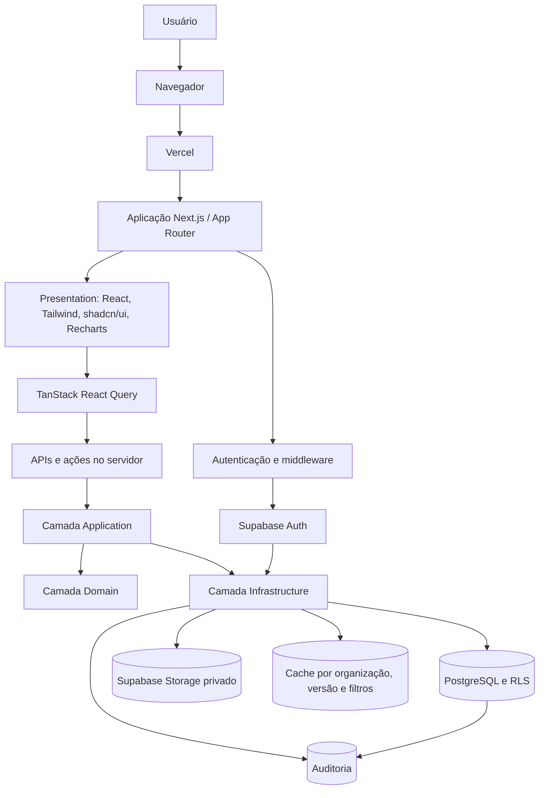
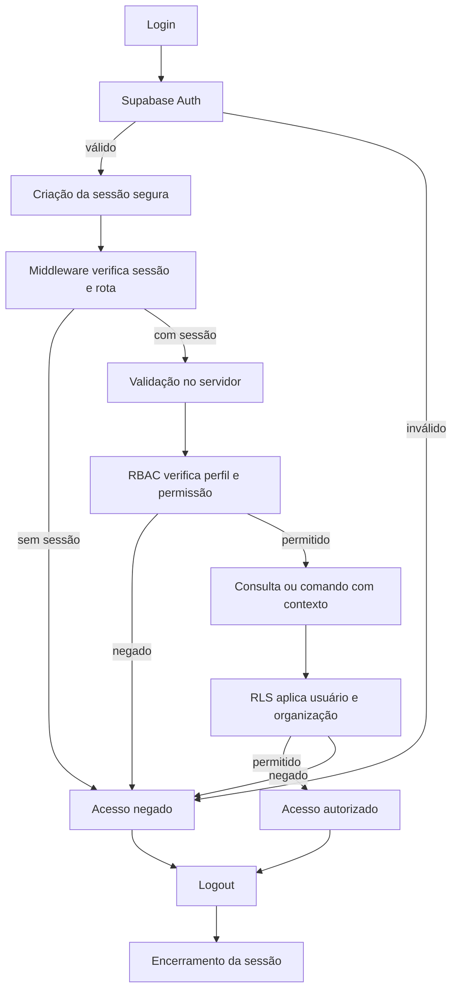
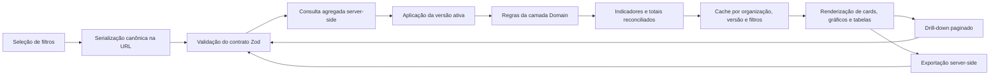
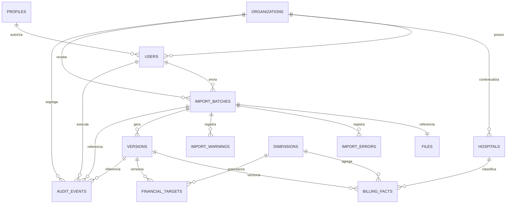

# Arquitetura Técnica Oficial — Biosaúde Analytics 2.0

**Versão:** 1.0  
**Status:** Referência arquitetural obrigatória  
**Especificação de referência:** [PROJECT_SPECIFICATION.md](../PROJECT_SPECIFICATION.md)  
**Regras de referência:** [BUSINESS_RULES.md](../BUSINESS_RULES.md)

## Índice

1. [Objetivo da arquitetura](#1-objetivo-da-arquitetura)
2. [Visão arquitetural](#2-visão-arquitetural)
3. [Estilo arquitetural](#3-estilo-arquitetural)
4. [Estrutura oficial de diretórios](#4-estrutura-oficial-de-diretórios)
5. [Módulos do sistema](#5-módulos-do-sistema)
6. [Fluxo de autenticação e autorização](#6-fluxo-de-autenticação-e-autorização)
7. [Fluxo de importação](#7-fluxo-de-importação)
8. [Fluxo do dashboard](#8-fluxo-do-dashboard)
9. [Contrato de filtros](#9-contrato-de-filtros)
10. [Arquitetura de dados](#10-arquitetura-de-dados)
11. [Estratégia para Meta Financeira](#11-estratégia-para-meta-financeira)
12. [Estratégia para UF do Hospital](#12-estratégia-para-uf-do-hospital)
13. [APIs e contratos](#13-apis-e-contratos)
14. [Estratégia de cache](#14-estratégia-de-cache)
15. [Estratégia de performance](#15-estratégia-de-performance)
16. [Estratégia de segurança](#16-estratégia-de-segurança)
17. [Estratégia de observabilidade](#17-estratégia-de-observabilidade)
18. [Estratégia de testes](#18-estratégia-de-testes)
19. [Estratégia de deploy](#19-estratégia-de-deploy)
20. [Decisões arquiteturais](#20-decisões-arquiteturais)
21. [Restrições](#21-restrições)
22. [Critérios de aceite do documento](#22-critérios-de-aceite-do-documento)

## 1. Objetivo da arquitetura

Esta arquitetura define limites técnicos, direção de dependências e padrões
obrigatórios para que todas as futuras fases implementem uma única plataforma
corporativa, segura, auditável e reconciliável. Ela reduz decisões locais,
permite evolução modular e torna explícito onde dados, regras e integrações
podem existir.

A substituição do dashboard anterior não poderá repetir dispersão de consultas
na interface, fórmulas duplicadas, filtros inconsistentes, publicação sem
staging, fragilidade de segurança, dados sem versão, baixa rastreabilidade,
carregamento excessivo ou acoplamento que torne a manutenção arriscada.

Os princípios orientadores são:

- **modularidade:** domínios coesos, contratos explícitos e responsabilidades
  únicas;
- **segurança:** autenticação em toda operação e autorização em interface,
  servidor e banco;
- **rastreabilidade:** importações, versões, mudanças e ações críticas
  auditáveis;
- **desempenho:** agregação no servidor, paginação, cache versionado e payloads
  mínimos;
- **manutenção:** domínio independente de frameworks, regras sem duplicação e
  dependências direcionadas para dentro.

Este documento traduz tecnicamente o
[`PROJECT_SPECIFICATION.md`](../PROJECT_SPECIFICATION.md), que permanece como
fonte oficial de requisitos. Em conflito, a especificação e as regras aprovadas
em [`BUSINESS_RULES.md`](../BUSINESS_RULES.md) prevalecem. Esta arquitetura não
cria nem altera regra de negócio.

## 2. Visão arquitetural

A solução será uma aplicação web corporativa em **Next.js com App Router** e
**React**, escrita em **TypeScript strict**. A apresentação usará **Tailwind
CSS**, **shadcn/ui** e **Recharts**; estado assíncrono e cache de cliente usarão
**TanStack React Query**. **Zod** validará contratos nas fronteiras.

**Supabase** fornecerá **PostgreSQL**, **Supabase Auth** e **Supabase Storage**.
A aplicação será hospedada na **Vercel**, e **GitHub Actions** executará gates de
qualidade e automação de entrega. A adoção dessas tecnologias não autoriza
atalhos entre camadas.



## 3. Estilo arquitetural

A arquitetura é modular, baseada em domínios e organizada em quatro camadas.

| Camada | Responsabilidade | Pode depender de | Não pode conter ou depender de |
|---|---|---|---|
| `presentation` | Rotas, layouts, componentes, gráficos, interação, acessibilidade e formatação de resultados. | `application`, contratos públicos e componentes compartilhados. | Fórmulas financeiras, acesso direto ao banco, credenciais privilegiadas ou consultas dispersas. |
| `application` | Orquestrar casos de uso, transações, autorização contextual, portas e coordenação entre domínio e infraestrutura. | `domain`, contratos e abstrações de portas. | Regra financeira duplicada, detalhes visuais ou decisão de persistência incorporada ao domínio. |
| `domain` | Entidades, valores, invariantes, políticas e cálculos oficiais reutilizáveis. | Somente linguagem e bibliotecas neutras indispensáveis. | React, Next.js, Supabase, PostgreSQL, navegador ou detalhes de transporte. |
| `infrastructure` | Implementar repositórios, gateways, cache, Storage, Auth, banco, logging e provedores externos. | Portas da `application`, tipos do `domain` e SDKs externos. | Definir ou reinterpretar regras de negócio. |

### Direção das dependências

`presentation → application → domain`; `infrastructure → application/domain`.
A camada de aplicação consome infraestrutura por interfaces (portas), e a
composição fornece adaptadores concretos. Dependências apontam para o domínio,
nunca do domínio para fora.

Regras mandatórias:

- componentes React não contêm regras financeiras;
- fórmulas não ficam em gráficos;
- o contrato e a semântica de filtros têm uma única definição;
- consultas não ficam espalhadas na interface;
- infraestrutura não define regras de negócio;
- domínio não depende de React, Next.js, Supabase ou banco;
- contratos de entrada e saída são validados com Zod nas fronteiras;
- cards, gráficos, tabelas e exportações consomem os mesmos resultados oficiais.

## 4. Estrutura oficial de diretórios

```text
src/
├── app/
│   ├── (auth)/
│   ├── dashboard/
│   ├── admin/
│   │   ├── imports/
│   │   ├── hospitals/
│   │   ├── users/
│   │   ├── audit/
│   │   └── settings/
│   ├── api/
│   ├── layout.tsx
│   └── providers.tsx
├── modules/
│   ├── dashboard/
│   ├── targets/
│   ├── hospitals/
│   ├── imports/
│   ├── identity/
│   └── audit/
├── components/
├── contracts/
├── hooks/
├── lib/
├── styles/
└── test/
```

### Regras por pasta

| Pasta | Finalidade e exemplos | Permitido | Proibido | Dependências aceitas |
|---|---|---|---|---|
| `src/app/` | Composição do App Router, metadata, layouts, boundaries e handlers finos. | `page`, `layout`, `loading`, `error`, route handlers e composição. | Domínio, consultas SQL, fórmulas ou páginas monolíticas. | Presentation, application e contratos. |
| `src/app/(auth)/` | Telas e fluxo visual de login/logout. | Páginas, formulários e ações delegadas. | Implementar Auth, RBAC ou persistir sessão manualmente. | Identity application e componentes. |
| `src/app/dashboard/` | Entrada para dashboards e drill-down. | Rotas, shells, loading e composição de views. | Consultas ou cálculo de indicadores. | Módulo dashboard e presentation compartilhada. |
| `src/app/admin/` | Limite visual de rotas administrativas protegidas. | Layout de autorização e composição das subrotas. | Confiar apenas em ocultação visual ou expor operações públicas. | Casos de uso autorizados. |
| `src/app/admin/imports/` | Upload, relatório, preview, confirmação e rollback visuais. | Views e chamadas a casos de uso. | Parsing, promoção ou service role no cliente. | Módulo imports. |
| `src/app/admin/hospitals/` | Gestão visual do cadastro mestre de hospitais. | Formulários e listagens paginadas. | Inferir UF ou relacionar por nome abreviado. | Módulo hospitals. |
| `src/app/admin/users/` | Gestão visual de usuários e perfis. | Interfaces administrativas autorizadas. | Alterar perfil somente no cliente. | Módulo identity/administration. |
| `src/app/admin/audit/` | Consulta paginada da auditoria. | Filtros e visualização. | Alterar ou excluir eventos. | Módulo audit. |
| `src/app/admin/settings/` | Configurações administrativas documentadas. | UI de configurações previstas. | Criar regra de negócio ad hoc. | Módulo administration. |
| `src/app/api/` | Adaptadores HTTP versionados e finos. | Autenticar, validar contrato, invocar caso de uso e mapear resposta. | SQL, regra financeira ou acesso administrativo anônimo. | Zod, application e infraestrutura composta no servidor. |
| `src/app/layout.tsx` | Estrutura raiz, metadata e providers globais mínimos. | Composição de layout. | Regra, consulta ou lógica de módulo. | Components e providers. |
| `src/app/providers.tsx` | Providers estritamente necessários no cliente. | Query client, tema e contextos de apresentação. | Segredos, SDK privilegiado ou estado duplicando servidor. | Bibliotecas client-safe. |
| `src/modules/` | Código coeso por domínio, internamente separado em domain/application/infrastructure/presentation quando aplicável. | Entidades, casos de uso, portas, adaptadores e views do módulo. | Importações cruzadas arbitrárias ou ciclos. | Núcleo próprio e contratos explícitos de outros módulos. |
| `src/modules/dashboard/` | Consultas analíticas, indicadores, drill-down e modelos de leitura. | Casos de uso e projeções oficiais. | Definir Meta ou hospital como fonte duplicada. | Targets, hospitals por contratos e audit quando necessário. |
| `src/modules/targets/` | Meta Financeira, granularidade e compatibilidade. | Políticas, cálculo e portas de meta. | Distribuição automática ou `float`. | Domain neutro e contratos oficiais. |
| `src/modules/hospitals/` | Cadastro mestre e UF física do hospital. | Entidade, validações e casos de uso. | Inferência de UF ou vínculo por nome abreviado. | Domain neutro e portas. |
| `src/modules/imports/` | Pipeline, staging, versões, ativação e rollback. | Estado do lote, validadores e orquestração. | Publicação direta ou exclusão destrutiva. | Targets, hospitals, audit e infrastructure via portas. |
| `src/modules/identity/` | Identidade, sessão, perfis e políticas de acesso. | Casos de uso RBAC e adaptadores Auth. | Confiar só no cliente ou contornar RLS. | Supabase apenas na infraestrutura. |
| `src/modules/audit/` | Registro e consulta imutável de eventos. | Evento, serviço e repositório. | Atualização destrutiva ou dado sensível desnecessário. | Portas e contexto de identidade. |
| `src/components/` | Componentes visuais reutilizáveis e acessíveis. | shadcn/ui, primitives e composição sem regra. | Casos de uso, fetch, SQL ou indicadores. | React e utilitários de presentation. |
| `src/contracts/` | Contratos Zod compartilhados nas fronteiras. | Schemas, tipos inferidos e envelopes. | Regra de domínio ou acesso a dados. | Zod e tipos neutros. |
| `src/hooks/` | Hooks de apresentação reutilizáveis. | Interação, URL e adapters de React Query. | Fórmulas, credenciais ou consulta direta ao banco. | React, contracts e APIs públicas da application. |
| `src/lib/` | Utilitários técnicos pequenos e composição transversal. | Formatação, configuração pública e helpers sem domínio. | Pasta genérica para regras, repositórios ou segredos client-side. | Bibliotecas técnicas aprovadas. |
| `src/styles/` | Tokens, CSS global e tema. | CSS e configuração visual. | Lógica TypeScript ou regra de domínio. | Tailwind/CSS. |
| `src/test/` | Fixtures, factories e configuração compartilhada de testes. | Builders, setup e utilitários de teste. | Código usado apenas para fazer produção funcionar. | Frameworks de teste e contratos públicos. |

`administration` é uma composição de capacidades administrativas dos módulos;
`exports` é uma capacidade de aplicação. Novas pastas de módulo somente deverão
ser criadas na fase correspondente e preservando esta separação.

## 5. Módulos do sistema

### 5.1 Identity

- **Objetivo:** autenticar, manter sessão e aplicar perfis e contexto de
  organização.
- **Entidades:** usuários, perfis e organizações.
- **Casos de uso:** login, logout, validar sessão, consultar permissões e gerir
  perfis mediante autorização.
- **Serviços:** política RBAC, serviço de sessão e porta de identidade.
- **Contratos:** credenciais, sessão, identidade autenticada e permissão.
- **Dependências:** Supabase Auth somente pelo adaptador; audit para ações
  críticas.
- **Eventos:** login, logout, falha de acesso e alteração de perfil.
- **Riscos:** escalada de privilégio, sessão indevida e isolamento insuficiente.
- **Limite:** não define regras comerciais nem substitui RLS.

### 5.2 Dashboard

- **Objetivo:** entregar indicadores oficiais, séries, tabelas e drill-down
  reconciliáveis.
- **Entidades:** fatos de faturamento, dimensões, versão e resultados de
  indicadores.
- **Casos de uso:** consultar resumo, série, detalhamento e filtros disponíveis.
- **Serviços:** orquestração analítica e reconciliação.
- **Contratos:** filtro único, indicador, série, detalhe paginado.
- **Dependências:** targets, hospitals e repositórios de leitura agregada.
- **Eventos:** consulta analítica e exportação solicitada quando auditável.
- **Riscos:** totais divergentes, joins multiplicadores e payload excessivo.
- **Limite:** não importa dados nem redefine fórmulas.

### 5.3 Targets

- **Objetivo:** representar e agregar exclusivamente Meta Financeira com sua
  granularidade formal.
- **Entidades:** Meta Financeira, dimensões compatíveis e versão.
- **Casos de uso:** validar, consultar, agregar e verificar compatibilidade.
- **Serviços:** política de granularidade, unicidade e reconciliação.
- **Contratos:** valor decimal, granularidade e resultado ausente/zero.
- **Dependências:** dimensões oficiais por identificadores estáveis.
- **Eventos:** meta validada, rejeitada e publicada com versão.
- **Riscos:** duplicidade, arredondamento, distribuição implícita e multiplicação.
- **Limite:** não representa procedimentos, produtos, recebimentos ou despesas.

### 5.4 Hospitals

- **Objetivo:** ser fonte única do hospital e de sua UF física.
- **Entidades:** hospitais e dimensão UF do Hospital.
- **Casos de uso:** consultar, validar referência e administrar cadastro mestre.
- **Serviços:** resolução por identificador estável e detecção de divergência.
- **Contratos:** referência de hospital e UF validada.
- **Dependências:** organização, autorização e audit.
- **Eventos:** hospital criado/alterado e divergência detectada.
- **Riscos:** inferência, homônimos, vínculo por abreviação e perda histórica.
- **Limite:** não confunde UF do Hospital com UF Comercial ou UF do Cliente.

### 5.5 Imports

- **Objetivo:** receber, validar, versionar, promover e reverter bases sem
  publicação direta.
- **Entidades:** lote, versão, arquivo, erros e warnings.
- **Casos de uso:** upload, validar, parsear, gerar relatório/preview, confirmar,
  ativar e rollback.
- **Serviços:** hash, pipeline, exclusão mútua, promoção e versionamento.
- **Contratos:** manifesto do arquivo, status, relatório e confirmação
  idempotente.
- **Dependências:** Storage privado, staging, targets, hospitals, identity e
  audit por portas.
- **Eventos:** etapas do lote, publicação, falha e rollback.
- **Riscos:** concorrência, arquivo malicioso, promoção parcial e duplicidade.
- **Limite:** não altera a base ativa antes da promoção transacional.

### 5.6 Audit

- **Objetivo:** registrar ações e transições críticas de forma preservada.
- **Entidades:** auditoria, usuário, organização, lote e versão relacionados.
- **Casos de uso:** registrar evento e consultar trilha autorizada/paginada.
- **Serviços:** contexto de auditoria e sanitização.
- **Contratos:** evento, ator, ação, resultado, request ID e referência.
- **Dependências:** identidade, relógio e persistência por portas.
- **Eventos:** o próprio registro auditável.
- **Riscos:** dados sensíveis, lacunas, alteração ou excesso de retenção.
- **Limite:** não é log técnico e não decide autorização.

### 5.7 Administration

- **Objetivo:** compor gestão autorizada de usuários, perfis, hospitais,
  dimensões e configurações.
- **Entidades:** as entidades pertencem aos módulos fonte; não são duplicadas.
- **Casos de uso:** comandos administrativos explicitamente autorizados.
- **Serviços:** fachada de aplicação e política de autorização contextual.
- **Contratos:** comandos e resultados administrativos versionados.
- **Dependências:** identity, hospitals, imports e audit.
- **Eventos:** toda alteração administrativa relevante.
- **Riscos:** API pública, privilégio excessivo e quebra da fonte única.
- **Limite:** não possui base paralela nem regras próprias dos módulos.

### 5.8 Exports

- **Objetivo:** exportar a mesma visão filtrada e reconciliada do dashboard.
- **Entidades:** nenhuma própria; usa resultados e filtros oficiais.
- **Casos de uso:** solicitar, gerar e obter exportação autorizada.
- **Serviços:** geração server-side e controle de payload/arquivo.
- **Contratos:** filtro oficial, status e referência segura do resultado.
- **Dependências:** dashboard, identity, Storage privado e audit.
- **Eventos:** exportação solicitada, concluída ou falha.
- **Riscos:** exfiltração, arquivo grande, divergência e link público.
- **Limite:** não recalcula indicadores nem consulta dados sem versão ativa.

## 6. Fluxo de autenticação e autorização



Perfis oficiais:

- **viewer:** visualização autorizada de dashboards;
- **analyst:** análise, drill-down e exportação autorizada;
- **importer:** capacidades de importação e consulta de seu fluxo, conforme
  matriz de permissões futura;
- **admin:** administração protegida, sem dispensar RLS ou auditoria.

A equivalência técnica de **Administrator** é `admin`; o nome canônico externo
deverá ser fixado no contrato de identidade antes da implementação. Ocultar um
botão é apenas conveniência visual, nunca autorização. Toda permissão crítica é
validada novamente no servidor e no PostgreSQL por RLS. Logout invalida a sessão
e remove dados privados do cache do navegador.

## 7. Fluxo de importação


### Local de execução e custódia

| Etapa | Local | Responsabilidade |
|---|---|---|
| Upload | Navegador para endpoint autenticado | Cliente mantém apenas seleção, progresso e metadados necessários; não processa a base. |
| Validação inicial | Servidor | Autorização, limites, tipo, hash e requisitos estruturais. |
| Armazenamento | Storage privado | Arquivo nunca recebe URL pública permanente. |
| Parsing e staging | Servidor/processador assíncrono | Normalização, contratos e gravação isolada por lote. |
| Relatório e preview | Servidor, projetados ao cliente | Cliente recebe amostras, totais e mensagens, não toda a base. |
| Confirmação, promoção e ativação | Servidor e banco | Comando idempotente, autorizado e transacional. |
| Auditoria e rollback | Servidor e banco | Eventos preservados e troca controlada da versão ativa. |

Uma promoção adquire exclusão mútua lógica/transacional por organização e
revalida que o lote e a versão ativa esperada não mudaram. Confirmações repetidas
usam idempotência; somente uma promoção vence. A nova versão é construída sem
alterar a ativa; uma transação promove dados e troca a referência ativa. Falha
reverte a transação e mantém a base anterior.

Cada lote e versão preserva os metadados previstos na especificação. Erros
bloqueantes impedem confirmação; warnings são exibidos, contabilizados e
preservados, com política de aceite explícita. Nenhum erro é corrigido
silenciosamente.

Referências de hospital são resolvidas pelo identificador estável contra
`Hospitals`; UF do Hospital precisa coincidir com o cadastro mestre. Divergências
são erros ou warnings conforme política futura documentada, nunca inferência.
Meta Financeira é validada como decimal e com granularidade conhecida; sua chave
conceitual de granularidade e versão deve ser única. A detecção ocorre em staging
antes da promoção e não soma duplicatas para fazê-las parecer válidas.

Rollback ativa uma versão anterior preservada, registra ator, data, referência e
resultado, e invalida caches; não exclui versão alguma.

## 8. Fluxo do dashboard



Agregação monetária, Meta Financeira, cobertura, diferença, saldo, excedente,
variação e reconciliação pertencem ao backend e ao domínio. O cliente pode
formatar BRL/pt-BR, ordenar uma página já recebida e manter estado visual; não
pode reinterpretar nem recalcular indicadores.

Uma mesma resposta oficial, ou projeções derivadas do mesmo caso de uso, alimenta
cards, gráficos, tabelas e exportações. Resultados carregam contexto de versão e
filtros. Totais são reconciliados no servidor contra agregações de origem; o
drill-down explicita paginação e escopo, sem assumir que a soma da página é o
total global.

Quando um filtro não é compatível com a granularidade da Meta Financeira, a API
retorna estado explícito de incompatibilidade; é proibido distribuir a meta ou
inventar precisão. Meta ausente difere de meta zero.

UF do Hospital usa a dimensão física de `Hospitals`; UF do Cliente usa sua
dimensão própria. Ambas podem integrar o contrato, mas nunca são substituídas,
fundidas ou derivadas uma da outra.

## 9. Contrato de filtros

Existe um contrato canônico, compartilhado por dashboard, drill-down e exports,
com:

- ano, trimestre e mês;
- GR e UF Comercial;
- hospital e UF do Hospital;
- UF do Cliente;
- representante e assessor;
- marca, tópico e tipo do produto;
- cliente e médico;
- controles derivados de Meta Financeira, limitados a estados oficiais como
  presença, compatibilidade e comparação, sem criar novos indicadores.

### Semântica

- **Validação:** Zod valida tipos, cardinalidade, valores admitidos e relações
  temporais nas fronteiras do navegador e novamente no servidor.
- **Serialização:** query string canônica, estável, sem dados sensíveis, com
  arrays ordenados e nomes versionados.
- **Normalização:** vazios redundantes são removidos; identificadores preservam
  forma canônica; mês/trimestre devem pertencer ao ano selecionado.
- **Dependências:** opções dependentes são consultadas a partir dos filtros pais,
  mas a API revalida a combinação completa.
- **Estados vazios:** “sem filtro” é distinto de “resultado sem registros”, meta
  ausente e valor zero.
- **Combinação impossível:** retorna erro de contrato ou resultado vazio
  explicado, nunca relaxamento silencioso de filtros.
- **Granularidade da meta:** incompatibilidade retorna estado explícito e não
  produz rateio automático.
- **URL compartilhável:** a URL reproduz seleção após autorização; nunca embute
  resultados, sessão ou organização manipulável.

A camada presentation não mantém uma segunda definição desse contrato. Estado
de URL, React Query, API e exportação usam a mesma normalização.

## 10. Arquitetura de dados

Esta é uma visão conceitual; nomes físicos, atributos, chaves, cardinalidades
finais, índices e migrations serão definidos e aprovados na fase de Banco. Não
são propostas colunas além dos conceitos previstos na especificação.

- dimensões oficiais: tempo, GR, UFs distintas, representantes, assessores,
  marcas, tópicos, tipos de produto, clientes, médicos, organizações, lotes e
  versões;
- `Billing Facts` como fonte de faturamento efetivo;
- `Financial Targets` como fonte de Meta Financeira decimal e granular;
- `Hospitals` como fonte de hospital e UF física;
- lotes, versões, arquivos, erros e warnings do pipeline;
- auditoria preservada;
- organizações, usuários e perfis para segregação e acesso.



As relações são conceituais, não prescrevem colunas ou cardinalidade física
definitiva. Especialmente, a relação entre Meta Financeira e dimensões será
formalizada segundo a granularidade conhecida, sem presumir todas as dimensões.

## 11. Estratégia para Meta Financeira

- **Armazenamento:** decimal exato; `float` é proibido. Arredondamento ocorre
  somente na apresentação.
- **Granularidade:** cada meta declara formalmente as dimensões que a definem;
  essa declaração acompanha validação, consulta e reconciliação.
- **Unicidade:** a combinação da versão, organização e dimensões efetivamente
  pertencentes à granularidade deve ser única; o desenho físico será decidido na
  fase de Banco.
- **Agregação:** primeiro agrega-se cada fato no seu próprio grão; faturamento e
  meta são combinados somente após compatibilização de grãos.
- **Filtros:** filtros presentes na granularidade podem restringir a meta.
  Filtros mais detalhados ou incompatíveis geram estado explícito, sem rateio.
- **Ausência:** meta ausente é “não informada”, nunca zero.
- **Zero:** zero é valor informado e válido, tratado separadamente da ausência;
  divisões e percentuais seguem política de domínio explicitamente testada.
- **Joins:** nunca ligar fatos detalhados diretamente a uma meta agregada de modo
  que multiplique seu valor; usar agregações independentes/projeções compatíveis.
- **Reconciliação:** cards, séries, detalhes e exports informam versão, filtros e
  granularidade e devem reconciliar com a mesma agregação oficial.

## 12. Estratégia para UF do Hospital

`Hospitals` é a entidade mestre e cada hospital possui identificador estável. A
UF do Hospital é o vínculo da localização física validado nesse cadastro, nunca
um texto inferido de faturamento, cliente, representante, cidade, GR ou UF
Comercial.

- referências importadas são resolvidas contra o cadastro mestre;
- nomes abreviados não são chaves de relacionamento;
- UF divergente é registrada no relatório e não corrigida silenciosamente;
- UF do Hospital, UF Comercial e UF do Cliente permanecem dimensões distintas no
  contrato, consulta e apresentação;
- filtrar UF do Hospital seleciona a dimensão física; filtrar UF do Cliente não
  altera essa seleção;
- Meta Financeira somente responde à UF do Hospital quando essa dimensão fizer
  parte de sua granularidade declarada; caso contrário, retorna
  incompatibilidade, sem distribuição;
- versões e auditoria devem permitir identificar qual referência mestre foi
  validada à época, preservando rastreabilidade histórica sem reescrever fatos.

## 13. APIs e contratos

Futuras APIs obedecerão aos seguintes padrões, sem rotas implementadas nesta
etapa:

| Tema | Padrão obrigatório |
|---|---|
| Versionamento | Prefixo ou contrato explícito de versão; mudanças incompatíveis criam nova versão. |
| Autenticação | Sessão Supabase validada no servidor em toda operação. |
| Autorização | RBAC no caso de uso e RLS no banco; organização obtida do contexto confiável. |
| Validação | Zod para parâmetros, query, corpo e forma de saída nas fronteiras. |
| Sucesso | Envelope conceitual com dados, metadados de versão/paginação e request ID. |
| Erro | Código estável, mensagem segura, detalhes de validação permitidos e request ID; sem stack ou segredo. |
| Paginação | Cursor preferencial para grandes coleções; limites máximos obrigatórios. |
| Filtros | Contrato canônico, normalizado e compartilhado. |
| Request ID | Recebido quando válido ou gerado no ingresso e propagado a logs/auditoria. |
| Rate limiting | Por identidade, organização, operação e risco. |
| Logging | Estruturado e sanitizado, com duração e resultado. |
| Idempotência | Obrigatória para confirmação, publicação, rollback e comandos repetíveis críticos. |
| Payload | Limites por endpoint; arquivos usam fluxo dedicado, nunca JSON irrestrito. |

Exemplo conceitual de sucesso: `dados + metadados (versão, paginação) + request
ID`. Exemplo conceitual de erro: `código + mensagem segura + detalhes permitidos
+ request ID`. São formas descritivas, não código executável. HTTP status deve
preservar a semântica de autenticação, autorização, validação, conflito,
limitação e falha interna.

## 14. Estratégia de cache

A chave de cache inclui organização, identidade/escopo quando necessário,
versão ativa, contrato de filtros normalizado, consulta e paginação. Após
publicação ou rollback, muda-se/invalida-se o namespace da versão; respostas da
versão anterior não podem ser apresentadas como atuais.

- usar cache server-side e TanStack React Query conforme natureza do dado;
- invalidar consultas afetadas após publicação, rollback ou alteração mestre;
- não fazer polling integral; atualização será dirigida por ações, invalidação
  ou consulta pontual de status;
- cache público somente para conteúdo realmente público e não comercial;
- dados de dashboard, administração, arquivos e auditoria são privados;
- nenhuma chave, tag ou entrada pode ser compartilhada entre organizações;
- logout limpa cache privado do cliente e troca de organização cria novo escopo.

## 15. Estratégia de performance

- realizar consultas agregadas no PostgreSQL e cálculos oficiais no servidor;
- paginar coleções e drill-down; nunca retornar a base inteira;
- planejar índices após desenho físico e medição de consultas, especialmente por
  organização, versão e dimensões filtráveis;
- aplicar code splitting por rota e carregar visualizações pesadas sob demanda;
- estabelecer limites de payload, cardinalidade de filtros e tamanho de página;
- processar parsing, reconciliação, exports e agregações no servidor;
- executar arquivos grandes de modo assíncrono, com status pontual;
- preservar metas da especificação: consultas abaixo de 1 segundo e filtros
  abaixo de 300 ms, medidos e observados em condições definidas;
- proibir `SELECT *` em produção; selecionar somente campos necessários;
- impedir carregamento da base completa no frontend;
- medir planos e duração antes de adicionar cache ou índice por suposição.

## 16. Estratégia de segurança

- **Autenticação:** Supabase Auth e sessão validada no servidor.
- **Autorização:** RBAC por caso de uso e RLS em toda tabela protegida.
- **Organizações:** contexto confiável e segregação em consulta, cache, Storage,
  logs e auditoria.
- **Segredos:** somente no servidor/plataforma; service role jamais no navegador
  ou Git.
- **Storage:** buckets privados, acesso autorizado e links temporários quando
  estritamente necessários.
- **Logs:** sem credenciais, tokens, arquivo bruto, dados financeiros detalhados
  ou dados pessoais desnecessários.
- **Web:** headers seguros, CSP restritiva, proteção XSS e CSRF, cookies seguros
  e validação de origem para mutações.
- **Abuso:** rate limiting por risco, limites de payload e validação de arquivo.
- **Auditoria:** comandos críticos, negações relevantes, publicação e rollback.
- **Administração:** middleware é primeira barreira; servidor e RLS são barreiras
  obrigatórias adicionais.
- **Publicação:** exige sessão, perfil permitido, confirmação, idempotência e
  auditoria; publicação anônima é impossível por desenho.

## 17. Estratégia de observabilidade

Logs serão estruturados e correlacionados por request ID, ambiente, operação,
organização em forma não sensível, resultado e duração. Métricas mínimas incluem
latência e taxa de erro das APIs, duração e volume das consultas, duração de cada
etapa das importações, falhas/warnings de validação, publicações, rollbacks,
invalidações de cache e acessos negados relevantes.

Erros serão capturados nas fronteiras, classificados e apresentados sem detalhes
internos. Alertas cobrirão aumento de falhas, latência fora das metas, importação
travada, publicação/rollback malsucedido e anomalias de autorização. Auditoria e
telemetria são distintas: a primeira prova ações de negócio; a segunda opera o
sistema.

Privacidade é padrão: minimizar campos, mascarar identificadores quando possível,
restringir acesso e retenção, nunca registrar tokens, segredos, conteúdo integral
de arquivos ou payloads sensíveis. Request ID permite investigação sem expor o
dado.

## 18. Estratégia de testes

### Pirâmide e escopo

| Nível | Foco |
|---|---|
| Unitários | Entidades, valores, políticas e fórmulas do domain sem framework ou banco. |
| Integração | Casos de uso com adaptadores, transações, cache, Storage e Auth controlados. |
| Contrato | Schemas Zod, compatibilidade de envelopes, filtros e erros. |
| Banco e RLS | Isolamento por organização/perfil, agregações, unicidade, promoção e rollback. |
| Componentes | Renderização, acessibilidade, estados vazio/erro/incompatível e interação sem regra financeira. |
| E2E | Login, filtros, drill-down, importação, confirmação, auditoria, exportação e logout. |
| Performance | Metas de consulta/filtro, volume, arquivo grande, paginação e concorrência. |
| Segurança | Autenticação, RBAC, RLS, origem, rate limit, payload e rotas administrativas. |
| Smoke | Saúde mínima de cada ambiente após deploy. |

O domain é isolado de React, Supabase e banco. Application é testada por portas
fake. Infrastructure é validada por integração realista. Presentation recebe
contratos prontos e não replica cálculo.

Casos obrigatórios incluem:

- Meta Financeira decimal, ausente, zero, duplicada e em granularidade
  incompatível;
- cobertura e demais indicadores oficiais sem arredondamento intermediário;
- UF do Hospital válida, divergente e distinta das UFs Comercial e do Cliente;
- filtros simples, combinados, vazios, impossíveis, normalizados e reproduzidos
  por URL;
- totais reconciliados entre cards, séries, detalhes e exports;
- pipeline com erros, warnings, arquivo repetido, confirmação idempotente e duas
  publicações concorrentes;
- promoção atômica, preservação da versão ativa em falha e rollback não
  destrutivo/auditado;
- matriz de perfis e RLS, incluindo tentativas entre organizações.

Nenhuma funcionalidade é concluída sem a suíte correspondente.

## 19. Estratégia de deploy

| Ambiente | Finalidade | Proteção |
|---|---|---|
| `development` | Desenvolvimento local/integrado com dados não produtivos. | Segredos próprios e isolamento de recursos. |
| `preview` | Validação de pull requests na Vercel e Supabase não produtivo. | Acesso controlado, dados sanitizados e gates completos. |
| `production` | Operação oficial. | Aprovação, menor privilégio, proteção de branch e monitoramento. |

GitHub Actions executará lint, typecheck, testes, verificações de segurança e
build antes da promoção. Vercel hospedará a aplicação por ambiente; Supabase
terá projetos/recursos segregados. Variáveis de ambiente serão geridas nas
plataformas, validadas na inicialização e nunca commitadas.

Migrations futuras serão versionadas, revisadas, testadas em ambiente isolado e
aplicadas por identidade controlada; esta etapa não cria migrations. Mudanças
destrutivas exigem estratégia explícita de expansão/contração e backup. Rollback
da aplicação usa artefato/deploy anterior compatível. Rollback de dados segue
versionamento da base e migrations com plano próprio; jamais se presume que
reverter aplicação reverta banco.

Produção exige branches protegidas, revisão, gates aprovados, autorização de
deploy, segredos segregados e validação smoke pós-deploy.

## 20. Decisões arquiteturais

| ID | Decisão | Motivo | Alternativas rejeitadas | Impacto |
|---|---|---|---|---|
| ADR-001 | Arquitetura modular baseada em domínios. | Coesão e manutenção previsível. | Organização apenas por tipo técnico; aplicação monolítica. | Limites e contratos entre módulos são obrigatórios. |
| ADR-002 | Domain independente de frameworks. | Regras únicas, testáveis e reutilizáveis. | Fórmulas em React, API ou SQL disperso. | Dependências apontam para dentro e adaptadores ficam fora. |
| ADR-003 | Supabase para PostgreSQL, Auth e Storage. | Integração consistente com requisitos oficiais. | Serviços desconectados ou autenticação própria. | RLS, recursos privados e SDK isolado na infraestrutura. |
| ADR-004 | Next.js App Router. | Modelo full-stack, rotas e renderização modular. | Pages Router ou SPA sem camada server-side. | Route handlers e componentes de servidor permanecem finos. |
| ADR-005 | Importação processada no servidor. | Segurança, volume e consistência. | Parsing/publicação no navegador. | Cliente só envia, acompanha e confirma; grandes arquivos são assíncronos. |
| ADR-006 | Meta Financeira declara granularidade. | Evitar falsa precisão, duplicidade e rateio. | Meta sem grão ou distribuição automática. | Consultas precisam verificar compatibilidade de filtros. |
| ADR-007 | UF do Hospital é dimensão independente. | Preservar significado de localização física. | Inferir de cliente, comercial, representante, GR ou cidade. | Cadastro mestre e validação por identificador estável. |
| ADR-008 | Sem polling integral. | Evitar custo, carga e tráfego desnecessários. | Recarregar continuamente toda a base. | Invalidação e consulta pontual de status substituem polling integral. |
| ADR-009 | Bases são versionadas e rollback é não destrutivo. | Integridade e rastreabilidade. | Sobrescrita ou exclusão da versão anterior. | Cache e consultas incluem versão; ativação é transacional. |
| ADR-010 | Consultas agregadas e paginadas. | Cumprir latência e minimizar payload. | `SELECT *` e base completa no cliente. | Backend fornece projeções específicas e drill-down paginado. |
| ADR-011 | Relacionamentos usam identificadores estáveis. | Evitar ambiguidade e quebra por renomeação. | Nome ou abreviação como chave. | Imports resolvem referências contra cadastros mestres. |
| ADR-012 | Testes são gate obrigatório. | Reconciliabilidade, segurança e regressão controlada. | Testar apenas ao final ou manualmente. | Cada camada/fase exige suíte e CI aprovadas. |
| ADR-013 | Zod valida contratos nas fronteiras. | Uma semântica verificável de entrada/saída. | Validação ad hoc por componente. | Schemas versionados e compartilhados, sem substituir invariantes do domínio. |
| ADR-014 | Cache é segregado por organização, versão e filtros. | Correção após publicação e proteção entre organizações. | Cache global por endpoint. | Invalidação acompanha ativação e logout. |

## 21. Restrições

É explicitamente proibido:

- arquivo `page.tsx` monolítico;
- fórmulas ou regras financeiras em componentes, gráficos ou tabelas;
- service role no navegador;
- publicação anônima ou apenas autorizada visualmente;
- exclusão destrutiva da base ou de versões;
- relacionamento por nome abreviado;
- inferência da UF do Hospital;
- distribuição automática de metas;
- converter ausência de meta em zero;
- joins que dupliquem Meta Financeira;
- `SELECT *` em produção;
- polling integral da base;
- segredos no Git, bundle do navegador ou logs;
- build que ignore erros de lint, tipo, teste ou segurança;
- código sem testes correspondentes;
- consultas espalhadas pela interface;
- domínio dependente de React, Next.js, Supabase ou PostgreSQL;
- publicação sem staging, preview, confirmação, versão e auditoria.

## 22. Critérios de aceite do documento

Este documento somente é concluído quando:

- [x] está consistente com
  [`PROJECT_SPECIFICATION.md`](../PROJECT_SPECIFICATION.md);
- [x] está consistente com [`BUSINESS_RULES.md`](../BUSINESS_RULES.md);
- [x] não altera regra aprovada;
- [x] possui índice navegável;
- [x] possui diagramas Mermaid sintaticamente estruturados;
- [x] define claramente presentation, application, domain e infrastructure;
- [x] define módulos, fluxos e dependências permitidas;
- [x] registra decisões arquiteturais;
- [x] não contém código de implementação;
- [x] não inicia aplicação, banco, API, autenticação ou dashboard.

Pontos físicos deliberadamente adiados para as fases apropriadas incluem matriz
detalhada de permissões, esquema/colunas e cardinalidades finais, política de
warnings, granularidades concretas das metas, índices, limites numéricos de
payload/rate limit, retenção de logs e mecanismo de processamento assíncrono.
Essas decisões exigirão documentação e validação manual antes da implementação.
