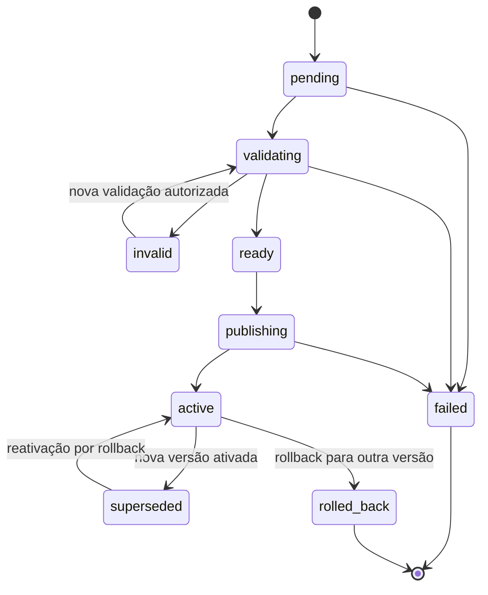
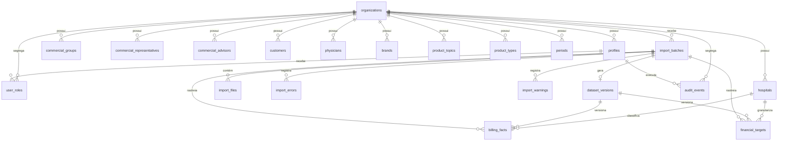

# Modelo Físico Oficial do Banco de Dados — Biosaúde Analytics 2.0

**Versão:** 1.0  
**Status:** Referência obrigatória; sem migrations executáveis  
**Referências:** [Especificação](../PROJECT_SPECIFICATION.md) · [Regras de negócio](../BUSINESS_RULES.md) · [Arquitetura](02_ARCHITECTURE.md)

## Índice

1. [Objetivo do documento](#1-objetivo-do-documento)
2. [Princípios do modelo](#2-princípios-do-modelo)
3. [Convenções de nomenclatura](#3-convenções-de-nomenclatura)
4. [Tipos e domínios](#4-tipos-e-domínios)
5. [Entidades obrigatórias](#5-entidades-obrigatórias)
6. [Organizations](#6-organizations)
7. [Profiles e user roles](#7-profiles-e-user-roles)
8. [Hospitals e UF do Hospital](#8-hospitals-e-uf-do-hospital)
9. [Dimensões comerciais](#9-dimensões-comerciais)
10. [Import batches](#10-import-batches)
11. [Import files](#11-import-files)
12. [Import errors e import warnings](#12-import-errors-e-import-warnings)
13. [Dataset versions](#13-dataset-versions)
14. [Billing facts](#14-billing-facts)
15. [Financial targets](#15-financial-targets)
16. [Chave de unicidade da Meta Financeira](#16-chave-de-unicidade-da-meta-financeira)
17. [Prevenção de multiplicação de meta](#17-prevenção-de-multiplicação-de-meta)
18. [Audit events](#18-audit-events)
19. [Relacionamentos e cardinalidades](#19-relacionamentos-e-cardinalidades)
20. [Foreign keys](#20-foreign-keys)
21. [Constraints](#21-constraints)
22. [Índices](#22-índices)
23. [RLS](#23-rls)
24. [Views e consultas analíticas](#24-views-e-consultas-analíticas)
25. [Migrations](#25-migrations)
26. [Seeds](#26-seeds)
27. [Retenção e exclusão](#27-retenção-e-exclusão)
28. [Performance e volume](#28-performance-e-volume)
29. [Segurança dos dados](#29-segurança-dos-dados)
30. [Testes do banco](#30-testes-do-banco)
31. [Decisões do modelo de dados](#31-decisões-do-modelo-de-dados)
32. [Decisões pendentes](#32-decisões-pendentes)
33. [Restrições](#33-restrições)
34. [Critérios de aceite](#34-critérios-de-aceite)

## 1. Objetivo do documento

Este documento define o modelo físico oficial e reproduzível do PostgreSQL para
as futuras fases. Ele traduz, sem alterar regras, o
[`PROJECT_SPECIFICATION.md`](../PROJECT_SPECIFICATION.md), os invariantes de
[`BUSINESS_RULES.md`](../BUSINESS_RULES.md) e os limites de
[`docs/02_ARCHITECTURE.md`](02_ARCHITECTURE.md).

O modelo garante segregação, chaves estáveis, integridade referencial,
rastreabilidade por lote e versão, histórico não destrutivo e auditoria. Seu
desenho deve impedir perda e duplicação, preservar a base ativa durante falhas e
impedir que joins multipliquem a Meta Financeira. O ambiente deverá ser
reconstruível exclusivamente por migrations versionadas.

**Este documento define o modelo físico, mas não cria nem executa migrations,
SQL, tabelas ou qualquer código nesta etapa.** Precisões e políticas ainda não
aprovadas permanecem explicitamente pendentes.

## 2. Princípios do modelo

- PostgreSQL é o banco; Supabase é a plataforma gerenciada.
- UUID é a chave primária padrão e identificador estável.
- Toda referência lógica usa foreign key; nomes nunca são relacionamentos.
- Dinheiro usa `numeric/decimal`; `real`, `float` e `double precision` são
  proibidos para finanças.
- Instantes usam `timestamptz`; datas civis usam `date`.
- Entidades comerciais carregam `organization_id` e RLS obrigatória.
- Ausência (`NULL`) é semanticamente distinta de zero.
- Versões, lotes e auditoria são não destrutivos e preservados.
- Toda linha importada é rastreável a lote, versão e origem.
- Histórico não é reescrito para refletir cadastros atuais.
- Auditoria é obrigatória para ações críticas.
- Migrations são incrementais, determinísticas e reproduzíveis.
- Foreign keys usam identificadores; nome oficial/normalizado serve somente à
  exibição/pesquisa.

## 3. Convenções de nomenclatura

| Objeto | Convenção | Exemplo |
|---|---|---|
| Tabela | plural, `snake_case` | `financial_targets` |
| Coluna | singular, `snake_case` | `organization_id` |
| Primary key | `pk_<table>` | `pk_hospitals` |
| Unique | `uq_<table>__<columns>` | `uq_organizations__slug` |
| Check | `ck_<table>__<rule>` | `ck_billing_facts__amount_nonnegative` |
| Foreign key | `fk_<table>__<column>__<ref>` | `fk_hospitals__organization_id__organizations` |
| Índice | `ix_<table>__<columns>`; parcial com finalidade | `ix_dataset_versions__active_org` |
| Policy | `pol_<table>__<action>__<scope>` | `pol_billing_facts__select__organization` |
| Status | `text` + check nomeado por padrão; enum só se ciclo rígido | `ck_import_batches__status` |
| View | `v_<purpose>` | `v_active_dataset_versions` |
| Materialized view | `mv_<purpose>` | `mv_billing_aggregate` |
| Função futura | verbo + objeto, `snake_case` | `activate_dataset_version` |

Sufixos: `_id` para identificador/FK; `_at` para instante; `_by` para ator;
`_code` para código controlado/externo; `_amount` para dinheiro. `_date` é data
civil, `_count` é contagem, `_ms` é duração em milissegundos. Nomes não carregam
tipo redundante. Identificadores SQL não usam aspas ou palavras reservadas.

## 4. Tipos e domínios

| Conceito | Tipo recomendado | Regra |
|---|---|---|
| UUID | `uuid` | Gerado no servidor; algoritmo definitivo na migration baseline. |
| Dinheiro | `numeric(p,s)` | `p,s` pendentes; mesmo padrão para faturamento e meta. |
| Percentual | `numeric(p,s)` | Resultado calculado, não `float`; precisão pendente. |
| Data | `date` | Sem fuso para data civil. |
| Ano | `smallint` | Faixa plausível por check. |
| Trimestre | `smallint` | 1 a 4. |
| Mês | `smallint` | 1 a 12. |
| UF | `text` | Duas letras e membro da lista oficial. |
| CNPJ | `text` | Somente dígitos, 14 caracteres; validação algorítmica também na aplicação. |
| Hash | `text` | Algoritmo e tamanho fixados por contrato de importação futuro. |
| Status | `text` | Check explícito e fácil evolução. |
| Metadados | `jsonb` | Apenas extensões não relacionais, versionadas e limitadas. |
| Timestamp | `timestamptz` | UTC no armazenamento, timezone na apresentação. |
| Duração | `bigint` | Milissegundos, não negativa. |
| Contagem | `bigint` | Não negativa. |

Meta Financeira e faturamento usam a mesma precisão decimal aprovada e nunca são
arredondados durante persistência, soma ou regra. Arredondamento é somente de
apresentação. `integer/smallint/bigint` servem a números integrais e contagens;
`text` a códigos e conteúdo variável; `jsonb` apenas a metadados que não precisam
de FK, unicidade ou filtro central. Enum PostgreSQL deve ser evitado quando o
ciclo de status ainda evolui; checks dão integridade com migrations mais simples.
Checks devem proteger intervalos e conjuntos finitos também validados na
aplicação.

## 5. Entidades obrigatórias

O modelo contém 21 tabelas: `organizations`, `profiles`, `user_roles`,
`commercial_groups`, `commercial_representatives`, `commercial_advisors`,
`hospitals`, `customers`, `physicians`, `brands`, `product_topics`,
`product_types`, `periods`, `import_batches`, `import_files`, `import_errors`,
`import_warnings`, `dataset_versions`, `billing_facts`, `financial_targets` e
`audit_events`. As seções seguintes documentam colunas e regras físicas.

Em todas: PK é `id`; updates atualizam `updated_at` quando presente; exclusão é
`RESTRICT` se houver histórico, preferindo `is_active=false`; mudanças críticas
são auditadas. Índices listados são candidatos sujeitos a medição.

## 6. Organizations

**Finalidade/grão:** raiz de segregação; uma linha por organização.

| Coluna | Tipo | Obrigatória | Default | Chave/regra |
|---|---|---:|---|---|
| `id` | `uuid` | sim | gerado | PK |
| `name` | `text` | sim | — | não vazio |
| `legal_name` | `text` | não | `NULL` | não vazio quando presente |
| `slug` | `text` | sim | — | unique, formato canônico |
| `is_active` | `boolean` | sim | `true` | — |
| `created_at` | `timestamptz` | sim | `now()` | — |
| `updated_at` | `timestamptz` | sim | `now()` | `updated_at >= created_at` |

Constraints: `pk_organizations`, `uq_organizations__slug` e checks de nomes/slug.
Índices: unique de slug e candidato parcial para ativas. Exclusão: `RESTRICT`;
inativar. Atualização de slug exige controle e auditoria. Nome, slug e estado são
auditáveis. Riscos: slug mutável em cache, acesso cruzado e inativação com sessão
ativa.

`organization_id` é obrigatório em toda entidade comercial e define RLS, escopo
de cache, lote, versão e auditoria. Usuários se vinculam por `profiles` e
`user_roles`; contexto organizacional nunca vem de parâmetro não confiável.

## 7. Profiles e user roles

### 7.1 `profiles`

**Finalidade/grão:** extensão controlada de `auth.users`; uma linha por usuário
da aplicação. Identidade é o UUID do Auth; perfil contém referência operacional.

| Coluna | Tipo | Obrigatória | Default | Chave/regra |
|---|---|---:|---|---|
| `id` | `uuid` | sim | — | PK e FK para `auth.users.id` |
| `organization_id` | `uuid` | sim | — | FK organizations |
| `name` | `text` | sim | — | não vazio |
| `email_reference` | `text` | não | `NULL` | referência, não credencial |
| `status` | `text` | sim | `'active'` | check de estados aprovados |
| `created_at` | `timestamptz` | sim | `now()` | — |
| `updated_at` | `timestamptz` | sim | `now()` | coerência temporal |

Unique candidato: email de referência normalizado por organização somente se a
política confirmar necessidade; Auth continua fonte de identidade. Índices:
`organization_id,status`. Delete `RESTRICT`/desativação; email/nome/status e
alterações de organização auditáveis. Riscos: duplicar credencial ou mover
usuário entre organizações sem trilha.

### 7.2 `user_roles`

**Finalidade/grão:** um papel técnico atribuído a um profile em uma organização.

| Coluna | Tipo | Obrigatória | Default | Chave/regra |
|---|---|---:|---|---|
| `id` | `uuid` | sim | gerado | PK |
| `organization_id` | `uuid` | sim | — | FK organizations |
| `profile_id` | `uuid` | sim | — | FK profiles |
| `role_code` | `text` | sim | — | `viewer`, `analyst`, `importer`, `admin` |
| `created_at` | `timestamptz` | sim | `now()` | — |
| `updated_at` | `timestamptz` | sim | `now()` | coerência temporal |

Unique: `(organization_id, profile_id, role_code)`; a consistência da
organização entre role e profile será garantida por FK composta ou validação
equivalente no banco. Delete `RESTRICT` quando auditado; revogação é evento
auditável. Índices: profile e organização/papel. Risco: escalada de privilégio.

**Distinção:** identidade autentica; profile descreve o usuário; papel agrupa a
capacidade (`viewer`, `analyst`, `importer`, `admin`); permissão é a ação avaliada
por RBAC/RLS. Não se cria catálogo excessivo de permissões nesta fase.

## 8. Hospitals e UF do Hospital

**Finalidade/grão:** cadastro mestre; uma linha por hospital estável dentro da
organização.

| Coluna | Tipo | Obrigatória | Default | Chave/regra |
|---|---|---:|---|---|
| `id` | `uuid` | sim | gerado | PK |
| `organization_id` | `uuid` | sim | — | FK organizations |
| `external_code` | `text` | não | `NULL` | unique por organização quando presente |
| `cnpj` | `text` | não | `NULL` | 14 dígitos; unique por organização quando presente |
| `official_name` | `text` | sim | — | não vazio |
| `normalized_name` | `text` | sim | — | pesquisa, nunca relacionamento |
| `state_code` | `text` | sim | — | UF oficial |
| `city` | `text` | sim | — | não vazio |
| `is_active` | `boolean` | sim | `true` | — |
| `created_at` | `timestamptz` | sim | `now()` | — |
| `updated_at` | `timestamptz` | sim | `now()` | coerência temporal |
| `created_by` | `uuid` | sim | — | FK profiles |
| `updated_by` | `uuid` | sim | — | FK profiles |

Unique parciais: `(organization_id, external_code)` e `(organization_id, cnpj)`
quando não nulos. Checks: nome/cidade, CNPJ estrutural e UF em `AC, AL, AP, AM,
BA, CE, DF, ES, GO, MA, MT, MS, MG, PA, PB, PR, PE, PI, RJ, RN, RS, RO, RR, SC,
SP, SE, TO`. Índices candidatos: organização/ativo, código, CNPJ, `state_code` e
pesquisa por `normalized_name`.

Hospital inativo continua referenciável pelo histórico e não aceita novo vínculo
sem política explícita. Mudanças de UF, nome, CNPJ, código e status são
auditáveis; fatos existentes não são reescritos. Divergência de UF na importação
é reportada, nunca inferida da UF do Cliente, UF Comercial ou similaridade de
nome. Consolidação textual automática é proibida.

`billing_facts.hospital_id` e `financial_targets.hospital_id` usam FK pelo UUID.
`hospital_state_code`, quando preservado no fato/meta, representa o valor
validado contra `hospitals.state_code` na importação e mantém contexto histórico;
não substitui a FK nem autoriza divergência silenciosa. Delete é `RESTRICT` e
update de `id` é proibido.

## 9. Dimensões comerciais

Todas têm UUID estável, organização, código externo opcional, nome oficial,
nome normalizado apenas para pesquisa, `is_active`, timestamps, unique parcial de
código por organização e exclusão `RESTRICT`. Nomes não são chaves. Alterações de
código/nome/status são auditáveis e o histórico não é reescrito.

### 9.1 `commercial_groups`

**Grão:** um GR por organização.

| Coluna | Tipo | Obrigatória | Default | Regra |
|---|---|---:|---|---|
| `id` | `uuid` | sim | gerado | PK |
| `organization_id` | `uuid` | sim | — | FK |
| `external_code` | `text` | não | `NULL` | unique parcial por org |
| `official_name` | `text` | sim | — | não vazio |
| `normalized_name` | `text` | sim | — | pesquisa |
| `is_active` | `boolean` | sim | `true` | — |
| `created_at`, `updated_at` | `timestamptz` | sim | `now()` | coerência |

Índices: organização/ativo e pesquisa. Risco: confundir GR com geografia.

### 9.2 `commercial_representatives`

**Grão:** um representante por organização.

| Coluna | Tipo | Obrigatória | Default | Regra |
|---|---|---:|---|---|
| `id` | `uuid` | sim | gerado | PK |
| `organization_id` | `uuid` | sim | — | FK |
| `external_code` | `text` | não | `NULL` | unique parcial por org |
| `official_name`, `normalized_name` | `text` | sim | — | oficial não vazio; normalizado só pesquisa |
| `is_active` | `boolean` | sim | `true` | — |
| `created_at`, `updated_at` | `timestamptz` | sim | `now()` | coerência |

Índices: organização/ativo e pesquisa. Risco: homônimos e troca de código.

### 9.3 `commercial_advisors`

**Grão:** um assessor por organização.

| Coluna | Tipo | Obrigatória | Default | Regra |
|---|---|---:|---|---|
| `id` | `uuid` | sim | gerado | PK |
| `organization_id` | `uuid` | sim | — | FK |
| `external_code` | `text` | não | `NULL` | unique parcial por org |
| `official_name`, `normalized_name` | `text` | sim | — | nome oficial não vazio |
| `is_active` | `boolean` | sim | `true` | — |
| `created_at`, `updated_at` | `timestamptz` | sim | `now()` | coerência |

Índices: organização/ativo e pesquisa. Risco: representante e assessor trocados.

### 9.4 `customers`

**Grão:** um cliente por organização.

| Coluna | Tipo | Obrigatória | Default | Regra |
|---|---|---:|---|---|
| `id` | `uuid` | sim | gerado | PK |
| `organization_id` | `uuid` | sim | — | FK |
| `external_code` | `text` | não | `NULL` | unique parcial por org |
| `official_name`, `normalized_name` | `text` | sim | — | pesquisa não relaciona |
| `state_code` | `text` | não | `NULL` | UF oficial quando presente |
| `is_active` | `boolean` | sim | `true` | — |
| `created_at`, `updated_at` | `timestamptz` | sim | `now()` | coerência |

Índices: organização/ativo, UF e pesquisa. Risco: UF do Cliente usada como UF do
Hospital.

### 9.5 `physicians`

**Grão:** um médico identificado por organização.

| Coluna | Tipo | Obrigatória | Default | Regra |
|---|---|---:|---|---|
| `id` | `uuid` | sim | gerado | PK |
| `organization_id` | `uuid` | sim | — | FK |
| `external_code` | `text` | não | `NULL` | unique parcial por org |
| `official_name`, `normalized_name` | `text` | sim | — | proteção de PII |
| `is_active` | `boolean` | sim | `true` | — |
| `created_at`, `updated_at` | `timestamptz` | sim | `now()` | coerência |

Índices mínimos e acesso restrito. Risco: PII e homônimos; códigos profissionais
não são inventados nesta fase.

### 9.6 `brands`

**Grão:** uma marca por organização.

| Coluna | Tipo | Obrigatória | Default | Regra |
|---|---|---:|---|---|
| `id`, `organization_id` | `uuid` | sim | id gerado | PK/FK |
| `external_code` | `text` | não | `NULL` | unique parcial por org |
| `official_name`, `normalized_name` | `text` | sim | — | não vazio/pesquisa |
| `is_active` | `boolean` | sim | `true` | — |
| `created_at`, `updated_at` | `timestamptz` | sim | `now()` | coerência |

Índices: organização/ativo e pesquisa. Risco: renomear e fragmentar histórico.

### 9.7 `product_topics`

**Grão:** um tópico por organização.

| Coluna | Tipo | Obrigatória | Default | Regra |
|---|---|---:|---|---|
| `id`, `organization_id` | `uuid` | sim | id gerado | PK/FK |
| `external_code` | `text` | não | `NULL` | unique parcial por org |
| `official_name`, `normalized_name` | `text` | sim | — | não vazio/pesquisa |
| `is_active` | `boolean` | sim | `true` | — |
| `created_at`, `updated_at` | `timestamptz` | sim | `now()` | coerência |

Índices: organização/ativo e pesquisa. Risco: classificação inconsistente.

### 9.8 `product_types`

**Grão:** um tipo de produto por organização.

| Coluna | Tipo | Obrigatória | Default | Regra |
|---|---|---:|---|---|
| `id`, `organization_id` | `uuid` | sim | id gerado | PK/FK |
| `external_code` | `text` | não | `NULL` | unique parcial por org |
| `official_name`, `normalized_name` | `text` | sim | — | não vazio/pesquisa |
| `is_active` | `boolean` | sim | `true` | — |
| `created_at`, `updated_at` | `timestamptz` | sim | `now()` | coerência |

Índices: organização/ativo e pesquisa. Risco: misturar tipo e tópico.

### 9.9 `periods`

**Grão:** um período oficial por organização e intervalo temporal.

| Coluna | Tipo | Obrigatória | Default | Regra |
|---|---|---:|---|---|
| `id` | `uuid` | sim | gerado | PK |
| `organization_id` | `uuid` | sim | — | FK |
| `external_code` | `text` | não | `NULL` | unique parcial por org |
| `official_name`, `normalized_name` | `text` | sim | — | não vazio/pesquisa |
| `year` | `smallint` | sim | — | faixa aprovada |
| `quarter` | `smallint` | não | `NULL` | 1..4 |
| `month` | `smallint` | não | `NULL` | 1..12 |
| `is_active` | `boolean` | sim | `true` | — |
| `created_at`, `updated_at` | `timestamptz` | sim | `now()` | coerência |

Unique temporal depende da definição oficial de período; candidato
`(organization_id, year, quarter, month)` com tratamento explícito de `NULL`.
Risco: combinações temporais incoerentes; aplicação e banco validam dependências.

## 10. Import batches

**Finalidade/grão:** uma tentativa rastreável de importação.

| Coluna | Tipo | Obrigatória | Default | Regra |
|---|---|---:|---|---|
| `id` | `uuid` | sim | gerado | PK |
| `organization_id` | `uuid` | sim | — | FK organizations |
| `schema_version` | `text` | sim | — | não vazio |
| `status` | `text` | sim | `'pending'` | check de status |
| `source_type` | `text` | sim | — | check futuro |
| `original_filename` | `text` | sim | — | nome sanitizado para exibição |
| `file_hash` | `text` | sim | — | formato conforme algoritmo |
| `requested_by` | `uuid` | sim | — | FK profiles |
| `started_at` | `timestamptz` | não | `NULL` | — |
| `completed_at` | `timestamptz` | não | `NULL` | — |
| `activated_at` | `timestamptz` | não | `NULL` | — |
| `rolled_back_at` | `timestamptz` | não | `NULL` | — |
| `row_count` | `bigint` | sim | `0` | >= 0 |
| `valid_row_count` | `bigint` | sim | `0` | 0..row_count |
| `warning_count` | `bigint` | sim | `0` | >= 0 |
| `error_count` | `bigint` | sim | `0` | >= 0 |
| `billing_total` | `numeric(p,s)` | não | `NULL` | >= 0 quando presente |
| `financial_target_total` | `numeric(p,s)` | não | `NULL` | >= 0 quando presente |
| `duration_ms` | `bigint` | não | `NULL` | >= 0 |
| `notes` | `text` | não | `NULL` | limitado/sanitizado |
| `metadata` | `jsonb` | sim | `'{}'` | objeto JSON |
| `created_at`, `updated_at` | `timestamptz` | sim | `now()` | coerência |

Status: `pending`, `validating`, `invalid`, `ready`, `publishing`, `active`,
`superseded`, `failed`, `rolled_back`. Índices candidatos: organização/status,
criação, hash e solicitante. Hash não é sozinho unique: reimportação pode ser
detectada e decidida sem apagar histórico. Delete `RESTRICT`; status/totais/
contagens/transições são auditáveis. Riscos: concorrência e contadores divergentes.

Transições não desenhadas são inválidas. A aplicação orquestra a máquina e o
banco protege estados terminais/coerência temporal; publicação e ativação são
transacionais e serializadas por organização.

## 11. Import files

**Finalidade/grão:** um arquivo físico vinculado a um lote.

| Coluna | Tipo | Obrigatória | Default | Chave/regra |
|---|---|---:|---|---|
| `id` | `uuid` | sim | gerado | PK |
| `organization_id` | `uuid` | sim | — | FK organizations |
| `import_batch_id` | `uuid` | sim | — | FK import_batches |
| `storage_path` | `text` | sim | — | unique no bucket/escopo |
| `original_filename` | `text` | sim | — | não vazio |
| `mime_type` | `text` | sim | — | allowlist futura |
| `file_extension` | `text` | sim | — | allowlist futura |
| `size_bytes` | `bigint` | sim | — | > 0 e limite futuro |
| `file_hash` | `text` | sim | — | formato controlado |
| `schema_version` | `text` | sim | — | não vazio |
| `uploaded_at` | `timestamptz` | sim | `now()` | — |
| `uploaded_by` | `uuid` | sim | — | FK profiles |
| `status` | `text` | sim | `'uploaded'` | check futuro |
| `metadata` | `jsonb` | sim | `'{}'` | objeto limitado |

Unique: `storage_path`; coerência organizacional com lote. Índices: lote, hash,
status. O bucket é privado, sem URL pública permanente; download usa autorização
e URL temporária/controlada. Retenção está pendente. Delete é `RESTRICT` enquanto
lote/versão/auditoria exigirem o arquivo. Upload, download sensível, mudança de
status e retenção são auditáveis. Riscos: malware, path traversal e exposição.

## 12. Import errors e import warnings

Erro bloqueia publicação; warning informa condição não bloqueante conforme
política futura. A classificação concreta **permanece pendente**, não é definida
por este modelo. Resolução manual nunca altera silenciosamente a origem e deve
registrar ator, instante e nota. Valores recebidos/esperados são minimizados e
sanitizados para evitar PII ou segredos desnecessários.

### 12.1 `import_errors`

**Grão:** um erro por ocorrência/célula ou regra no lote.

| Coluna | Tipo | Obrigatória | Default | Regra |
|---|---|---:|---|---|
| `id` | `uuid` | sim | gerado | PK |
| `organization_id`, `import_batch_id` | `uuid` | sim | — | FKs |
| `sheet_name` | `text` | não | `NULL` | origem |
| `row_number` | `bigint` | não | `NULL` | > 0 |
| `column_name` | `text` | não | `NULL` | origem |
| `error_code` | `text` | sim | — | não vazio |
| `message` | `text` | sim | — | segura/não vazia |
| `received_value`, `expected_value` | `text` | não | `NULL` | minimizados |
| `entity_type` | `text` | não | `NULL` | código controlado |
| `resolution_status` | `text` | sim | `'open'` | check futuro |
| `resolved_by` | `uuid` | não | `NULL` | FK profiles |
| `resolved_at` | `timestamptz` | não | `NULL` | coerente com status |
| `resolution_notes` | `text` | não | `NULL` | sanitizada |
| `created_at` | `timestamptz` | sim | `now()` | — |

Índices: lote, código, status e linha. Delete `RESTRICT`; resolução auditável.
Risco: volume e armazenamento de conteúdo sensível.

### 12.2 `import_warnings`

**Grão:** um warning por ocorrência/célula ou regra no lote.

| Coluna | Tipo | Obrigatória | Default | Regra |
|---|---|---:|---|---|
| `id` | `uuid` | sim | gerado | PK |
| `organization_id`, `import_batch_id` | `uuid` | sim | — | FKs |
| `sheet_name` | `text` | não | `NULL` | origem |
| `row_number` | `bigint` | não | `NULL` | > 0 |
| `column_name` | `text` | não | `NULL` | origem |
| `warning_code` | `text` | sim | — | não vazio |
| `message` | `text` | sim | — | segura/não vazia |
| `received_value`, `expected_value` | `text` | não | `NULL` | minimizados |
| `entity_type` | `text` | não | `NULL` | código controlado |
| `resolution_status` | `text` | sim | `'open'` | check futuro |
| `resolved_by` | `uuid` | não | `NULL` | FK profiles |
| `resolved_at` | `timestamptz` | não | `NULL` | coerência |
| `resolution_notes` | `text` | não | `NULL` | sanitizada |
| `created_at` | `timestamptz` | sim | `now()` | — |

Índices, retenção, atualização e riscos seguem errors. O aceite de warning, se
permitido pela política futura, é auditável.

## 13. Dataset versions

**Finalidade/grão:** uma versão publicável da base por lote e organização.

| Coluna | Tipo | Obrigatória | Default | Regra |
|---|---|---:|---|---|
| `id` | `uuid` | sim | gerado | PK |
| `organization_id` | `uuid` | sim | — | FK organizations |
| `import_batch_id` | `uuid` | sim | — | FK import_batches, unique |
| `version_number` | `bigint` | sim | — | > 0, unique por org |
| `status` | `text` | sim | — | `active`, `inactive` ou `rolled_back` (aprovação física futura) |
| `activated_at` | `timestamptz` | não | `NULL` | obrigatório se ativa |
| `deactivated_at` | `timestamptz` | não | `NULL` | >= activated_at |
| `activated_by` | `uuid` | não | `NULL` | FK profiles; obrigatório se ativada |
| `rollback_source_version_id` | `uuid` | não | `NULL` | autorreferência |
| `created_at` | `timestamptz` | sim | `now()` | — |

Constraints: unique de lote; `(organization_id, version_number)`; índice unique
parcial em `organization_id WHERE status='active'`, garantindo uma ativa por
organização. Ativação adquire lock lógico/transacional da organização, desativa a
anterior, ativa a nova e grava auditoria na mesma unidade de trabalho. Falha
preserva a anterior. Dashboard resolve sempre a versão ativa; ativação/rollback
invalida cache. Delete `RESTRICT`; versão anterior jamais é excluída. Reativação
por rollback cria trilha com `rollback_source_version_id`. Riscos: duas ativações
concorrentes e cache antigo.

## 14. Billing facts

**Finalidade/grão:** uma linha de faturamento efetivamente faturado na
granularidade da linha fonte validada. Não representa pedido, meta, recebimento
ou utilização.

| Coluna | Tipo | Obrigatória | Default | Chave/regra |
|---|---|---:|---|---|
| `id` | `uuid` | sim | gerado | PK |
| `organization_id` | `uuid` | sim | — | FK organizations |
| `dataset_version_id` | `uuid` | sim | — | FK dataset_versions |
| `import_batch_id` | `uuid` | sim | — | FK import_batches |
| `period_id` | `uuid` | não | `NULL` | FK periods |
| `year` | `smallint` | sim | — | faixa aprovada |
| `quarter` | `smallint` | não | `NULL` | 1..4 |
| `month` | `smallint` | não | `NULL` | 1..12 |
| `billing_date` | `date` | não | `NULL` | coerente com tempo quando presente |
| `commercial_group_id` | `uuid` | não | `NULL` | FK |
| `commercial_state_code` | `text` | não | `NULL` | UF oficial |
| `hospital_id` | `uuid` | não | `NULL` | FK hospitals |
| `hospital_state_code` | `text` | não | `NULL` | UF validada do hospital |
| `representative_id` | `uuid` | não | `NULL` | FK representatives |
| `advisor_id` | `uuid` | não | `NULL` | FK advisors |
| `brand_id` | `uuid` | não | `NULL` | FK brands |
| `product_topic_id` | `uuid` | não | `NULL` | FK topics |
| `product_type_id` | `uuid` | não | `NULL` | FK types |
| `customer_id` | `uuid` | não | `NULL` | FK customers |
| `customer_state_code` | `text` | não | `NULL` | UF oficial, distinta |
| `physician_id` | `uuid` | não | `NULL` | FK physicians |
| `amount` | `numeric(p,s)` | sim | — | regra de sinal pendente; nunca float |
| `source_row_number` | `bigint` | sim | — | > 0 |
| `source_sheet_name` | `text` | sim | — | não vazio |
| `created_at` | `timestamptz` | sim | `now()` | — |

Ano, versão, lote, origem e amount são obrigatórios; dimensões ausentes ficam
`NULL`, nunca recebem registro “desconhecido” sem decisão oficial. A organização
de todas as FKs deve coincidir. Hospital é UUID e sua UF é validada contra o
cadastro; `hospital_state_code` preserva o valor validado à época e nunca é
inferido de cliente/comercial.

Unique mínimo candidato: `(import_batch_id, source_sheet_name,
source_row_number)` se uma linha gerar exatamente um fato. Se parsing puder gerar
mais de um fato, será necessária chave natural técnica ou fingerprint
determinístico incluindo somente campos fonte canônicos; a regra definitiva está
pendente. Duplicatas são detectadas em staging, reportadas e não somadas
silenciosamente. Índices candidatos: organização/versão/tempo e dimensões de
filtro. Delete/update de fatos publicados é `RESTRICT`; correção gera nova versão.
Riscos: duplicata, dimensão cruzada e rastreabilidade incompleta.

## 15. Financial targets

**Finalidade/grão:** uma Meta Financeira monetária planejada, para uma versão e
uma granularidade formal. Não representa procedimentos ou outras medidas.

| Coluna | Tipo | Obrigatória | Default | Chave/regra |
|---|---|---:|---|---|
| `id` | `uuid` | sim | gerado | PK |
| `organization_id` | `uuid` | sim | — | FK organizations |
| `dataset_version_id` | `uuid` | sim | — | FK versions |
| `import_batch_id` | `uuid` | sim | — | FK batches |
| `amount` | `numeric(p,s)` | sim | — | >= 0; zero válido |
| `year` | `smallint` | sim | — | faixa aprovada |
| `quarter` | `smallint` | não | `NULL` | 1..4 |
| `month` | `smallint` | não | `NULL` | 1..12 |
| `period_id` | `uuid` | não | `NULL` | FK periods |
| `commercial_group_id` | `uuid` | não | `NULL` | FK GR |
| `commercial_state_code` | `text` | não | `NULL` | UF Comercial |
| `hospital_id` | `uuid` | não | `NULL` | FK hospitals |
| `hospital_state_code` | `text` | não | `NULL` | UF do Hospital validada |
| `representative_id` | `uuid` | não | `NULL` | FK representatives |
| `brand_id` | `uuid` | não | `NULL` | FK brands |
| `product_topic_id` | `uuid` | não | `NULL` | FK topics |
| `product_type_id` | `uuid` | não | `NULL` | FK types |
| `granularity_level` | `text` | sim | — | check/registro formal |
| `source_row_number` | `bigint` | sim | — | > 0 |
| `source_sheet_name` | `text` | sim | — | não vazio |
| `created_at` | `timestamptz` | sim | `now()` | — |

Ano, lote, versão, granularidade e amount são obrigatórios. `NULL` em dimensão
significa que ela não integra o grão, não valor zero ou “todos” arbitrário.
Relacionamentos são por UUID/código controlado. Hospital e sua UF seguem cadastro
mestre. Não há distribuição automática.

### Granularidades

A especificação prevê Ano, Trimestre, Mês, Período, GR, UF Comercial, Hospital,
UF do Hospital, Representante, Marca, Tópico e Tipo do Produto como dimensões
possíveis. Nesta fase, ficam formalmente distinguíveis os candidatos: anual
geral, trimestral, mensal, período, por GR, UF Comercial, representante, UF do
Hospital, hospital, marca, tópico e tipo. **Quais candidatos e combinações são
realmente permitidos dependem de validação do negócio.** Até essa aprovação,
nenhuma combinação pode ser aceita por suposição. `granularity_level` deverá
mapear uma definição aprovada que imponha exatamente colunas obrigatórias e
proibidas.

Índices: organização/versão/granularidade/tempo e unique específico do grão.
Delete/update publicado é `RESTRICT`; correção gera versão. Riscos: grão ambíguo,
NULL burlando unique, duplicação e join multiplicador.

## 16. Chave de unicidade da Meta Financeira

Uma unique multicoluna comum não basta: PostgreSQL normalmente considera `NULL`
distinto de outro `NULL`, permitindo duas metas anuais idênticas com dimensões
opcionais nulas. `COALESCE` indiscriminado também é proibido porque pode colidir
com valores reais e ocultar semântica.

| Alternativa | Vantagem | Limitação |
|---|---|---|
| Índices únicos parciais por granularidade | Semântica explícita e integridade no banco | Cresce com combinações aprovadas. |
| Chave dimensional canônica | Uma chave uniforme | Exige formato estável e validação contra dimensões. |
| Fingerprint determinístico | Útil para detecção/idempotência | Colisão/formato e auditabilidade; não substitui checks. |
| Tabela por granularidade | Constraints simples | Fragmentação e consultas/manutenção complexas. |
| Constraint apoiada por função | Flexível | Função deve ser imutável, versionada e muito testada. |
| Estrutura auxiliar normalizada | Expressiva para grãos dinâmicos | Mais joins e complexidade de integridade. |

**Recomendação:** catálogo fechado de granularidades aprovadas, checks que exijam
ou proíbam dimensões para cada grão e **índices únicos parciais por granularidade**
incluindo `organization_id`, `dataset_version_id`, tempo e somente dimensões do
grão. Fingerprint pode complementar deduplicação de arquivo, nunca substituir a
unicidade física. A recomendação só será materializada após o negócio aprovar as
granularidades.

Assim, anual geral, trimestral e mensal possuem chaves temporais distintas; GR,
representante, UF do Hospital, hospital, marca, tópico e tipo adicionam apenas o
respectivo UUID/código validado. Combinações (por exemplo, mês + GR) somente
ganham check e índice próprios quando oficialmente permitidas. Período e UF
Comercial seguem a mesma regra. Não existe grão genérico que aceite qualquer
mistura de colunas.

## 17. Prevenção de multiplicação de meta

É proibido juntar cada linha de `billing_facts` diretamente a uma linha de
`financial_targets`: uma meta mensal de 100 ligada a dez fatos apareceria dez
vezes e seria somada como 1.000.

Abordagem correta conceitual:

1. filtrar faturamento e meta pela mesma organização e versão ativa;
2. verificar compatibilidade dos filtros com a granularidade da meta;
3. agregar faturamento no grão de saída;
4. agregar metas separadamente no grão compatível;
5. unir apenas os dois resultados agregados por chaves compatíveis;
6. aplicar indicadores oficiais no Domain e reconciliar totais.

Views, funções analíticas ou queries server-side controladas poderão encapsular
esse padrão. Não haverá join linha a linha nem soma após expansão de fatos. Cada
indicador usa consulta específica/projeção oficial. Testes devem provar que
duplicar o número de fatos sem mudar faturamento/meta esperados não multiplica a
meta e que cards, gráficos, detalhes e exportações reconciliam.

## 18. Audit events

**Finalidade/grão:** um evento imutável por ação/resultado auditável.

| Coluna | Tipo | Obrigatória | Default | Chave/regra |
|---|---|---:|---|---|
| `id` | `uuid` | sim | gerado | PK |
| `organization_id` | `uuid` | sim | — | FK organizations |
| `actor_user_id` | `uuid` | não | `NULL` | FK profiles; eventos técnicos controlados podem não ter ator |
| `action` | `text` | sim | — | código não vazio |
| `resource_type` | `text` | sim | — | código não vazio |
| `resource_id` | `uuid` | não | `NULL` | referência lógica tipada |
| `request_id` | `uuid` | sim | — | correlação |
| `result` | `text` | sim | — | check futuro |
| `before_data` | `jsonb` | não | `NULL` | sanitizado |
| `after_data` | `jsonb` | não | `NULL` | sanitizado |
| `metadata` | `jsonb` | sim | `'{}'` | objeto limitado |
| `occurred_at` | `timestamptz` | sim | `now()` | imutável |

Índices: organização/tempo, ator/tempo, recurso e request ID. Sem update/delete
pela aplicação; acesso restrito. Retenção permanece pendente. JSON nunca contém
token, segredo, arquivo bruto ou PII desnecessária. Login, negação relevante,
importação, publicação, rollback, hospital, usuário, papel e exportação sensível
são auditáveis. Risco: excesso de dados, adulteração e volume.

## 19. Relacionamentos e cardinalidades

Todas as relações comerciais também devem comprovar a mesma organização. O
diagrama omite, por legibilidade, as FKs de cada fato/meta às demais dimensões,
documentadas nas seções 14, 15 e 20; não omite lote ou versão.

## 20. Foreign keys

Política: `RESTRICT` para referências históricas; `CASCADE` somente em filhos
estritamente internos ainda não publicados, se comprovadamente seguro; `SET
NULL` apenas se a semântica aceitar ausência. Dimensões com fatos não são
apagadas: são inativadas. Updates de identificadores usam `NO ACTION/RESTRICT`.

| Tabela | Coluna | Referência | Obrigatória | Exclusão | Atualização |
|---|---|---|---:|---|---|
| profiles | id | auth.users.id | sim | RESTRICT | RESTRICT |
| profiles | organization_id | organizations.id | sim | RESTRICT | RESTRICT |
| user_roles | organization_id/profile_id | organizations/profiles | sim | RESTRICT | RESTRICT |
| dimensões e hospitals | organization_id | organizations.id | sim | RESTRICT | RESTRICT |
| hospitals | created_by/updated_by | profiles.id | sim | RESTRICT | RESTRICT |
| import_batches | organization_id/requested_by | organizations/profiles | sim | RESTRICT | RESTRICT |
| import_files | organization_id/import_batch_id/uploaded_by | organizations/import_batches/profiles | sim | RESTRICT | RESTRICT |
| import_errors/warnings | organization_id/import_batch_id | organizations/import_batches | sim | RESTRICT | RESTRICT |
| import_errors/warnings | resolved_by | profiles.id | não | RESTRICT | RESTRICT |
| dataset_versions | organization_id/import_batch_id | organizations/import_batches | sim | RESTRICT | RESTRICT |
| dataset_versions | activated_by/rollback_source_version_id | profiles/dataset_versions | não | RESTRICT | RESTRICT |
| billing_facts | organization_id/dataset_version_id/import_batch_id | organizations/dataset_versions/import_batches | sim | RESTRICT | RESTRICT |
| billing_facts | period e dimensões `_id` | respectivas dimensões | não | RESTRICT | RESTRICT |
| financial_targets | organization_id/dataset_version_id/import_batch_id | organizations/dataset_versions/import_batches | sim | RESTRICT | RESTRICT |
| financial_targets | period e dimensões `_id` | respectivas dimensões | conforme grão | RESTRICT | RESTRICT |
| audit_events | organization_id | organizations.id | sim | RESTRICT | RESTRICT |
| audit_events | actor_user_id | profiles.id | não | RESTRICT | RESTRICT |

## 21. Constraints

### Obrigatórias no banco e aplicação

- dinheiro em numeric; `financial_targets.amount >= 0`; sinal permitido do
  faturamento permanece pendente e não será suposto;
- ano em faixa aprovada, trimestre 1..4, mês 1..12 e coerência entre eles/data;
- UF na lista oficial; CNPJ somente 14 dígitos quando presente;
- nomes obrigatórios não vazios após trim;
- status em conjuntos aprovados e timestamps coerentes;
- contagens/duração não negativas e `valid_row_count <= row_count`;
- uma versão ativa por organização via índice unique parcial;
- granularidade de meta exige/proíbe as colunas correspondentes;
- FKs e coerência de organização/lote/versão;
- zero preservado e ausência não substituída.

### Recomendadas, sujeitas a decisão física

- formato/algoritmo de hash e slug;
- limite de JSON/texto/arquivo;
- coerência entre contagens e ocorrências por validação transacional;
- fingerprint de linha fonte;
- checks de transição apoiados por função controlada.

### Primariamente na aplicação

Mensagens amigáveis, validação algorítmica de CNPJ, allowlist de arquivo,
transição orquestrada, compatibilidade de filtro/meta e classificação error versus
warning. Integridade crítica (FK, faixa, estado, unicidade, organização, versão
ativa e meta) também deve existir no banco; validação de aplicação nunca a
substitui.

## 22. Índices

Candidatos, não definitivos:

- prefixar consultas multi-tenant por `organization_id` e, nos fatos/metas,
  `dataset_version_id`;
- compostos de versão com ano/trimestre/mês e dimensões efetivamente filtradas:
  GR, hospital, UF do Hospital, representante, assessor, marca, tópico, tipo,
  cliente e médico;
- parciais para versão ativa, entidades ativas e status de lotes em andamento;
- lote/status/criação e hash em imports;
- organização/ocorrido em auditoria, mais request/recurso quando medido;
- índices únicos parciais por granularidade de meta;
- lookup de códigos externos por organização.

Não se cria índice para toda combinação. Índices compostos seguem igualdade,
seletividade, ordenação e consultas reais; excesso aumenta Storage e custo de
import/update. Planos, cardinalidade e telemetria decidirão definição final após
workloads reais. Índices parciais precisam usar predicado estável e comprovado.

## 23. RLS

RLS estará habilitada em organizations, profiles, user_roles, dimensões,
hospitals, fatos, metas, lotes, arquivos, erros, warnings, versões e auditoria.
Policies conceituais derivam organização da sessão/profile confiável, nunca de
um corpo enviado pelo cliente.

| Perfil | Leitura | Escrita |
|---|---|---|
| viewer | Dashboard autorizado da própria organização. | Nenhuma comercial/administrativa. |
| analyst | Dashboard, drill-down e exportação autorizada da própria organização. | Somente ações analíticas previstas, não publicação. |
| importer | Lotes, arquivos, relatórios e versões permitidos da própria organização. | Pipeline por casos de uso server-side; sem promoção arbitrária. |
| admin | Recursos administrativos da própria organização. | Operações explicitamente autorizadas e auditadas. |

Organizations/profiles expõem somente o necessário; dimensões/hospitals seguem
matriz de perfil; fatos/metas leem apenas versão/organização autorizada; imports e
filhos restringem importer/admin; auditoria tem leitura administrativa restrita
e escrita apenas por serviço controlado. Service role existe somente no servidor,
com menor privilégio operacional. Não há escrita anônima nem leitura comercial
para não autenticados. API administrativa não é pública. SQL de policies será
criado apenas na fase própria.

## 24. Views e consultas analíticas

Poderão ser necessárias `v_active_dataset_versions`, faturamento agregado, Meta
Financeira agregada, cobertura/indicadores, rankings documentados, dimensões
disponíveis, histórico de importações e auditoria autorizada. Nenhuma é criada
agora e “rankings” não adiciona indicador oficial: é apenas ordenação de medida
já aprovada.

- **view:** composição atual e simples, com RLS preservada;
- **materialized view:** agregação cara, estável e com invalidação por versão;
- **RPC/função:** transação, autorização ou cálculo server-side controlado;
- **query server-side:** consulta variável sem benefício de objeto persistido;
- **cache:** repetição cara por organização/versão/filtros, com invalidação.

A decisão usa plano, volume, frescor, segurança, custo de refresh e
reconciliabilidade. Faturamento e meta são agregados separadamente.

## 25. Migrations

Estratégia futura: baseline de extensões/funções auxiliares aprovadas; tabelas
raiz; identidade; dimensões; imports/versões; fatos/metas; auditoria; constraints
e FKs; índices; RLS/policies; seeds mínimos; testes. Evolução usa migrations
incrementais pequenas e revisadas.

`supabase db reset` deverá reconstruir integralmente o ambiente, incluindo
funções, tabelas, constraints, índices, RLS, policies e seeds permitidos. É
proibida dependência em objeto manual/não versionado, alterar migration aplicada
ou “consertar” produção fora do histórico. Mudanças usam nova migration.

CI fará reset limpo, testes de schema/RLS e detecção de drift. Rollback da
aplicação é diferente de rollback do banco: banco usa estratégia compatível de
expansão/contração, backup e migration corretiva/forward. Esta etapa não cria
migration alguma.

## 26. Seeds

Permitidos: UFs brasileiras, papéis `viewer/analyst/importer/admin`, estados
técnicos aprovados, organização local, usuários totalmente fictícios somente no
ambiente local e dimensões técnicas indispensáveis. Seeds devem ser
determinísticos e idempotentes.

Proibidos: dados comerciais reais, médicos/clientes reais, hospitais reais sem
autorização, chaves, tokens, credenciais, arquivos ou bases completas no Git.

## 27. Retenção e exclusão

Inativação é preferida para cadastros. Fatos publicados, versões, lotes e
auditoria são preservados; exclusão destrutiva exige política formal, autorização
e trilha. Prazos de arquivos, erros/warnings, logs e auditoria estão pendentes.

Direitos legais de exclusão serão atendidos conforme base legal e política
aprovada, usando anonimização/pseudonimização quando necessária sem destruir
integridade financeira. Nenhuma decisão de retenção é presumida neste documento.

## 28. Performance e volume

`billing_facts` será a maior relação provável; `financial_targets` cresce por
versão/grão. Consultas usam versão ativa, organização, projeções específicas,
agregação server-side e paginação. Importações grandes usam staging e processo
assíncrono futuro, sem carregar a base no frontend.

Particionamento não será prematuro. Será considerado após volume, taxa de carga,
planos, manutenção e pruning demonstrarem benefício, com candidatos por versão/
tempo avaliados sem comprometer uniques/FKs. Materialized views só após medição e
com refresh/invalidação por ativação. Índices e arquivamento seguem telemetria e
política de retenção; metas de latência permanecem as da arquitetura.

## 29. Segurança dos dados

- segregação por organização em RLS, FKs, cache, Storage e auditoria;
- menor privilégio para usuários, serviços e CI;
- PII de médicos, clientes e hospitais minimizada e acessível por necessidade;
- TLS em trânsito e criptografia gerenciada da plataforma em repouso;
- segredos em cofre/variáveis da plataforma, fora do banco de aplicação e Git;
- logs e JSON auditável sem conteúdo sensível desnecessário;
- Storage privado, download temporário e auditável;
- service role exclusivamente server-side;
- eventos críticos registrados e acesso à auditoria restrito.

## 30. Testes do banco

São obrigatórios testes de:

- execução ordenada de migrations e `supabase db reset` do zero;
- checks, uniques e todas as FKs, inclusive organização cruzada;
- RLS por perfil e tentativa entre organizações;
- índice/garantia de uma única versão ativa e ativações concorrentes;
- rollback não destrutivo, auditoria e cache sinalizado para invalidação;
- duplicidade de Meta Financeira em cada granularidade aprovada;
- meta zero preservada versus meta ausente;
- hospital/UF válida, divergente e UFs Comercial/Cliente independentes;
- lote, origem, erros/warnings, contagens e promoção atômica;
- imutabilidade/acesso de auditoria;
- consultas que não multiplicam meta;
- reconciliação financeira entre agregados, detalhes e versões.

Testes negativos devem provar que constraints e RLS rejeitam violações, não
apenas que o caminho feliz funciona.

## 31. Decisões do modelo de dados

| ID | Decisão | Motivo | Alternativas | Consequências |
|---|---|---|---|---|
| DB-001 | UUID como PK. | Estabilidade e geração distribuída. | Sequencial como identidade externa. | Índices maiores; UUID nunca muda. |
| DB-002 | `numeric` para dinheiro. | Exatidão financeira. | Float/double. | Precisão final precisa ser aprovada. |
| DB-003 | `hospitals` é dimensão mestre. | Fonte única. | Hospital textual no fato. | FK e cadastro controlado. |
| DB-004 | UF do Hospital independente. | Preservar localização física. | Inferência de cliente/comercial. | Validação e filtro próprios. |
| DB-005 | `dataset_versions`. | Base ativa e rollback rastreáveis. | Sobrescrita. | Toda consulta inclui versão. |
| DB-006 | `import_batches`. | Rastreabilidade ponta a ponta. | Publicação direta. | Toda linha aponta ao lote. |
| DB-007 | Fatos e metas separados. | Grãos e semânticas distintos. | Tabela única ou join linha a linha. | Agregações separadas. |
| DB-008 | Granularidade formal da meta. | Evitar falsa precisão. | Colunas opcionais sem regra. | Checks/unique por grão aprovado. |
| DB-009 | Unique parcial por granularidade. | NULL não pode burlar duplicidade. | COALESCE genérico/fingerprint sozinho. | Mais índices, semântica explícita. |
| DB-010 | Ausência difere de zero. | Regra financeira. | Preencher NULL com zero. | Contratos e testes distinguem estados. |
| DB-011 | RLS por organização. | Isolamento em profundidade. | Filtro apenas na API. | Policies em toda relação protegida. |
| DB-012 | Preservação histórica/inativação. | Auditoria e rollback. | Deletes destrutivos. | Crescimento gerenciado por retenção. |
| DB-013 | Auditoria imutável. | Provar ações críticas. | Somente log técnico. | Acesso/retenção controlados. |
| DB-014 | Migrations reproduzíveis. | Evitar drift e objetos manuais. | Alteração direta. | Reset e CI obrigatórios. |
| DB-015 | Timestamps com timezone. | Instantes consistentes. | Timestamp local. | UTC armazenado, localização na UI. |

## 32. Decisões pendentes

Não serão resolvidas por suposição:

1. precisão/escala decimal definitiva de dinheiro e percentuais;
2. volume, crescimento e concorrência esperados;
3. granularidades e combinações reais da Meta Financeira;
4. retenção de arquivos, versões, erros/warnings, logs e auditoria;
5. códigos externos efetivamente disponíveis em cada dimensão;
6. obrigatoriedade e validação definitiva do CNPJ;
7. chave/fingerprint e regras de deduplicação de faturamento;
8. classificação concreta entre erro e warning e sua resolução;
9. mecanismo de processamento assíncrono;
10. índices finais e eventual particionamento/materialização;
11. política legal/técnica de anonimização;
12. limites de arquivo, payload, linhas e tempo;
13. política de arquivamento;
14. sinal permitido para faturamento e tratamento de estornos;
15. estados definitivos de profile, arquivo, versão e resolução.

## 33. Restrições

É proibido:

- `float`, `real` ou `double precision` para dinheiro;
- tabela comercial sem organização quando exigida;
- relacionamento por nome oficial, normalizado ou abreviado;
- hospital ou UF do Hospital inferidos;
- meta ausente convertida em zero;
- distribuição automática de Meta Financeira;
- join direto linha a linha que multiplique meta;
- excluir versão anterior, lote ou histórico para publicar;
- base ativa sem lote, versão, ator e auditoria;
- service role no navegador ou escrita anônima;
- migration incompleta, dependente de objeto manual ou alterada após aplicação;
- objeto de produção criado fora de migrations;
- dado real ou segredo em seed;
- `SELECT *` em consulta analítica de produção;
- corrigir fato/meta publicado no lugar em vez de nova versão;
- usar JSON para evitar FK, unicidade ou granularidade.

## 34. Critérios de aceite

- [x] consistente com especificação, regras e arquitetura;
- [x] nenhuma regra aprovada alterada;
- [x] índice navegável e todas as 21 tabelas documentadas;
- [x] colunas, tipos, relações, FKs, constraints e índices conceituais definidos;
- [x] diagrama ER e máquina de estados incluídos;
- [x] granularidade e estratégia contra duplicidade da meta definidas sem supor
  combinações ainda não aprovadas;
- [x] prevenção de joins multiplicadores definida;
- [x] UF do Hospital, versões, lotes e auditoria definidos;
- [x] RLS, migrations, seeds, segurança, performance e testes definidos;
- [x] decisões pendentes registradas;
- [x] nenhuma migration ou código implementado.

Este documento encerra exclusivamente a definição documental do modelo físico.
A implementação do banco depende de validação manual e de decisões pendentes.
