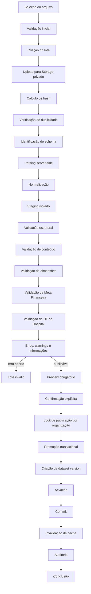

# Processo Oficial de Importação — Biosaúde Analytics 2.0

**Versão:** 1.0  
**Status:** Referência obrigatória; sem implementação  
**Referências:** [Especificação](../PROJECT_SPECIFICATION.md) · [Regras](../BUSINESS_RULES.md) · [Arquitetura](02_ARCHITECTURE.md) · [Banco](03_DATABASE.md)

## Índice

1. [Objetivo do documento](#1-objetivo-do-documento)
2. [Princípios do processo](#2-princípios-do-processo)
3. [Visão geral do fluxo](#3-visão-geral-do-fluxo)
4. [Atores e permissões](#4-atores-e-permissões)
5. [Formatos de arquivo](#5-formatos-de-arquivo)
6. [Criação do lote](#6-criação-do-lote)
7. [Armazenamento do arquivo](#7-armazenamento-do-arquivo)
8. [Hash e duplicidade](#8-hash-e-duplicidade)
9. [Versionamento do schema](#9-versionamento-do-schema)
10. [Estrutura do arquivo](#10-estrutura-do-arquivo)
11. [Mapeamento de colunas](#11-mapeamento-de-colunas)
12. [Parsing](#12-parsing)
13. [Normalização](#13-normalização)
14. [Staging](#14-staging)
15. [Validação estrutural](#15-validação-estrutural)
16. [Validação de tipos](#16-validação-de-tipos)
17. [Validação de faturamento](#17-validação-de-faturamento)
18. [Validação de Meta Financeira](#18-validação-de-meta-financeira)
19. [Validação de UF do Hospital](#19-validação-de-uf-do-hospital)
20. [Resolução de dimensões](#20-resolução-de-dimensões)
21. [Erros e warnings](#21-erros-e-warnings)
22. [Resolução manual](#22-resolução-manual)
23. [Preview](#23-preview)
24. [Comparação com a versão ativa](#24-comparação-com-a-versão-ativa)
25. [Confirmação da publicação](#25-confirmação-da-publicação)
26. [Exclusão mútua e concorrência](#26-exclusão-mútua-e-concorrência)
27. [Promoção transacional](#27-promoção-transacional)
28. [Criação da dataset version](#28-criação-da-dataset-version)
29. [Ativação e cache](#29-ativação-e-cache)
30. [Rollback](#30-rollback)
31. [Falhas e recuperação](#31-falhas-e-recuperação)
32. [Processamento assíncrono](#32-processamento-assíncrono)
33. [Observabilidade](#33-observabilidade)
34. [Segurança](#34-segurança)
35. [Relatório de erros](#35-relatório-de-erros)
36. [Modelo de planilha](#36-modelo-de-planilha)
37. [Testes do processo](#37-testes-do-processo)
38. [Decisões do processo](#38-decisões-do-processo)
39. [Decisões pendentes](#39-decisões-pendentes)
40. [Restrições](#40-restrições)
41. [Critérios de aceite](#41-critérios-de-aceite)

## 1. Objetivo do documento

Este documento define o processo oficial de recepção, validação, staging,
publicação, versionamento e rollback das bases comerciais. Ele concretiza o fluxo
do [`PROJECT_SPECIFICATION.md`](../PROJECT_SPECIFICATION.md), preserva os
invariantes de [`BUSINESS_RULES.md`](../BUSINESS_RULES.md), obedece às camadas e
controles de [`02_ARCHITECTURE.md`](02_ARCHITECTURE.md) e utiliza o modelo físico
definido em [`03_DATABASE.md`](03_DATABASE.md), sem alterá-los.

O processo preserva a versão ativa até uma promoção integralmente bem-sucedida,
valida antes de publicar, rastreia arquivo/lote/linha/ator, admite rollback não
destrutivo e impede publicações concorrentes. Valores inválidos, metas duplicadas
e divergências de UF do Hospital nunca entram silenciosamente na base oficial.

**Este documento define processo e contratos conceituais; não implementa código,
API, banco, migration, autenticação, job ou processamento nesta etapa.**

## 2. Princípios do processo

- Selecionar arquivo nunca publica dados diretamente.
- Arquivo original é imutável, privado, vinculado ao lote e identificado por
  hash.
- Todo lote tem organização, ator, request ID, status e timestamps.
- Parsing, normalização confiável e validação ocorrem no servidor.
- Linhas passam por staging isolado antes de serem oficiais.
- Erros e warnings são separados; informação é uma terceira severidade de
  relatório.
- Preview e confirmação explícita são pré-condições da publicação.
- Promoção é transacional e serializada por organização.
- A versão ativa muda apenas após sucesso total; a anterior é preservada.
- Rollback é transacional, auditado e não destrutivo.
- Ações e decisões críticas são auditadas.
- Conversão inválida ou correção silenciosa é proibida.
- Ausência não vira zero; zero explícito permanece zero.
- Meta Financeira não é duplicada, replicada ou distribuída.
- UF do Hospital não é inferida de outra dimensão.

## 3. Visão geral do fluxo

Cada seta representa uma transição verificável; atalhos são proibidos. Falha
antes do commit mantém a versão ativa. Cache só é invalidado após commit.

## 4. Atores e permissões

A matriz detalhada permanece sujeita à aprovação de RBAC; o mínimo seguro é:

| Ação | viewer | analyst | importer | admin |
|---|---:|---:|---:|---:|
| Ver histórico publicado autorizado | leitura limitada | sim | sim | sim |
| Iniciar upload | não | não | sim | sim |
| Disparar validação/revalidação | não | não | sim | sim |
| Confirmar publicação | não | não | conforme permissão aprovada | sim |
| Resolver pendência de mapeamento/dado | não | não | correções permitidas | sim |
| Executar rollback | não | não | não | sim |
| Baixar original | não | não | próprio/permitido | sim |
| Baixar relatório de erros | não | leitura autorizada | sim | sim |
| Acessar dado sensível | mínimo necessário | mínimo necessário | mínimo necessário | somente necessidade administrativa |

Validação automática é serviço, não privilégio humano. Correções que alterem
cadastro mestre, regra ou significado exigem admin ou novo arquivo, conforme
política. Toda autorização é revalidada no servidor e por RLS; ocultar controles
no cliente não autoriza operação. Downloads sensíveis são auditados.

## 5. Formatos de arquivo

| Formato | Situação inicial | MIME/assinatura esperados | Abas/codificação | Limitações e riscos |
|---|---|---|---|---|
| `.xlsx` | Candidato inicial preferencial, sujeito à aprovação do layout | MIME OOXML e contêiner ZIP/assinatura compatível; ambos validados | Múltiplas abas; strings/valores conforme OOXML | ZIP bomb, fórmulas, corrupção, macros/objetos e alto uso de memória. |
| `.xls` | Não aprovado por padrão; somente compatibilidade justificada | MIME legado e assinatura OLE Compound File | Múltiplas abas; formato binário legado | Parser legado, segurança e ambiguidade de tipos. |
| `.csv` | Não aprovado até decisão oficial | MIME textual e conteúdo coerente; extensão insuficiente | Uma tabela; encoding e delimitador devem ser identificados/confirmados | Sem abas/tipos, locale e delimitador ambíguos. |

Extensão, MIME e assinatura devem concordar; extensão isolada nunca aprova. O
tamanho máximo está pendente. Arquivo corrompido ou protegido por senha gera erro
bloqueante e não é contornado. Senhas não serão coletadas nem armazenadas sem
política futura. Fórmulas, macros e conteúdo ativo não são executados.

## 6. Criação do lote

O `import_batch` é criado após autenticação/autorização e validação inicial de
nome, tamanho e formato, antes da custódia definitiva, para rastrear inclusive
falhas de upload. Recebe UUID, organização, solicitante, nome original,
`source_type`, status `pending`, request ID, timestamps, contadores zero e
metadados mínimos. Hash e `schema_version` são preenchidos tão logo calculados/
identificados, sem inventar valores provisórios.

| Status | Entrada e significado |
|---|---|
| `pending` | Lote criado; upload/hash ainda pode estar em curso. |
| `validating` | Arquivo íntegro em análise, parsing, staging ou revalidação. |
| `invalid` | Há erro bloqueante; pode voltar a `validating` por revalidação autorizada. |
| `ready` | Validação concluída, sem erro aberto, preview disponível. |
| `publishing` | Confirmação aceita e lock adquirido; promoção em curso. |
| `active` | Dataset criado e ativado com commit. |
| `superseded` | Outra versão substituiu a versão desse lote. |
| `failed` | Falha técnica terminal dessa tentativa. |
| `rolled_back` | Versão do lote deixou de ser ativa por rollback para outra. |

Somente transições desenhadas na máquina de estados do banco são válidas:
`pending→validating|failed`, `validating→invalid|ready|failed`,
`invalid→validating`, `ready→publishing`, `publishing→active|failed`,
`active→superseded|rolled_back` e `superseded→active` por rollback. Request ID
fica em auditoria/metadados correlacionados; sua persistência física final não
altera as colunas aprovadas sem revisão documental.

## 7. Armazenamento do arquivo

O original vai a bucket privado. Path conceitual contém escopo não adivinhável de
organização/lote/arquivo, sem usar nome fornecido como caminho confiável. O nome
interno é imutável; o original é preservado somente como metadado sanitizado.
Registra-se hash, MIME, tamanho, upload, usuário, schema e metadados permitidos.

- nenhuma URL pública permanente;
- download autenticado/autorizado, com URL assinada de prazo curto pendente;
- objeto não é alterado após upload; novo conteúdo gera novo arquivo/lote;
- original permanece ligado ao lote durante retenção, ainda pendente;
- arquivo nunca entra no Git, diretório público ou bundle da aplicação;
- acesso, download sensível e decisão de retenção são auditados.

## 8. Hash e duplicidade

Recomenda-se SHA-256 calculado server-side durante/apos upload sobre os bytes
exatos; algoritmo e digest são registrados. A checagem é por organização para
não vazar existência entre tenants.

Se o mesmo hash estiver ativo, o lote não publica automaticamente: informa a
duplicidade e exige cancelamento ou reprocessamento administrativo justificado.
Se já falhou, reprocessamento explícito cria/preserva tentativa rastreável, sem
reescrever o lote anterior. Toda decisão registra ator, motivo e request ID.

| Duplicidade | Definição | Controle |
|---|---|---|
| Arquivo | Mesmos bytes/hash na organização. | Detecção por hash e decisão explícita. |
| Lote | Tentativa repetida/idempotency key. | Retornar resultado existente, não criar efeitos duplos. |
| Linha | Mesma origem ou fingerprint canônico. | Detectar em staging; regra final pendente. |
| Meta | Mesma chave dimensional/granularidade/versão. | Checks e unique parcial por grão aprovado. |
| Faturamento | Mesmo evento/linha técnica. | Origem e fingerprint futuro; não somar silenciosamente. |

## 9. Versionamento do schema

`schema_version` identifica o contrato de planilha: abas/blocos, cabeçalhos,
campos obrigatórios/condicionais, aliases, tipos e semântica. Identificação
automática usa sinais inequívocos; ambiguidade exige confirmação antes do parsing
completo. Versão desconhecida é rejeitada. Modelos antigos suportados mantêm
parser/contrato próprios; migração nunca muda o original e produz representação
de staging rastreável.

| Versão | Status | Descrição | Compatibilidade |
|---|---|---|---|
| `1` (conceitual) | Pendente de aprovação | Layout inicial de faturamento e Meta Financeira descrito neste documento. | Não liberado até aprovação formal do modelo. |

Não há versão futura presumida. Cada versão terá documentação oficial de layout,
aliases, exemplos fictícios e janela de suporte.

## 10. Estrutura do arquivo

### Bloco de faturamento

Ano, Período, Trimestre, Mês, Data, GR, UF Comercial, Hospital, Código do
Hospital, CNPJ do Hospital, UF do Hospital, Representante, Assessor, Marca,
Tópico do Produto, Tipo do Produto, Cliente, UF do Cliente, Médico e Valor
Faturado.

### Bloco de Meta Financeira

Ano, Período, Trimestre, Mês, GR, UF Comercial, Hospital, Código do Hospital, UF
do Hospital, Representante, Marca, Tópico do Produto, Tipo do Produto e Meta
Financeira.

Ano e valor são obrigatórios nos respectivos blocos; as demais obrigatoriedades
dependem do schema e, para meta, da granularidade aprovada. Cabeçalhos devem ser
únicos e mapeáveis. Abas/blocos múltiplos somente são aceitos se o schema os
declarar, sem misturar tipos de linha implicitamente. Coluna integralmente vazia
não satisfaz campo obrigatório; linhas vazias são ignoradas mas contabilizadas
como informação quando relevante.

Fórmulas não são executadas: somente valor armazenado pode ser considerado após
validação; fórmula sem valor é erro. Célula mesclada em área de dados e cabeçalho
fora da posição prevista são bloqueantes ou pendentes de matriz, nunca
interpretados por adivinhação. Limites iniciais de abas, linhas, cabeçalho e
blocos dependem da aprovação do schema.

## 11. Mapeamento de colunas

Aliases somente pertencem à versão do schema. Conjunto conceitual inicial:

| Campo canônico | Aliases candidatos controlados |
|---|---|
| Ano | `Ano` |
| Período | `Período`, `Periodo` |
| Trimestre | `Trimestre` |
| Mês | `Mês`, `Mes` |
| Data | `Data`, `Data de Faturamento` |
| GR | `GR`, `Grupo Regional`, `Grupo Comercial` |
| UF Comercial | `UF Comercial`, `Estado Comercial` |
| Hospital | `Hospital`, `Nome do Hospital` |
| Código do Hospital | `Código do Hospital`, `Codigo Hospital` |
| CNPJ do Hospital | `CNPJ do Hospital`, `CNPJ Hospital` |
| UF do Hospital | `UF do Hospital`, `UF Hospital`, `Estado do Hospital` |
| Representante | `Representante` |
| Assessor | `Assessor` |
| Marca | `Marca` |
| Tópico do Produto | `Tópico do Produto`, `Topico do Produto`, `Tópico` |
| Tipo do Produto | `Tipo do Produto`, `Tipo de Produto` |
| Cliente | `Cliente` |
| UF do Cliente | `UF do Cliente`, `Estado do Cliente` |
| Médico | `Médico`, `Medico` |
| Valor Faturado | `Valor Faturado`, `Faturamento` |
| Meta Financeira | `Meta Financeira`, `Meta`, `Meta de Faturamento`, `Meta de Venda`, `Meta Comercial` |

Aliases são candidatos até aprovação do schema inicial. `UF` isolado nunca é UF
do Hospital quando há outras UFs. Ambiguidade exige confirmação; colunas
semanticamente diferentes não são escolhidas automaticamente. Mapeamento e
confirmação ficam no lote, aparecem no preview e podem causar rejeição antes do
parsing completo.

## 12. Parsing

O servidor lê o original, nunca dados “tratados” pelo navegador. Impõe limites
de memória/tempo e usa streaming quando o formato/biblioteca permitirem. Percorre
apenas abas declaradas e preserva aba, número de linha e valor original por
ocorrência.

Datas são interpretadas conforme schema/locale, inclusive serial de planilha com
epoch conhecido; números não perdem precisão; fórmulas não executam; célula vazia
vira ausência; `R$ 1.250.000,50` é analisado como decimal brasileiro. Toda
conversão falha explicitamente.

A biblioteca futura deve suportar formatos aprovados, limites/streaming,
segurança contra conteúdo ativo/ZIP bomb, leitura de valor armazenado de fórmula,
abas, locale, TypeScript/server runtime, manutenção e testes. Nenhuma biblioteca
é escolhida ou instalada agora.

## 13. Normalização

Permitido, preservando original e valor normalizado: trim, compactação de espaços,
UF em maiúsculas, CNPJ apenas com dígitos após validação, data em representação
canônica, separadores monetários conforme locale confirmado e nome normalizado
somente para pesquisa manual.

Proibido: fuzzy merge, abreviar nome, reduzir representante a inicial, deduzir
hospital/UF, corrigir valor silenciosamente, transformar ausência em zero ou
remover sinal financeiro. Original permanece disponível à trilha/relatório com
minimização de dado sensível.

## 14. Staging

Staging contém representação não oficial, isolada por organização e lote, com
origem, valores originais/normalizados, status de validação, dimensões resolvidas,
erros e warnings. Dashboard e exportação oficial nunca consultam staging.

Não há ativação parcial. Correções controladas criam representação corrigida sem
alterar original; revalidação integral ocorre antes de `ready`. Limpeza somente
após política de retenção e sem romper lote/relatório/auditoria. A forma física,
temporária ou híbrida do staging é decisão pendente baseada em volume, segurança
e retomada; nenhuma estrutura é criada agora.

## 15. Validação estrutural

Valida: legibilidade, formato/MIME/assinatura, schema, abas, cabeçalhos, colunas
obrigatórias/duplicadas, ambiguidades, blocos completos, arquivo não vazio,
presença dos blocos exigidos, tamanho, fórmula sem valor, mesclas e linhas fora do
padrão. Ausência de faturamento ou meta é avaliada conforme escopo declarado do
schema/lote, sem inventar zero.

- `error`: impede publicação;
- `warning`: exige visibilidade e eventual aceite, não necessariamente bloqueia;
- `information`: registra contexto sem pendência.

A matriz definitiva (inclusive mesclas, blocos opcionais e limites) está
pendente. Condição estrutural que impossibilite interpretação segura é sempre
bloqueante.

## 16. Validação de tipos

Datas devem existir; ano, trimestre e mês devem ser coerentes; números e dinheiro
usam decimal; UF pertence às 27 siglas; CNPJ tem estrutura válida; códigos/IDs
seguem contrato; obrigatórios não ficam vazios. Precisão excedente gera erro ou
política explícita, nunca arredondamento intermediário.

`R$ 1.250.000,50` vira exatamente o decimal correspondente. Vazio permanece
ausente; texto inválido é erro; zero explícito permanece zero; inválido nunca vira
zero. Meta negativa é erro. Sinal/estorno do faturamento permanece pendente.
Internamente não se usa float.

## 17. Validação de faturamento

Cada linha exige ano, valor parseável e origem (aba/linha); período/data seguem o
schema e devem ser coerentes. Dimensões oficiais podem ser opcionais conforme o
contrato, ficando ausentes, não sintetizadas. Linha sem valor é erro/informação
conforme ser linha de dados ou vazia; zero explícito é preservado. Negativo/
estorno não é decidido por suposição e bloqueia até política aprovada quando não
interpretável.

Duplicidade usa origem e fingerprint futuro; regra definitiva está pendente.
Hospital, cliente e médico são resolvidos por IDs/códigos oficiais e podem gerar
pendência. O fato publicado preserva lote, versão, aba e linha.

## 18. Validação de Meta Financeira

Meta é decimal exato com `amount >= 0`, ano, lote, origem e granularidade
identificável. Período e dimensões devem ser exatamente coerentes com o grão.
Ausente difere de zero; zero explícito é válido. Chave dimensional canônica e
unique parcial por granularidade aprovada detectam duplicata.

São candidatos a validação: anual geral, trimestral, mensal, por GR,
representante, UF do Hospital, hospital, marca, tópico e tipo; combinações
somente quando formalmente aprovadas. Período e UF Comercial seguem dimensões
oficiais, mas sua participação em grãos depende da mesma validação de negócio.

É proibido distribuir, replicar, converter silenciosamente ou juntar meta linha a
linha com faturamento. Grão desconhecido gera erro, lista dimensões presentes,
impede publicação e exige decisão de negócio.

## 19. Validação de UF do Hospital

Normaliza-se para duas letras maiúsculas e valida-se contra `AC, AL, AP, AM, BA,
CE, DF, ES, GO, MA, MT, MS, MG, PA, PB, PR, PE, PI, RJ, RN, RS, RO, RR, SC, SP,
SE, TO`. Cidade ou múltiplos valores não são UF válida. Hospital resolvido por
código/CNPJ/ID deve ter a mesma UF do cadastro mestre.

Não se infere de UF do Cliente, UF Comercial ou GR. Divergência registra valor
recebido/esperado, hospital, aba, linha e coluna; recebe severidade conforme
política futura, requer resolução controlada e audita ator/decisão. Código e CNPJ
divergentes do mesmo hospital também impedem resolução automática.

## 20. Resolução de dimensões

Para hospital, representante, assessor, cliente, médico, marca, tópico, tipo e
GR, a ordem é: ID/código externo; CNPJ quando aplicável; chave oficial disponível;
nome oficial exato; nome normalizado apenas como apoio à pesquisa manual.

Fuzzy matching, abreviação, primeiro nome, iniciais, consolidação silenciosa e
criação automática são proibidos. Sem correspondência única, cria-se pendência
com candidatos permitidos, origem e motivo. Importer propõe resolução dentro de
sua permissão; admin confirma cadastro/alteração sensível; staging recebe a
referência, é revalidado e a decisão é auditada. Ambiguidade não resolvida impede
`ready` quando necessária ao dado.

## 21. Erros e warnings

Error bloqueia; warning não bloqueia necessariamente; information apenas informa.
A política final de severidade/aceite será aprovada antes da implementação.
Ocorrência registra código, mensagem segura, aba, linha, coluna, recebido,
esperado, entidade, severidade, resolução, usuário, data e observação.

Categorias iniciais (códigos definitivos pendentes): arquivo/segurança, schema,
estrutura, tipo/formato, valor financeiro, período, dimensão não resolvida,
hospital/UF, duplicidade de linha, duplicidade/granularidade de meta, integridade,
concorrência e falha técnica. Dados sensíveis são minimizados.

## 22. Resolução manual

Importer pode corrigir mapeamentos/representações permitidas; admin é exigido
para cadastro mestre, override excepcional aprovado, papel ou decisão sensível.
Correção massiva, sem evidência, que altere significado ou regra exige novo
arquivo ou decisão documental.

Original é imutável. Staging ganha representação corrigida com before/after,
comentário obrigatório, ator, instante e vínculo à ocorrência. Toda correção é
auditada e dispara revalidação afetada e reconciliação; edição silenciosa é
proibida.

## 23. Preview

Preview é obrigatório e mostra:

- arquivo, hash, schema, linhas totais/válidas, erros e warnings;
- totais de faturamento e Meta Financeira, sem arredondamento de cálculo;
- quantidade de hospitais e UFs do Hospital;
- hospitais não resolvidos, divergências de UF, metas duplicadas/sem grão;
- comparação com ativa: total e variações por GR, UF do Hospital, hospital,
  representante, marca e tópico.

Deve explicar o que a nova versão substituirá, o que não será alterado, que a
ativa permanece segura até commit, limitações e dados ausentes. Preview não
autoriza sozinho e usa os mesmos resultados reconciliados da promoção.

## 24. Comparação com a versão ativa

Compara linhas, faturamento, meta, dimensões adicionadas/removidas, hospitais
novos/ausentes, UFs alteradas, variação percentual e mudanças relevantes. A
comparação usa grãos compatíveis e distingue ausência de zero.

Variação não bloqueia automaticamente sem política formal. Thresholds, baseline
quando não há ativa e severidade das mudanças ficam pendentes; resultados são
registrados no preview/auditoria da confirmação.

## 25. Confirmação da publicação

Somente lote `ready`, usuário autorizado e confirmação explícita sobre resumo
atual. O comando leva request ID e idempotency key, adquire bloqueio por
organização, relê status/contagens/erros e impede dupla submissão. Não confia no
frontend nem em preview antigo; mudança invalida a confirmação. Tentativa,
resultado e resumo são auditados.

## 26. Exclusão mútua e concorrência

O objetivo é uma publicação ou rollback mutante por organização, nenhum par de
lotes em `publishing`, uma versão ativa e idempotência recuperável. Lock tem dono,
escopo, timeout/recuperação seguros e liberação em falha.

| Alternativa | Benefício | Risco/limite |
|---|---|---|
| Advisory lock PostgreSQL | Transacional e por chave de organização | Disciplina de conexão/chave. |
| Linha/tabela de lock | Estado observável | Limpeza, contenção e stale lock. |
| Constraint | Garante estado único | Sozinha não serializa todo o processo. |
| Fila por organização | Ordenação e retry | Infraestrutura/latência. |
| Função transacional | Centraliza invariantes | Limites de duração e acoplamento. |

Índice unique de versão ativa permanece última barreira. Mecanismo físico
definitivo será decidido com runtime/volume; não é escolhido aqui.

## 27. Promoção transacional

Fluxo: revalidar lote; adquirir lock; iniciar transação; criar
`dataset_version`; inserir/associar fatos e metas provenientes do staging;
verificar contagens, totais, FKs, unicidade e organização; marcar nova ativa;
desativar anterior; registrar auditoria transacional; commit; só então invalidar
cache e finalizar.

Em falha, toda transação reverte, anterior continua ativa, lote vai a `failed`
quando a máquina permitir, lock é liberado, erro seguro/auditoria são registrados
e não existe ativação parcial. Falha após commit (por exemplo cache) não reverte
dados já consistentes; é recuperada idempotentemente e alertada.

## 28. Criação da dataset version

A versão recebe número monotônico por organização, `organization_id`, lote,
status, ativação/ator e vínculo de origem de rollback quando aplicável. A versão
anterior é identificada na auditoria e preservada; não precisa ser copiada ou
apagada. Unique parcial e transação garantem uma ativa por organização. Fatos e
metas apontam tanto à versão quanto ao lote.

## 29. Ativação e cache

Ativação torna-se visível atomicamente no commit. Cache é segregado por
organização, versão, filtros e escopo; publicação/rollback invalida namespace
antigo depois do commit. Resposta antiga não é rotulada como atual, versões não
se misturam e dado parcial não aparece. Não há polling integral: status é
consultado pontualmente/invalidation-driven. Dashboard sempre resolve a versão
ativa no servidor.

## 30. Rollback

Rollback é exclusivo de admin, idempotente e concorrente com nenhuma publicação.
Somente versão íntegra da mesma organização pode ser reativada. Atual, arquivos,
lotes e histórico não são apagados; registra-se origem, alvo, ator, motivo e
resultado. Não se reconstrói dado manualmente. Falha antes do commit preserva a
ativa.

## 31. Falhas e recuperação

| Falha | Estado/ação | Retry e preservação |
|---|---|---|
| Upload interrompido/Storage indisponível | `pending` ou `failed`, mensagem segura | Retomar/repetir com idempotência; ativa intocada. |
| Corrompido, assinatura/MIME inválidos | `invalid` | Novo arquivo; sem retry cego. |
| Hash falhou | `failed` | Retry técnico idempotente; não parsear sem hash. |
| Parsing, timeout ou memória | `failed` | Retry controlado/assíncrono; original preservado. |
| Validação encontrou erro | `invalid` | Corrigir staging permitido ou novo arquivo e revalidar. |
| Banco indisponível | estado anterior seguro/`failed` | Retry com idempotency key; ativa preservada. |
| Lock indisponível | `ready`, sem promoção | Retry com backoff; não marcar `publishing` indevidamente. |
| Promoção/ativação falhou | `failed` após rollback transacional | Retry exige nova confirmação/política; ativa anterior. |
| Cache falhou após commit | versão nova continua ativa | Retry de invalidação, alerta; nunca rollback implícito. |
| Rollback falhou | ativa atual permanece | Retry admin idempotente, auditoria e alerta. |

Toda categoria gera request/batch ID, mensagem sem segredo, log, métrica e
auditoria quando crítica. Política detalhada de retries permanece pendente.

## 32. Processamento assíncrono

Será adotado quando tamanho, duração, memória, timeout, volume ou concorrência
excederem limites síncronos medidos.

| Opção | Uso conceitual | Limite |
|---|---|---|
| Serverless síncrona | Arquivo pequeno/previsível | Timeout e memória. |
| Background job | Trabalho longo desacoplado | Requer executor e estado. |
| Fila | Backpressure, ordem e retry | Operação adicional. |
| Worker | Controle de recursos/streaming | Infraestrutura dedicada. |
| Edge Function | Validação leve próxima ao ingresso | Não ideal para parsing pesado. |
| Serviço externo | Workload especializado | Segurança, custo e governança. |

Sem dados de volume não há escolha definitiva. Qualquer opção usa lote como
estado, idempotência, isolamento e observabilidade.

## 33. Observabilidade

Métricas: duração de upload, parsing, validação e publicação; linhas; erros,
warnings, falhas e retries; espera/conflito de locks; rollbacks; totais financeiros
de controle e divergências. Totais em telemetria devem ser protegidos e agregados
conforme necessidade.

Logs estruturados levam request ID, batch ID, organização pseudonimizada,
operação, etapa, status, duração e código de erro. Não registram arquivo, célula,
PII, token ou segredo desnecessário. Alertas cobrem lote travado, falhas repetidas,
latência, inconsistência e rollback/publicação falhos.

## 34. Segurança

- Supabase Auth, RBAC server-side e RLS no banco;
- menor privilégio e segregação por organização em banco/cache/Storage;
- bucket privado e URL assinada curta para download autorizado;
- validação conjunta de extensão, MIME, assinatura, tamanho e estrutura;
- proteção contra conteúdo ativo, malware, ZIP bomb e nomes/path maliciosos;
- rate limit por usuário/organização/operação e validação de origem/CSRF;
- service role somente no servidor, nunca no bundle;
- auditoria de upload, download, resolução, confirmação, publicação e rollback.

Limite, scanner e prazo da URL dependem de decisão futura; ausência dessas
definições impede liberação em produção, não autoriza padrão inseguro.

## 35. Relatório de erros

Exportação contém lote, arquivo, aba, linha, coluna, código, severidade, mensagem,
recebido/esperado minimizados, status e observação. Usa snapshot/versionamento do
relatório para rastreabilidade.

Download respeita organização/perfil, não contém segredos ou dados excessivos e
é auditado quando sensível. Valores originais são incluídos apenas quando
necessários à correção e permitidos pela política de dados.

## 36. Modelo de planilha

Modelo oficial futuro informa `schema_version`, abas/blocos, cabeçalhos canônicos,
exemplos fictícios, formatos de data/dinheiro, obrigatórios, condicionais e
instruções. O arquivo e sua documentação são versionados juntos; usuário baixa a
versão suportada.

Nenhum dado real entra no modelo/repositório. **Nenhum Excel é criado nesta
etapa.** Abas e layout final dependem da aprovação do schema conceitual inicial.

## 37. Testes do processo

São obrigatórios testes de arquivo válido; formato/MIME/assinatura inválidos;
corrompido/duplicado; schema incompatível; coluna ausente/duplicada/ambígua; data
e dinheiro inválidos; zero e ausência distintos; meta duplicada/grão inválido;
hospital não encontrado; UF inválida/divergente; arquivo protegido; fórmula sem
valor; isolamento de organização; permissões e downloads.

Também: publicação concorrente, dupla submissão/idempotência, lock, falha em cada
passo transacional, contagens/totais, ativação única, cache pós-commit, rollback
íntegro, auditoria, retry e preservação da versão ativa. Testes de reconciliação
provam ausência de multiplicação da meta.

## 38. Decisões do processo

| ID | Decisão | Motivo | Alternativas | Consequências |
|---|---|---|---|---|
| IMP-001 | Parsing/validação server-side. | Segurança e consistência. | Confiar no navegador. | Limites e recursos no servidor. |
| IMP-002 | Storage privado. | Proteger base original. | URL pública/bundle. | Download assinado/autorizado. |
| IMP-003 | Hash do original. | Integridade e duplicidade. | Nome/tamanho. | SHA-256 recomendado e auditável. |
| IMP-004 | Staging obrigatório. | Isolar dado não validado. | Publicar ao parsear. | Dashboard não o acessa. |
| IMP-005 | Preview obrigatório. | Consentimento informado. | Confirmação cega. | Resumo reconciliado antes do comando. |
| IMP-006 | Promoção transacional. | Evitar parcialidade. | Etapas autocommit. | Falha preserva ativa. |
| IMP-007 | Dataset versionado. | Histórico/cache/rollback. | Sobrescrita. | Toda consulta resolve ativa. |
| IMP-008 | Rollback não destrutivo. | Auditoria e recuperação. | Restaurar apagando atual. | Versões/lotes preservados. |
| IMP-009 | Erros e warnings separados. | Bloqueio e decisão claros. | Lista única. | Política de severidade pendente. |
| IMP-010 | Resolução manual auditada. | Ambiguidade sem inferência. | Correção silenciosa. | Before/after e revalidação. |
| IMP-011 | UF do Hospital não inferida. | Dimensão física oficial. | Cliente/comercial/GR. | Divergência vira ocorrência. |
| IMP-012 | Meta sem distribuição. | Respeitar granularidade. | Rateio automático. | Grão desconhecido bloqueia. |
| IMP-013 | Lock por organização. | Impedir corrida. | Concorrência otimista isolada. | Mecanismo físico pendente. |
| IMP-014 | Idempotência em comandos críticos. | Evitar efeito duplo. | Confiar no botão. | Chave e resultado persistidos. |
| IMP-015 | Cache invalidado pós-ativação. | Consistência transacional. | Invalidar antes/polling integral. | Retry separado se cache falhar. |

## 39. Decisões pendentes

Não serão resolvidas por suposição:

1. tamanho máximo de arquivo, linha e aba;
2. aprovação final de `.xlsx`, `.xls` e `.csv`;
3. biblioteca de parsing;
4. volume e concorrência esperados;
5. síncrono versus assíncrono e executor;
6. retenção de original, staging e relatórios;
7. thresholds de comparação/alerta;
8. matriz error/warning/information;
9. fingerprint/deduplicação do faturamento;
10. tratamento de valores negativos e estornos;
11. matriz detalhada de permissões e dados sensíveis;
12. mecanismo físico de lock;
13. estratégia, limites e backoff de retry;
14. prazo de URLs assinadas;
15. política de exclusão/anonimização de staging;
16. schema inicial, abas, campos condicionais e aliases aprovados;
17. granularidades/combinações reais de Meta Financeira;
18. scanner de malware e política para arquivos protegidos.

## 40. Restrições

É proibido:

- publicação direta ou sem preview/confirmação;
- parsing confiado apenas ao navegador;
- arquivo público, no Git ou no bundle;
- service role no cliente;
- apagar base ativa antes do sucesso ou ativar parcialmente;
- converter ausência em zero ou corrigir valor silenciosamente;
- inferir UF do Hospital;
- distribuir, replicar ou duplicar Meta Financeira;
- fuzzy matching/consolidação automática;
- dois lotes publicados simultaneamente na organização;
- rollback destrutivo ou reconstrução manual;
- editar/sobrescrever o arquivo original;
- ignorar erro crítico ou transição inválida;
- dashboard/export oficial consultando staging;
- join linha a linha que multiplique meta;
- reutilizar cache entre organizações ou versões.

## 41. Critérios de aceite

- [x] consistente com especificação, regras, arquitetura e banco;
- [x] nenhuma regra aprovada alterada;
- [x] índice e diagramas Mermaid estruturados;
- [x] fluxo, atores, formatos, schema, estrutura e mapeamento documentados;
- [x] parsing, normalização, staging e validações documentados;
- [x] Meta Financeira e UF do Hospital protegidas;
- [x] erros, resolução, preview e comparação documentados;
- [x] confirmação, concorrência, promoção, versão, cache e rollback definidos;
- [x] falhas, assíncrono, observabilidade, segurança, relatório e testes definidos;
- [x] decisões e pendências explícitas;
- [x] nenhum código, API, migration, componente, rota, autenticação ou job criado.

Este documento encerra somente a definição documental. Implementação depende de
validação manual e resolução formal das decisões pendentes.
