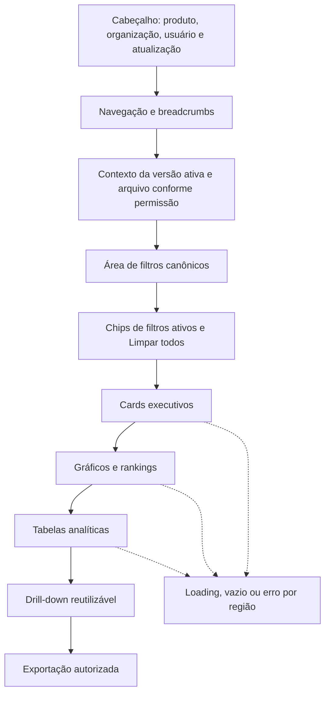

# Especificação Oficial do Dashboard — Biosaúde Analytics 2.0

**Versão:** 1.0  
**Status:** Especificação funcional, analítica e visual; sem implementação  
**Referências:** [Especificação](../PROJECT_SPECIFICATION.md) · [Regras](../BUSINESS_RULES.md) · [Arquitetura](02_ARCHITECTURE.md) · [Banco](03_DATABASE.md) · [Importação](04_IMPORT_PROCESS.md)

## Índice

1. [Objetivo do documento](#1-objetivo-do-documento)
2. [Princípios do dashboard](#2-princípios-do-dashboard)
3. [Público e casos de uso](#3-público-e-casos-de-uso)
4. [Estrutura geral da interface](#4-estrutura-geral-da-interface)
5. [Navegação](#5-navegação)
6. [Contexto da base ativa](#6-contexto-da-base-ativa)
7. [Contrato canônico de filtros](#7-contrato-canônico-de-filtros)
8. [Comportamento geral dos filtros](#8-comportamento-geral-dos-filtros)
9. [Filtro UF do Hospital](#9-filtro-uf-do-hospital)
10. [Controles derivados de Meta Financeira](#10-controles-derivados-de-meta-financeira)
11. [Indicadores oficiais](#11-indicadores-oficiais)
12. [Cards executivos](#12-cards-executivos)
13. [Tratamento visual dos indicadores](#13-tratamento-visual-dos-indicadores)
14. [Gráficos obrigatórios](#14-gráficos-obrigatórios)
15. [Evolução por período](#15-evolução-por-período)
16. [Gráficos de UF do Hospital](#16-gráficos-de-uf-do-hospital)
17. [Rankings](#17-rankings)
18. [Tabelas analíticas](#18-tabelas-analíticas)
19. [Drill-down](#19-drill-down)
20. [Colunas financeiras do drill-down](#20-colunas-financeiras-do-drill-down)
21. [Status da Meta Financeira](#21-status-da-meta-financeira)
22. [Granularidade da meta na interface](#22-granularidade-da-meta-na-interface)
23. [Estados de carregamento](#23-estados-de-carregamento)
24. [Estados vazios](#24-estados-vazios)
25. [Estados de erro](#25-estados-de-erro)
26. [Tooltips](#26-tooltips)
27. [Formatação](#27-formatação)
28. [Exportações](#28-exportações)
29. [URL e estado compartilhável](#29-url-e-estado-compartilhável)
30. [Responsividade](#30-responsividade)
31. [Acessibilidade](#31-acessibilidade)
32. [Design system](#32-design-system)
33. [Performance do dashboard](#33-performance-do-dashboard)
34. [Cache e atualização](#34-cache-e-atualização)
35. [Segurança e privacidade](#35-segurança-e-privacidade)
36. [Testes do dashboard](#36-testes-do-dashboard)
37. [Datasets de referência](#37-datasets-de-referência)
38. [Reconciliação](#38-reconciliação)
39. [Telemetria e observabilidade](#39-telemetria-e-observabilidade)
40. [Decisões do dashboard](#40-decisões-do-dashboard)
41. [Decisões pendentes](#41-decisões-pendentes)
42. [Restrições](#42-restrições)
43. [Critérios de aceite](#43-critérios-de-aceite)

## 1. Objetivo do documento

Este documento especifica o produto analítico usado por Diretoria, Gerência
Comercial, analistas e perfis operacionais autorizados. Ele traduz o
[`PROJECT_SPECIFICATION.md`](../PROJECT_SPECIFICATION.md), preserva os invariantes
de [`BUSINESS_RULES.md`](../BUSINESS_RULES.md), respeita as camadas de
[`02_ARCHITECTURE.md`](02_ARCHITECTURE.md), consulta o modelo versionado de
[`03_DATABASE.md`](03_DATABASE.md) e somente apresenta dados publicados pelo
processo de [`04_IMPORT_PROCESS.md`](04_IMPORT_PROCESS.md).

Cards, gráficos, rankings, tabelas, drill-downs e exportações devem reconciliar no
mesmo escopo, filtros e versão. Meta Financeira conserva granularidade; UF do
Hospital permanece distinta de UF Comercial e UF do Cliente.

**Esta etapa documenta o produto analítico; não implementa interface, componente,
rota, API, query, migration, gráfico ou código.**

## 2. Princípios do dashboard

- Cada indicador tem uma fonte de verdade e fórmula única no Domain.
- Frontend, gráfico e tabela não recalculam fórmula financeira.
- Cards, gráficos, rankings, tabelas e exports reconciliam.
- Todo consumidor usa o contrato canônico de filtros.
- Ausência é diferente de zero; nenhum dos dois é inventado.
- Meta Financeira só responde às dimensões de sua granularidade.
- UF do Hospital é uma dimensão física independente.
- Resultado anterior é removido ao carregar escopo novo ou vazio.
- `Infinity` e `NaN` nunca são apresentados.
- Não há estimativa, interpolação ou distribuição implícita.
- Cálculo decimal não arredonda internamente; apresentação pode arredondar.
- Clareza executiva não elimina rastreabilidade a versão, lote e origem.

## 3. Público e casos de uso

| Público | Objetivo/informação | Detalhamento e ações | Limitações e risco |
|---|---|---|---|
| Diretoria | Visão consolidada de FY, meta, cobertura e tendências. | Cards, comparações, gráficos executivos e drill-down autorizado. | Menor detalhe pessoal; risco de inferência comercial/PII em recortes pequenos. |
| Gerência Comercial | Acompanhar GR, representantes, hospitais, marcas e desvios. | Filtros, rankings, tabelas e exportação conforme papel. | Não administra/importa sem papel; risco de exposição entre equipes. |
| Analistas | Reconciliar indicadores e explorar dimensões. | Drill-down paginado, filtros combinados e exportação autorizada. | Sem alterar fontes/regras; PII minimizada. |
| Importadores | Verificar impacto da base publicada e histórico permitido. | Consultar versão, lote e comparação; importação fica em outro módulo. | Não obtém privilégio analítico/admin automático. |
| Administradores | Operar contexto, permissões e auditoria. | Acesso administrativo autorizado e rastreável. | Menor privilégio continua válido; exportação sensível é auditada. |

Diretoria e Gerência são públicos funcionais; o acesso técnico continua pelos
papéis `viewer`, `analyst`, `importer` e `admin` e pela organização.

## 4. Estrutura geral da interface

Cabeçalho/navegação estabelecem contexto; versão e atualização permanecem
visíveis; filtros e chips antecedem resultados; cards resumem; gráficos/rankings
explicam; tabelas/drill-down detalham; exportação preserva o mesmo escopo. Cada
região possui loading, vazio e erro sem reutilizar dado antigo.

## 5. Navegação

`Dashboard Executivo` e `Análises` pertencem ao módulo dashboard. `Importações`,
`Histórico`, `Hospitais`, `Auditoria`, `Administração` e `Configurações` são
entradas para módulos próprios, embora possam receber contexto autorizado.

Desktop usa navegação lateral ou superior persistente; tablet usa navegação
compacta; celular usa menu acessível e fechado por padrão. Breadcrumbs mostram
hierarquia e são operáveis por teclado. Navegação interna entre executivo,
análise e drill-down preserva filtros canônicos e histórico; entrada em outro
módulo não transmite filtro incompatível. Voltar restaura URL/scroll quando
seguro. URLs compartilháveis reproduzem filtros após autenticação, nunca dados ou
credenciais.

## 6. Contexto da base ativa

Uma faixa contextual exibe versão, data de ativação, responsável, nome do arquivo
conforme permissão, quantidade de registros, status e última atualização.
Ativação recente recebe texto e instante; “desatualizada” só aparece com critério
formal ainda pendente. Sem versão ativa, todos os resultados ficam vazios e há
orientação segura.

Toda resposta inclui a versão consultada. Se a ativa mudar, consultas/cache do
namespace antigo são cancelados/invalidados e a interface mostra troca em curso;
nenhum componente combina versões. Após revalidação, todos os blocos usam o novo
contexto. Arquivo/ator podem ser ocultados por permissão sem remover versão e
data.

## 7. Contrato canônico de filtros

Todos os filtros são validados no servidor e serializados por identificadores
estáveis. “Todos” significa ausência do parâmetro, não uma lista materializada.

| Filtro | Tipo/seleção/pesquisa | Dependências e impacto | URL/vazio/restrições |
|---|---|---|---|
| Ano | temporal; única; sem pesquisa | Restringe faturamento/meta e trimestre/mês. | `year`; obrigatório quando a análise exigir; ano sem dado fica vazio. |
| Trimestre | temporal; múltipla; sem pesquisa | Depende de ano; meta somente se grão compatível. | `quarter` ordenado; 1–4; combinação coerente. |
| Mês | temporal; múltipla; pesquisa opcional | Depende de ano/trimestre; meta mensal compatível. | `month` ordenado; 1–12; sem extrapolar grão. |
| GR | UUID; múltipla; pesquisável | Restringe fatos/opções; meta só se GR integra grão. | `gr`; vazio explícito; não é UF. |
| UF Comercial | sigla; múltipla; pesquisável | Restringe dimensão comercial; meta se compatível. | `commercialState`; UF oficial; distinta das outras UFs. |
| Hospital | UUID; múltipla; pesquisável | Depende de organização/UF Hospital; meta por hospital compatível. | `hospital`; não usar nome; incompatível é removido com aviso. |
| UF do Hospital | sigla; múltipla; pesquisável | Restringe hospitais/fatos; meta somente no grão correspondente. | `hospitalState`; UF oficial; independente. |
| UF do Cliente | sigla; múltipla; pesquisável | Restringe clientes/fatos; não substitui UF Hospital. | `customerState`; meta incompatível fica limitada. |
| Representante | UUID; múltipla; pesquisável | Restringe fatos/opções; meta por representante compatível. | `representative`; identificador estável. |
| Assessor | UUID; múltipla; pesquisável | Restringe fatos/opções; não há meta por assessor presumida. | `advisor`; meta pode ficar incompatível. |
| Marca | UUID; múltipla; pesquisável | Restringe fatos; meta por marca compatível. | `brand`; identificador estável. |
| Tópico do produto | UUID; múltipla; pesquisável | Restringe fatos; meta por tópico compatível. | `topic`; não confundir com tipo. |
| Tipo do produto | UUID; múltipla; pesquisável | Restringe fatos; meta por tipo compatível. | `productType`; não confundir com tópico. |
| Cliente | UUID; múltipla; pesquisável | Depende da organização/UF Cliente; sem grão de meta aprovado. | `customer`; pode limitar meta. |
| Médico | UUID; múltipla; pesquisável | Restringe fatos; PII e sem grão de meta presumido. | `physician`; permissão e privacidade. |
| Controles de meta | derivado; múltipla conforme controle; pesquisável nos valores | Domain filtra presença, status, faixa ou valor no grão válido. | `targetStatus`, `coverageBand`, `targetMin/Max`; não é dimensão física. |

Todas as seleções admitem “Todos” quando semanticamente aplicável. Opções dos
demais filtros são recalculadas no mesmo escopo, sem ocultar seleção ativa; uma
seleção inválida é sinalizada, não reinterpretada.

## 8. Comportamento geral dos filtros

Filtros são combinados por interseção e enviados como contrato normalizado ao
backend. Chips visíveis permitem remoção individual e “Limpar todos”; URL é fonte
restaurável do estado compartilhável. Opções dependentes revalidam sem criar
loops e consultas antigas são canceladas/invalidadas.

Combinação impossível mostra estado próprio e ação de limpar. Resultado vazio
remove todos os números/gráficos anteriores. Filtro incompatível com meta produz
limitação explícita; nunca é ignorado ou aproximado. Nenhum componente apresenta
outro escopo. Controles, chips, listas e remoção são acessíveis por teclado e
leitor de tela.

## 9. Filtro UF do Hospital

É multisseleção pesquisável das 27 siglas oficiais, com “Todas”. É independente
de UF Comercial, UF do Cliente e GR. Selecioná-lo atualiza hospitais e opções
relacionadas segundo dados disponíveis, sem exibir hospital cuja UF física seja
incompatível.

Faturamento é filtrado pela UF validada de `Hospitals`. Meta só é filtrada se UF
do Hospital integrar a granularidade; caso contrário, indicadores mostram aviso
de incompatibilidade/limitação. Hospital + UF incompatíveis geram combinação
impossível, nunca relaxamento. Estado vazio remove resultados. Drill-down e
exportação carregam exatamente as UFs selecionadas e a granularidade.

É proibido inferir ou substituir UF do Hospital por UF do Cliente, UF Comercial
ou GR.

## 10. Controles derivados de Meta Financeira

Controles oficiais de presença: com meta cadastrada e sem meta cadastrada.
Controles de atingimento: abaixo de 50%; 50%–79,99%; 80%–99,99%;
100%–109,99%; e >=110%. Controles monetários: valor mínimo/máximo. Controles de
status: abaixo da meta, atingida e superada.

São projeções calculadas pelo Domain após agregação, não dimensões físicas comuns.
Respeitam período/granularidade e usam a fórmula oficial de cobertura. Meta
ausente não é zero; meta zero não tem denominador válido e não entra em faixa de
cobertura. Sobreposição entre faixas é proibida e limites são avaliados com valor
decimal interno, não valor visual arredondado.

## 11. Indicadores oficiais

Notação: `F25` e `F26` são somas decimais do faturamento efetivo no FY e escopo;
`M26` é a soma compatível da Meta Financeira 2026. `N/A` é estado, não número.
As fórmulas abaixo centralizam a interpretação dos indicadores solicitados; se
conflitarem com regra formal posterior, a governança exige atualizar os três
documentos normativos antes da implementação.

### Contrato comum

Filtros aplicáveis são os presentes no faturamento e, para operações com meta,
os compatíveis com sua granularidade. Filtro não aplicável não é ignorado:
resultado de meta fica limitado/N/A. Negativo em faturamento depende da política
de estornos pendente; não é corrigido. Tooltip informa fórmula, escopo, grão,
versão e estados. Drill-down/export usam agregados oficiais. Reconciliação compara
o indicador com soma independente do mesmo escopo, sem arredondamento.

| Indicador | Definição/fórmula | Unidade e granularidade | Ausência/zero | Visual, drill-down e export |
|---|---|---|---|---|
| FY 2025 | `F25 = Σ faturamento efetivo com ano 2025` | BRL; grão dos filtros/fatos. | Sem fatos = ausência, não zero; zero explícito = BRL 0. | Card/série; abre fatos 2025; exporta total e origem. |
| FY 2026 | `F26 = Σ faturamento efetivo com ano 2026` | BRL; grão dos filtros/fatos. | Igual FY 2025. | Card/série; abre fatos 2026. |
| Meta Financeira 2026 | `M26 = Σ metas 2026 após compatibilizar o grão` | BRL; grão formal da meta. | Ausente = não cadastrada; zero = cadastrada com zero. | Card/série compatível; detalhe de metas, nunca fatos replicados. |
| Cobertura 2026 | `(F26 / M26) × 100` quando `M26 > 0` e compatível | Percentual; grão comum. | Meta ausente/zero/incompatível = N/A; faturamento zero com meta positiva = 0%. | Card/faixas; abre comparação agregada. |
| Diferença para meta | `F26 - M26` quando meta existe e é compatível | BRL; grão comum. | Meta ausente/incompatível = N/A; meta zero mantém cálculo, sem cobertura. | Valor sinalizado com contexto, não “pendência”. |
| Saldo para atingir meta | `max(M26 - F26, 0)` quando compatível | BRL; grão comum. | Ausente/incompatível = N/A; zero pode resultar zero. | Card/contexto; nunca despesa ou pendência financeira. |
| Excedente sobre meta | `max(F26 - M26, 0)` quando compatível | BRL; grão comum. | Ausente/incompatível = N/A; meta zero mantém semântica monetária. | Card opcional/detalhe/drill-down; decisão visual pendente. |
| Diferença 2025/2026 | `F26 - F25` | BRL; filtros comparáveis nos dois anos. | Ano ausente = sem base; zero explícito é valor. | Card e comparação por período. |
| Variação % 2025/2026 | `((F26 - F25) / F25) × 100` quando `F25 != 0` | Percentual; grão comparável. | F25 ausente/zero = sem base/N/A; nunca Infinity/NaN. | Card/série; exporta numerador/denominador. |

## 12. Cards executivos

Cards obrigatórios: FY 2025, FY 2026, Meta Financeira 2026, Cobertura,
Diferença para Meta, Saldo para Meta, Diferença 2025/2026 e Variação percentual.
Excedente pode ser card adicional, detalhe ou drill-down; escolha pendente.

| Card | Título/subtítulo e valor | Comparação/clique |
|---|---|---|
| FY 2025/2026 | FY e escopo; BRL formatado. | Comparação anual; abre faturamento do ano. |
| Meta 2026 | “Meta Financeira 2026”; grão/limitação. | Com faturamento; abre metas agregadas. |
| Cobertura | “Cobertura da Meta”; período/grão; %. | Faixa textual; abre faturamento × meta. |
| Diferença/Saldo | Termos exatos; BRL. | Contexto evita chamar saldo de pendência; abre comparação. |
| Diferença/Variação anual | Períodos comparados; BRL/%. | Abre série comparativa. |

Todo card tem tooltip, skeleton de geometria estável, vazio específico, erro com
request ID/retry, foco/ação de clique acessíveis e drill-down preservando filtros.
Em telas estreitas, reordena em uma coluna sem truncar unidade/estado. Título,
valor e estado possuem nomes acessíveis; comparação não depende de cor.

## 13. Tratamento visual dos indicadores

Estados: positivo, negativo e neutro (variação contextual); abaixo/próxima/
atingida/superada (meta); meta ausente; meta zero; não aplicável; sem base de
comparação. Cada estado combina texto e, quando útil, ícone/forma/cor.

Verde/vermelho só com rótulo e sem assumir que todo aumento/queda é bom/ruim.
Saldo para atingir meta nunca é “pendência financeira”. Contraste atende WCAG
2.2 AA. Cards, gráficos, tabelas, tooltips e exports usam os mesmos termos.

## 14. Gráficos obrigatórios

### Contrato comum dos gráficos

Todos recebem filtros canônicos, dados agregados server-side e versão; tooltip
mostra valores completos, período, grão e limitações. Clique abre drill-down no
mesmo ponto. Vazio não mantém série anterior. Soma das categorias reconcilia com
o total do mesmo escopo, salvo Top N claramente rotulado com “demais”. Meta só
aparece em grão compatível. Cada gráfico possui título/descrição textual, legenda
operável, tabela alternativa acessível e não depende apenas de cor.

| # | Objetivo e tipo recomendado | X / Y / séries / agrupamento | Ordem, Top N, clique e limitação |
|---:|---|---|---|
| 1 | Evolução FY25 × FY26; linhas ou colunas agrupadas | X trimestre; Y BRL; séries FY25/FY26 | Q1–Q4; clique período; anos precisam ser comparáveis. |
| 2 | Meta 2026 trimestral; colunas | X trimestre; Y BRL; série M26 | Q1–Q4; sem Top N; só meta trimestral compatível. |
| 3 | Faturamento × meta trimestral; colunas/linha | X trimestre; Y BRL; F26/M26 | Q1–Q4; clique comparação; sem rateio anual. |
| 4 | Faturamento por GR; barras | X BRL; Y GR; F26 ou FY selecionado | Decrescente; Top 10 + demais; clique GR. |
| 5 | Ranking de marcas; barras | X BRL; Y marca; faturamento | Decrescente; Top 10; clique marca. |
| 6 | Ranking de representantes; barras | X BRL; Y representante; faturamento | Decrescente; Top 10; clique representante. |
| 7 | Ranking de assessores; barras | X BRL; Y assessor; faturamento | Decrescente; Top 10; clique assessor. |
| 8 | Ranking de clientes; barras | X BRL; Y cliente; faturamento | Decrescente; Top 10; clique; PII/permissão. |
| 9 | Ranking de médicos; barras | X BRL; Y médico; faturamento | Decrescente; Top 10; clique; PII/permissão. |
| 10 | Faturamento por tópico; barras | X tópico; Y BRL; faturamento | Decrescente; Top 10; clique tópico. |
| 11 | Faturamento por UF Cliente; barras ou mapa acessível com tabela | X UF Cliente; Y BRL | Decrescente; todas UFs/Top N no detalhe; nunca UF Hospital. |
| 12 | Faturamento por UF Hospital; barras ou mapa acessível | X UF Hospital; Y BRL | Decrescente; clique UF; hospital resolvido. |
| 13 | Meta por UF Hospital; barras | X UF Hospital; Y BRL; meta | Decrescente; somente grão estadual compatível. |
| 14 | Faturamento × meta por UF Hospital; agrupadas | X UF Hospital; Y BRL; duas séries | Decrescente por faturamento; clique UF; grãos alinhados. |
| 15 | Cobertura por UF Hospital; barras | X UF Hospital; Y %; cobertura | Decrescente; sem meta/zero = N/A, não barra zero. |
| 16 | Faturamento × meta por hospital; agrupadas | X hospital; Y BRL; duas séries | Top 10; meta precisa conter hospital; sem distribuir estadual. |
| 17 | Ranking hospitais por faturamento; barras | X BRL; Y hospital | Decrescente; Top 10; clique hospital. |
| 18 | Ranking hospitais por cobertura; barras | X %; Y hospital | Top 10; somente meta hospitalar compatível e positiva. |

Filtros aplicáveis são todos os filtros factuais; séries de meta respeitam o
subconjunto compatível. Critério de desempate final é pendente, mas deve ser
estável e explícito. Top N nunca altera total de reconciliação.

## 15. Evolução por período

FY 2025 e FY 2026 seguem Q1, Q2, Q3, Q4; seleção mensal ordena meses dentro do
ano. Período sem fato é ausência se não houver registro, não interpolação. Tooltip
mostra valores integrais e estado; clique abre o período.

Meta trimestral pode ser comparada ao trimestre. Meta anual não é dividida nem
rateada: o gráfico trimestral informa incompatibilidade e usa apenas meta
trimestral disponível. A solução visual definitiva para exibir contexto da meta
anual ao lado do gráfico trimestral permanece pendente.

## 16. Gráficos de UF do Hospital

Faturamento, meta, cobertura e comparação usam a UF física, ordenação declarada,
escala iniciando em zero quando apropriada e tokens distintos com texto/legenda.
Ausência e meta zero são estados, não barras de cobertura. Clique abre hospitais
da UF e preserva filtros.

Meta estadual não é distribuída entre hospitais; meta hospitalar pode ser
agregada à UF somente se a soma respeitar grão/unique aprovado. UF do Cliente não
participa como substituta. Total por UFs reconcilia com total geral no mesmo
escopo; cobertura só existe com meta positiva e compatível.

## 17. Rankings

Rankings iniciais: marcas, representantes, assessores, clientes, médicos,
hospitais, UF do Hospital e tópicos. Padrão Top 10 decrescente; detalhamento
permite Top N/paginação autorizados. Desempate será estável, exibido e definido
antes da implementação.

Mostra BRL completo no tooltip/tabela. Participação percentual é parcela do total
do mesmo escopo, nunca percentual relativo ao maior rotulado como participação.
Dimensão ausente aparece como “Não informado” somente se representar `NULL`, sem
criar entidade. Clique abre drill-down; export preserva ranking e total. Bottom N
é evolução possível, não requisito inicial.

## 18. Tabelas analíticas

| Tabela | Colunas mínimas | Limitação |
|---|---|---|
| Faturamento | dimensões do escopo, período, faturamento, versão/lote permitidos | Linhas paginadas; não expor PII sem permissão. |
| Meta Financeira | grão, dimensões presentes, meta, status, versão/lote | Uma meta por chave; ausência não é linha zero. |
| Faturamento × meta | chaves comuns, faturamento, meta, cobertura, diferença, saldo, excedente | Apenas grão compatível; agregações separadas. |
| Hospital | hospital, UF Hospital e colunas financeiras compatíveis | Não inferir UF; meta estadual não vira hospitalar. |
| UF do Hospital | UF e colunas financeiras compatíveis | Distinguir UF Cliente/Comercial. |
| Representante | representante e medidas compatíveis | Meta somente se grão permitir. |
| Cliente/médico | dimensão e faturamento; meta apenas se aprovada | Privacidade e sem grão presumido. |
| Marca/tópico | dimensão e medidas compatíveis | Meta somente no grão correspondente. |

Todas suportam ordenação server-side, pesquisa, filtros por coluna compatíveis,
paginação, total global independente da página, subtotal apenas com semântica
declarada e exportação reconciliada. Colunas de contexto podem ser fixas; densidade
é configurável. Em telas estreitas há scroll/visual resumida sem ocultar estado ou
unidade. Vazio e incompatibilidade são explícitos.

## 19. Drill-down

Clique em card abre a medida/escopo; gráfico/linha/barra abre a categoria; ranking
abre a dimensão; célula abre combinação permitida. O drill-down reutilizável
oferece pesquisa, ordenação, filtros por coluna, Top N, paginação, totais,
exportação, níveis inferiores, retorno e preservação de filtros/URL.

Dimensões disponíveis: período, GR, UF Comercial, hospital, UF do Hospital,
representante, assessor, marca, tópico, tipo, cliente, UF do Cliente e médico.
Somente caminhos compatíveis são habilitados; voltar restaura contexto sem
consultar base antiga.

## 20. Colunas financeiras do drill-down

Colunas: faturamento, Meta Financeira, cobertura, diferença, saldo, excedente,
granularidade/status da meta, versão e lote de origem conforme permissão.

Faturamento e metas são agregados separadamente e unidos no grão comum. Meta não
é repetida por fato nem somada por quantidade de linhas. Total usa consulta
oficial, não soma da página. Ausência, zero e incompatibilidade têm estados
distintos. Export usa o mesmo contrato e reconcilia.

## 21. Status da Meta Financeira

| Status | Condição/texto | Uso visual e analítico |
|---|---|---|
| Não cadastrada | Não existe meta no grão. | Rótulo “Meta não cadastrada”; ícone informativo; filtro/export preservam ausência. |
| Cadastrada com zero | Meta existe e vale zero. | “Meta cadastrada: R$ 0,00”; cobertura N/A. |
| Abaixo da meta | Cobertura positiva válida abaixo da faixa próxima. | Rótulo/ícone contextual, sem cor isolada. |
| Próxima da meta | Cobertura entre 80% e 99,99%, conforme faixas aprovadas. | Rótulo “Próxima da meta”. |
| Atingida | 100% a 109,99%, conforme controles aprovados. | Rótulo “Meta atingida”. |
| Superada | >=110%, conforme controles aprovados. | Rótulo “Meta superada”. |
| Não aplicável | Filtro/grão incompatível ou denominador inválido. | Rótulo “Não aplicável neste detalhamento” e explicação. |

As faixas abaixo de 80% continuam distinguíveis pelos controles derivados, mas o
vocabulário visual final pode detalhá-las sem alterar limites. Texto, ícone,
tooltip, filtros e export usam o mesmo status; leitores de tela recebem o texto.

## 22. Granularidade da meta na interface

A interface exibe badge/coluna/tooltip com: anual, trimestral, mensal, GR,
representante, UF do Hospital, hospital, marca, tópico, tipo ou combinação
formalmente aprovada. Nenhuma combinação é presumida.

Se um filtro não pertence ao grão, não se aproxima, distribui ou elimina
silenciosamente. Exibe aviso, explica tooltip, marca indicador limitado/N/A e
impede leitura enganosa. Faturamento ainda pode responder ao filtro, mas meta e
derivados deixam clara a incompatibilidade.

## 23. Estados de carregamento

Skeletons preservam geometria no carregamento inicial. Troca de filtro/versão
marca a região como atualizando e remove ou desidentifica dado antigo; drill-down
e export têm progresso próprio. Timeout oferece retry e request ID. Revalidação
não bloqueia toda a interface quando regiões independentes podem operar, mas
nunca apresenta antigo como atual. Cancelamento é oferecido em export/consulta
longa quando tecnicamente aplicável; movimento reduzido é respeitado.

## 24. Estados vazios

| Estado | Mensagem, impacto e ação |
|---|---|
| Sem versão ativa | Não há base publicada; nenhum indicador; orientar usuário autorizado a Histórico/Importações. |
| Versão sem linhas | Base ativa não contém linhas no escopo; revisar versão. |
| Filtro sem resultado | Nenhum registro corresponde; oferecer remover filtro/limpar todos. |
| Combinação impossível | Seleções incompatíveis; identificar conflito e permitir correção. |
| Sem Meta Financeira | Faturamento pode existir; indicadores de meta ficam não cadastrados. |
| Sem faturamento | Meta pode existir; faturamento ausente não é inventado como zero. |
| Hospital não identificado | Dado não pode ser atribuído; orientar resolução/importação conforme permissão. |
| Dimensão indisponível | Dimensão não existe no escopo/versão; informar limitação. |
| Sem permissão | Conteúdo oculto; orientar acesso, sem revelar existência sensível. |

## 25. Estados de erro

Consulta, autenticação, autorização, timeout, cache inválido, versão indisponível,
exportação, inconsistência e falha parcial têm mensagens compreensíveis, request
ID e retry quando seguro. Erro não expõe stack/SQL/segredo nem conserva dado
potencialmente inválido. Falha parcial delimita bloco afetado e impede total geral
enganoso. Eventos alimentam observabilidade; auth orienta login, autorização não
revela dados.

## 26. Tooltips

Indicadores informam definição, fórmula, período, filtros, granularidade, origem,
versão, limitações e tratamento de zero/ausência. Gráficos incluem categoria e
valor integral. Tooltip é acessível por foco/toque e nunca única fonte de
informação essencial: a mesma explicação existe em texto, ajuda ou tabela.

## 27. Formatação

- Dinheiro: `pt-BR`, BRL, duas casas no padrão e valor integral no tooltip/export;
  nenhum arredondamento interno.
- Percentuais: `pt-BR`, casas configuráveis pendentes; N/A em denominador
  inválido, nunca Infinity/NaN.
- Datas: `pt-BR`, timezone oficial pendente; data/hora para ativação/auditoria.
- Contagens: separador de milhares e nenhuma casa decimal.

Sinal, unidade e valor acessível acompanham abreviações visuais; abreviar milhões
não substitui valor completo.

## 28. Exportações

Exportam drill-down, rankings, hospital, UF do Hospital, faturamento, Meta,
cobertura e manifesto de filtros. Incluem filtros, versão ativa consultada, data,
usuário, período, granularidade e valores completos. Respeitam organização,
permissão e PII; export sensível é auditado.

Faturamento/meta permanecem agregados corretamente, sem duplicação. Geração
server-side usa snapshot de versão; troca posterior não altera arquivo em curso.
Formatos definitivos estão pendentes.

## 29. URL e estado compartilhável

Filtros usam parâmetros canônicos versionados, arrays ordenados e IDs estáveis.
Entrada é validada; inválido é removido com aviso, não reinterpretado. URL restaura
estado após autenticação e suporta evolução por versão do contrato. Não contém
nome sensível, PII, organização confiada, token, resultado ou permissão. Links
somente mostram dados que o destinatário pode consultar.

## 30. Responsividade

Desktop usa grade ampla e filtros persistentes; notebook reduz colunas; tablet
move filtros para painel acessível; celular empilha cards, simplifica resumo e usa
painel/modal. Gráficos densos permitem rolagem/alternativa tabular; tabelas usam
scroll com primeira coluna/contexto preservados. Funcionalidades essenciais,
filtros, estados, unidades e exportação não desaparecem. Visualização inviável em
tela estreita orienta abrir detalhamento adequado, sem miniaturização ilegível.

## 31. Acessibilidade

Requisito: WCAG 2.2 AA. Toda ação é navegável por teclado, com foco visível e
ordem lógica. Controles têm nomes/estados acessíveis; contraste atende AA; cor não
é canal único. Gráficos possuem descrição e tabela equivalente; tabelas usam
cabeçalhos/legendas corretos. Erros vinculam mensagem ao campo, regiões dinâmicas
anunciam atualização sem excesso e preferência por redução de movimento é
respeitada.

## 32. Design system

Tokens sem valores RGB definitivos: fundo, superfície, texto primário/secundário,
borda, vermelho institucional, escala de cinzas, sucesso, alerta, erro,
informação, faturamento, Meta, cobertura, saldo, excedente e desabilitado. Tokens
semânticos não equivalem automaticamente a bom/ruim.

Tipografia define hierarquia/tabular numbers; espaçamento usa escala; bordas,
raios e sombras comunicam hierarquia com parcimônia; ícones têm rótulo; densidade
varia por contexto; componentes compartilham estados e acessibilidade. Identidade,
cores e valores definitivos dependem de aprovação visual.

## 33. Performance do dashboard

- consulta agregada p95 < 1 segundo, medida em cenário definido;
- interação percebida < 300 ms com cache;
- paginação e agregação server-side;
- nunca base completa ou `SELECT *`;
- code splitting/lazy loading de áreas e gráficos;
- virtualização apenas quando volume medido exigir;
- payload específico e cancelamento de consulta obsoleta;
- cache por organização, versão, filtros e consulta;
- invalidação após versão nova/rollback.

## 34. Cache e atualização

Chave contém organização, versão ativa, filtros normalizados, consulta e página.
Ativação/rollback invalida namespace depois do commit. Não há polling integral;
revalidação vem de evento, ação controlada ou foco conforme política. Na troca,
resultado antigo não recebe rótulo da versão nova. Cache privado é limpo no
logout/troca de organização e jamais atravessa tenants.

## 35. Segurança e privacidade

Supabase Auth, autorização server-side e RLS protegem toda consulta/export.
Médicos, clientes e hospitais recebem minimização/ocultação por perfil e risco de
reidentificação. Exportações respeitam permissão, limite e auditoria. URL não leva
PII. Cache e respostas são segregados por organização. Logs guardam request ID,
duração e códigos, não nomes, filtros sensíveis ou conteúdo exportado
desnecessário.

## 36. Testes do dashboard

Obrigatórios: fórmulas Domain; cards; cada filtro e combinações; Hospital/UF do
Hospital; Meta ausente/zero/positiva e granularidade; rankings/gráficos; tabelas/
drill-down; export; URL; breakpoints; WCAG/teclado/leitor; papéis/RLS; loading,
vazios e erros; cache/troca de versão.

Testes de contrato verificam mesmos filtros/versão. Reconciliação compara card,
gráfico, total da tabela, drill-down e exportação sem arredondamento. Testes
negativos cobrem Infinity/NaN, meta multiplicada, UF trocada, dado antigo em vazio
e vazamento entre organizações.

## 37. Datasets de referência

Fixtures pequenas, determinísticas e fictícias cobrem FY25/FY26; meta anual,
trimestral, hospitalar e por UF Hospital; meta ausente/zero; cobertura <100%,
=100% e >100%; filtros combinados; hospital/UF válida e divergente; múltiplos
fatos para uma meta comprovando não duplicação. Cada fixture declara resultados
decimais esperados, versão/lote fictícios e grão. Nenhum dado real é usado.

## 38. Reconciliação

Card reconcilia com gráfico; gráfico com drill-down; drill-down com export. Soma
por UF reconcilia com geral no mesmo escopo. Meta preserva grão e nunca é somada
após expansão por fatos. Todos usam filtros e versão idênticos; lote/origem são
rastreáveis conforme permissão.

Reconciliador compara valores decimais antes da apresentação. Tolerância
financeira, se necessária por fontes externas, permanece decisão pendente; não se
inventa tolerância nem se mascara divergência.

## 39. Telemetria e observabilidade

Métricas: carregamento percebido, duração de queries, cache hit/miss, filtros mais
usados em forma agregada, erros, exports, aberturas de drill-down, consultas
lentas, inconsistências e falhas de reconciliação. Logs correlacionam request ID,
versão, operação, duração e resultado, com organização pseudonimizada. Não
registram PII, valores detalhados, URL sensível ou conteúdo exportado.

## 40. Decisões do dashboard

| ID | Decisão | Motivo | Alternativas | Consequências |
|---|---|---|---|---|
| DASH-001 | Consultas agregadas. | Performance e correção. | Base no cliente. | Backend fornece projeções. |
| DASH-002 | Filtros canônicos. | Mesmo escopo em todos os blocos. | Estado por componente. | Contrato único/validado. |
| DASH-003 | URL compartilhável. | Reprodutibilidade. | Estado somente local. | IDs estáveis e sem PII. |
| DASH-004 | Grão da meta visível. | Evitar falsa precisão. | Ocultar limitação. | Indicadores podem ficar N/A. |
| DASH-005 | UF Hospital independente. | Preservar dimensão física. | Usar UF Cliente/Comercial. | Filtro, gráfico e export próprios. |
| DASH-006 | Cards reconciliáveis. | Confiança executiva. | Cálculo local. | Mesma resposta/fórmula. |
| DASH-007 | Drill-down reutilizável. | Consistência/manutenção. | Modal específico por gráfico. | Contrato comum. |
| DASH-008 | Top 10 padrão. | Legibilidade. | Mostrar tudo. | Detalhe permite Top N/paginação. |
| DASH-009 | Ausência distinta de zero. | Integridade semântica. | Preencher zero. | Estados/exports explícitos. |
| DASH-010 | Sem polling integral. | Custo e estabilidade. | Recarregar base. | Eventos/ações controladas. |
| DASH-011 | Exports auditados quando sensíveis. | Rastreabilidade. | Download anônimo. | Permissão e evento. |
| DASH-012 | WCAG 2.2 AA. | Acesso corporativo inclusivo. | Acessibilidade posterior. | Teste/gate obrigatório. |
| DASH-013 | Design por tokens. | Consistência/evolução. | Cores locais. | Identidade pode ser aplicada depois. |
| DASH-014 | Cálculos fora de componentes. | Regra única. | Fórmula em React/Recharts. | Domain/backend calculam. |

## 41. Decisões pendentes

Não serão decididos por suposição:

1. identidade visual e códigos de cores;
2. quantidade de casas percentuais;
3. posição/card específico de Excedente;
4. formatos de exportação;
5. limites máximos de Top N;
6. desempates finais dos rankings;
7. tolerância de reconciliação;
8. thresholds visuais adicionais além das faixas documentadas;
9. layout de alta fidelidade;
10. gráfico final por breakpoint;
11. anonimização/mascaramento por perfil;
12. visual da meta anual em gráfico trimestral;
13. páginas analíticas adicionais;
14. timezone oficial e critério de base desatualizada;
15. política de estornos/valores negativos;
16. granularidades/combinações de meta ainda não aprovadas.

## 42. Restrições

É proibido:

- fórmula em componente, gráfico ou tabela;
- dado fictício em produção ou gráfico oculto calculando;
- componente/página monolítico;
- Meta Financeira duplicada ou multiplicada por fatos;
- cobertura com denominador ausente, zero ou incompatível;
- converter ausência em zero;
- inferir UF do Hospital ou distribuir meta;
- manter dado anterior em estado vazio/novo escopo;
- exibir Infinity ou NaN;
- filtros inconsistentes/ocultos ou ignorados silenciosamente;
- percentual com semântica/rótulo incorreto;
- exportação divergente;
- base completa no frontend ou `SELECT *` analítico;
- polling integral;
- informação essencial apenas em tooltip;
- significado somente por cor;
- interpolar, estimar ou inventar valor.

## 43. Critérios de aceite

- [x] consistente com todos os documentos anteriores e sem alterar regra;
- [x] índice navegável e wireframe Mermaid;
- [x] filtros, UF do Hospital e Meta Financeira documentados;
- [x] indicadores/cards e todos os 18 gráficos documentados;
- [x] rankings, tabelas, drill-down e exports documentados;
- [x] loading, vazios, erros, tooltips e formatação definidos;
- [x] URL, responsividade e WCAG 2.2 AA definidos;
- [x] design, performance, cache, privacidade e testes definidos;
- [x] datasets, reconciliação e telemetria definidos;
- [x] decisões, pendências e restrições registradas;
- [x] nenhuma interface ou código implementado.

Este documento encerra apenas a especificação documental do dashboard. Design de
alta fidelidade e implementação dependem de validação manual.
