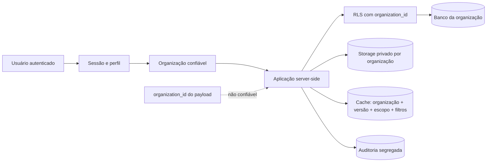
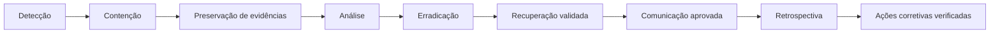

# Especificação Oficial de Segurança — Biosaúde Analytics 2.0

**Versão:** 1.0  
**Status:** Referência obrigatória; controles não implementados  
**Referências:** [Especificação](../PROJECT_SPECIFICATION.md) · [Regras](../BUSINESS_RULES.md) · [Arquitetura](02_ARCHITECTURE.md) · [Banco](03_DATABASE.md) · [Importação](04_IMPORT_PROCESS.md) · [Dashboard](05_DASHBOARD.md)

## Índice

1. [Objetivo do documento](#1-objetivo-do-documento)
2. [Princípios de segurança](#2-princípios-de-segurança)
3. [Modelo de ameaças](#3-modelo-de-ameaças)
4. [Ativos protegidos](#4-ativos-protegidos)
5. [Identidade e autenticação](#5-identidade-e-autenticação)
6. [Sessões](#6-sessões)
7. [Perfis e papéis](#7-perfis-e-papéis)
8. [Matriz de permissões](#8-matriz-de-permissões)
9. [Autorização](#9-autorização)
10. [Segregação por organização](#10-segregação-por-organização)
11. [Row Level Security](#11-row-level-security)
12. [Service role](#12-service-role)
13. [Segredos e variáveis de ambiente](#13-segredos-e-variáveis-de-ambiente)
14. [Segurança de APIs](#14-segurança-de-apis)
15. [Validação de entradas](#15-validação-de-entradas)
16. [Segurança de importação](#16-segurança-de-importação)
17. [Formula e CSV injection](#17-formula-e-csv-injection)
18. [Storage](#18-storage)
19. [Dashboard e dados sensíveis](#19-dashboard-e-dados-sensíveis)
20. [Exportações](#20-exportações)
21. [Cache](#21-cache)
22. [Segurança no frontend](#22-segurança-no-frontend)
23. [CSRF](#23-csrf)
24. [CORS e origem](#24-cors-e-origem)
25. [Rate limiting](#25-rate-limiting)
26. [Headers de segurança](#26-headers-de-segurança)
27. [Content Security Policy](#27-content-security-policy)
28. [Logs](#28-logs)
29. [Auditoria](#29-auditoria)
30. [Monitoramento e detecção](#30-monitoramento-e-detecção)
31. [Resposta a incidentes](#31-resposta-a-incidentes)
32. [Rotação e revogação](#32-rotação-e-revogação)
33. [Dependências e supply chain](#33-dependências-e-supply-chain)
34. [GitHub e repositório](#34-github-e-repositório)
35. [CI/CD](#35-cicd)
36. [Vercel](#36-vercel)
37. [Supabase](#37-supabase)
38. [Privacidade e dados pessoais](#38-privacidade-e-dados-pessoais)
39. [Ambientes](#39-ambientes)
40. [Backup e recuperação](#40-backup-e-recuperação)
41. [Revisões de segurança](#41-revisões-de-segurança)
42. [Testes de segurança](#42-testes-de-segurança)
43. [Matriz de controles](#43-matriz-de-controles)
44. [Decisões de segurança](#44-decisões-de-segurança)
45. [Decisões pendentes](#45-decisões-pendentes)
46. [Restrições](#46-restrições)
47. [Critérios de aceite](#47-critérios-de-aceite)

## 1. Objetivo do documento

Esta especificação define identidade, autenticação, autorização, privacidade,
auditoria e defesa em profundidade. Ela operacionaliza os requisitos do
[`PROJECT_SPECIFICATION.md`](../PROJECT_SPECIFICATION.md) e invariantes de
[`BUSINESS_RULES.md`](../BUSINESS_RULES.md), dentro das camadas de
[`02_ARCHITECTURE.md`](02_ARCHITECTURE.md), relações/RLS de
[`03_DATABASE.md`](03_DATABASE.md), pipeline de
[`04_IMPORT_PROCESS.md`](04_IMPORT_PROCESS.md) e exposição analítica de
[`05_DASHBOARD.md`](05_DASHBOARD.md), sem alterá-los.

Protege dados comerciais e dados de clientes, médicos e hospitais; impede
publicação anônima e vazamento entre organizações; preserva rastreabilidade;
aplica menor privilégio e múltiplas barreiras independentes.

**Esta etapa documenta controles; não implementa autenticação, policy, migration,
middleware, API, componente, rota, deploy ou infraestrutura.**

## 2. Princípios de segurança

- Zero trust entre navegador, servidor, banco e integrações.
- Autenticação obrigatória; autorização server-side e RLS obrigatórias.
- Organização isolada, menor privilégio, `deny by default`.
- UI nunca é fronteira de autorização; IDs/payload do cliente não são confiáveis.
- Chave privilegiada jamais vai ao navegador; escrita anônima é proibida.
- Toda fronteira valida contrato, tamanho, tipo e contexto.
- Logs não contêm segredos; ações críticas geram auditoria imutável.
- Dados pessoais são minimizados; arquivos ficam privados.
- Defesa em profundidade combina identidade, aplicação, banco, Storage e operação.
- Segurança é gate: falha obrigatória impede entrega.

## 3. Modelo de ameaças

O modelo é qualitativo; não atribui risco numérico sem metodologia aprovada.

| ID | Ameaça | Ativo | Vetor | Impacto | Controle preventivo | Controle de detecção |
|---|---|---|---|---|---|---|
| TH-01 | Acesso não autorizado/brute force | Conta/sessão | Login/recovery | Exposição | Auth, rate limit, MFA pendente | Falhas e alerta de anomalia |
| TH-02 | Sequestro/fixação/replay | Sessão | Token/cookie roubado | Impersonação | Cookies seguros, rotação, revogação | Uso anômalo e eventos de sessão |
| TH-03 | Escalada de privilégio | Papéis | Payload/endpoint direto | Administração indevida | RBAC server-side, deny default | Auditoria de papel/acesso negado |
| TH-04 | Vazamento entre organizações | Dados | IDOR/FK/filtro/cache | Incidente crítico | Escopo da sessão, RLS e chave de cache | Testes cross-tenant e alertas RLS |
| TH-05 | Publicação anônima | Base ativa | Bypass do frontend | Dados corrompidos | Auth, RBAC, RLS, lock e confirmação | Auditoria de tentativa/publicação |
| TH-06 | Manipulação/mass assignment | API | JSON/campos extras | Integridade/privilégio | Zod estrito, allowlist, caso de uso | Erros de contrato/request ID |
| TH-07 | Enumeração/IDOR | API | UUID/erros distintos | Vazamento | Ownership, resposta uniforme, rate limit | Padrões de 403/404 |
| TH-08 | CSRF | Mutação | Navegador autenticado | Ação involuntária | SameSite, origem e token se necessário | Origem rejeitada/auditoria |
| TH-09 | XSS | Dashboard | Conteúdo importado/HTML | Sessão/dado exposto | Escape, sanitização e CSP | Relatórios CSP/telemetria |
| TH-10 | Clickjacking | UI | Frame externo | Ação enganosa | `frame-ancestors` e headers | Violações CSP |
| TH-11 | Upload malicioso/ZIP bomb | Arquivo/serviço | Excel/CSV | Exfiltração/DoS | Assinatura, limites, parser server-side, scanner pendente | Falhas, duração e tamanho anômalos |
| TH-12 | Formula/CSV injection | Usuário/export | Célula executável | Código no cliente | Escape de export e tipos controlados | Testes/registro de export |
| TH-13 | Exposição de segredo | Chaves | Git, log, env pública | Controle total | Secret manager/scanning/rotação | Alertas de scanning e acesso |
| TH-14 | Corrida/replay de publicação | Versão | Comando repetido | Duas ativações | Lock, idempotência, unique ativa | Conflitos e auditoria |
| TH-15 | Alteração de auditoria | Evidência | Update/delete privilegiado | Perda de prova | Imutabilidade/RLS/menor privilégio | Verificação de integridade |
| TH-16 | Cache poisoning/vazamento | Cache | Chave incompleta/header | Cross-tenant/dado obsoleto | Org+versão+papel+filtros | Miss/hit anômalo e testes |
| TH-17 | Vazamento em logs | PII/segredos | Payload/erro | Exposição persistente | Redação/allowlist de campos | Scanner e revisão de logs |
| TH-18 | Exportação indevida | Dados/PII | Permissão/URL longa | Exfiltração | RBAC, limite, URL curta, auditoria | Volume/downloads anômalos |
| TH-19 | Dependência vulnerável | Código/pipeline | Pacote/script comprometido | Supply-chain | Lockfile, audit, revisão | Alertas Dependabot/SAST |
| TH-20 | Compromisso de CI/GitHub | Código/produção | Token/workflow/PR | Deploy malicioso | Branch protection, OIDC/segredos mínimos | Logs e aprovações |
| TH-21 | Configuração insegura Vercel/Supabase | Plataforma | Dashboard/env/policy | Exposição ampla | Acesso mínimo, ambientes, revisão | Logs de plataforma/config review |

## 4. Ativos protegidos

Classificação recomendada, sujeita a validação formal:

| Classe | Recomendação de ativos |
|---|---|
| Público | Somente conteúdo institucional explicitamente aprovado; nenhum dado comercial. |
| Interno | Código não sensível, documentação e configurações sem segredo. |
| Confidencial | Faturamento, Meta, hospitais, clientes, versões, relatórios e exports comuns. |
| Restrito | Médicos/PII, arquivos originais, auditoria, perfis, tokens, sessões, segredos e exports sensíveis. |

Também são protegidos organizações, usuários, histórico, código-fonte, pipelines e
configurações. Classificação, proprietários, retenção e manuseio finais exigem
validação de segurança, negócio e privacidade.

## 5. Identidade e autenticação

Supabase Auth é o provedor inicial. Login cria sessão somente para usuário e
organização ativos; logout revoga/encerra contexto; recuperação, convite e
ativação usam tokens de uso limitado e resposta não enumerável. Bloqueio,
expiração, renovação, revogação, conta excluída e organização inativa negam novo
acesso e invalidam sessões conforme política. Múltiplas sessões serão visíveis e
revogáveis segundo decisão futura.

Login/logout/falha, recovery, convite, ativação, bloqueio, revogação e alteração
sensível são auditáveis, sem registrar credencial/token.

| Método | Benefício | Risco/decisão |
|---|---|---|
| Email/senha | Familiar | Política de senha, recovery e brute force. |
| Magic link | Menos senha | Segurança do email, replay e expiração. |
| SSO/provedor corporativo | Ciclo corporativo central | Integração, disponibilidade e mapeamento. |
| MFA | Reduz comprometimento | Método, recovery e perfis obrigatórios pendentes. |

Método definitivo, SSO e MFA permanecem pendentes.

## 6. Sessões

Sessões web usam cookies `Secure`, `HttpOnly` quando aplicável e `SameSite`
compatível com fluxo/CSRF. Duração, renovação, expiração absoluta e por inatividade
serão aprovadas, sem valores presumidos. Login regenera identificadores contra
fixation; logout, bloqueio, revogação, usuário/organização inativos e mudança de
papel crítica encerram ou revalidam sessões. Política de múltiplos dispositivos
define listagem/revogação e eventos sem expor token.

## 7. Perfis e papéis

Identificadores técnicos: `viewer`, `analyst`, `importer`, `admin`. `Administrator`
pode ser apenas rótulo visual aprovado; contrato/banco usam `admin`.

- identidade: principal autenticado do Auth;
- perfil: dados operacionais do usuário;
- papel: agrupamento técnico de capacidades;
- permissão: ação autorizável;
- organização: tenant obrigatório;
- ownership: vínculo entre recurso, organização e ator quando aplicável;
- policy: regra executável de acesso, inclusive RLS.

## 8. Matriz de permissões

`Pendente` não concede acesso. Toda linha é revalidada no servidor/RLS/Storage.

| Recurso/Ação | viewer | analyst | importer | admin | Validação obrigatória |
|---|---|---|---|---|---|
| Dashboard/filtros | Sim | Sim | Conforme acesso analítico | Sim | Sessão, org, RLS |
| Drill-down | Leitura autorizada | Sim | Pendente | Sim | Papel, PII, RLS |
| Exportar | Pendente | Conforme permissão | Pendente | Sim | Papel, limite, org, auditoria |
| Ver médicos/clientes | Pendente | Pendente por privacidade | Não presumido | Pendente por necessidade | Mascaramento/PII/RLS |
| Ver hospitais | Sim no dashboard | Sim | Sim no contexto de import | Sim | Org/RLS |
| Ver histórico | Limitado à versão | Sim | Sim | Sim | Papel/org |
| Baixar original | Não | Não | Conforme lote/permissão | Sim | Ownership, Storage, auditoria |
| Baixar erros | Não | Pendente | Sim | Sim | Org/lote/dado sensível |
| Upload/validar | Não | Não | Sim | Sim | Auth, papel, limites |
| Resolver warnings | Não | Não | Conforme política | Sim | Lote, before/after, auditoria |
| Resolver erros | Não | Não | Conforme política | Sim | Regra/cadastro/revalidação |
| Confirmar publicação | Não | Não | Pendente | Sim | `ready`, lock, idempotência |
| Rollback | Não | Não | Não | Sim | Versão válida, lock, auditoria |
| Administrar hospitais | Não | Não | Não presumido | Sim | Caso de uso/RLS/auditoria |
| Administrar usuários | Não | Não | Não | Sim | Org, anti-escalada |
| Alterar papéis | Não | Não | Não | Sim | Reautorização/auditoria |
| Consultar auditoria | Não | Pendente | Limitado ao lote | Sim | RLS, minimização |
| Alterar configurações | Não | Não | Não | Pendente por configuração | Allowlist/auditoria |
| Logs operacionais | Não | Não | Não | Pendente | Separação de função/PII |

## 9. Autorização

Camadas: (1) navegação/UI reduz ações; (2) middleware barra rota evidente; (3)
servidor autentica e deriva organização; (4) caso de uso verifica permissão,
estado e ownership; (5) RLS impede bypass; (6) Storage valida path/ownership; (7)
auditoria prova tentativa/resultado.

Botão oculto não autoriza. Toda ação crítica é server-side. Service role só em
adaptador privilegiado controlado. `organization_id` e IDs enviados pelo cliente
são apenas alegações a validar contra sessão e recurso.

## 10. Segregação por organização

`organization_id` é obrigatório onde definido e deriva do perfil/sessão
confiável, jamais do payload. RLS, cache, Storage, logs, imports, versões, exports
e auditoria preservam o mesmo tenant.

## 11. Row Level Security

| Categoria | Leitura | Inserção/atualização | Exclusão | Papel/escopo/restrição |
|---|---|---|---|---|
| organizations | Própria e campos mínimos | Administração controlada | Proibida/inativação | Auth + org; admin quando mutável |
| profiles/user_roles | Próprio; admin da org conforme necessidade | Casos admin, anti-escalada | Inativar/revogar | Não alterar próprio papel |
| Dimensões/hospitals | Auth autorizado da org | Admin; importer só se política futura | RESTRICT/inativar | Histórico preservado |
| billing_facts | Viewer/analyst autorizado, versão/org | Somente promoção privilegiada controlada | Proibida publicada | Nunca escrita direta do cliente |
| financial_targets | Idem fatos e grão compatível | Somente promoção | Proibida publicada | Unique/granularidade |
| import_batches/files | Importer/admin da org; outros conforme matriz | Casos de importação | Retenção formal | Ownership não substitui org |
| import_errors/warnings | Importer/admin; analyst pendente | Resolução controlada | Retenção formal | Before/after e revalidação |
| dataset_versions | Auth conforme dashboard/histórico | Ativação/rollback controlados | Proibida | Uma ativa/org |
| audit_events | Admin e escopos mínimos | Serviço controlado append-only | Proibida | Imutável e segregada |

SQL e policies não são criados agora. Service role não torna policy opcional.

## 12. Service role

Service role fica apenas no servidor, segregada por ambiente, encapsulada no
menor adaptador/caso de uso e usada pelo mínimo tempo. É proibida no frontend,
`NEXT_PUBLIC_*`, log, stack, erro e artefato. Acesso/rotação/revogação são
controlados e operações privilegiadas auditadas.

Preferir sessão do usuário com RLS sempre que a operação puder manter contexto e
policies. Service role só serve a promoção/job/operação interna que legitimamente
precise ultrapassar RLS, com autorização prévia e validações equivalentes.

## 13. Segredos e variáveis de ambiente

Segredos são restritos, armazenados no secret manager de cada ambiente, com
acesso mínimo, inventário, rotação e revogação. Variável pública contém somente
valor publicável; nome privado não ganha prefixo público. Secret scanning cobre
commit/PR/CI. Screenshots, logs e suporte devem ser redigidos.

Proibidos: `.env` versionado; chave real em `.env.example`; segredo em README,
issue ou commit; segredo em `NEXT_PUBLIC_*`. Vazamento exige revogação/rotação
imediata, busca de uso, preservação de evidência e limpeza do histórico sem
considerar a limpeza suficiente.

## 14. Segurança de APIs

Futuras APIs: sessão válida; RBAC/ownership/org; Zod estrito; rate limit; request
ID; idempotência em mutações críticas; limites de payload/lista/página; allowlist
de campos; paginação; timeout; origem/CSRF; headers. Erros usam código estável e
mensagem segura, sem stack/SQL. Logging é redigido.

Respostas uniformes reduzem enumeração; recurso sempre valida ownership contra a
sessão para evitar IDOR; objetos sensíveis rejeitam campos extras/mass assignment.
Nenhuma rota é implementada nesta etapa.

## 15. Validação de entradas

Cliente valida só para UX. Servidor valida novamente com Zod e banco protege
FK/check/unique/RLS. Contratos controlam campos extras, normalização, tamanho,
listas, UUIDs, datas, decimals, UFs, strings, filtros, URLs e nomes de arquivo.

É proibido confiar no JSON do navegador, converter inválido em zero, interpolar
SQL ou aceitar campo não documentado em mutação sensível. Normalização preserva
original quando a auditoria exigir e não muda semântica.

## 16. Segurança de importação

Upload requer auth/RBAC/org, valida extensão+MIME+assinatura+tamanho e calcula
hash. Arquivo protegido/corrompido falha explicitamente. ZIP bombs, malware,
conteúdo ativo, fórmula e CSV injection são tratados como ameaças; scanner de
malware permanece decisão pendente.

Parsing server-side, Storage privado, staging isolado, lock organizacional,
idempotência, preview/confirmação, promoção transacional, auditoria e rollback não
destrutivo são obrigatórios. Arquivo nunca executa macro/fórmula.

## 17. Formula e CSV injection

Texto exportado iniciado por `=`, `+`, `-` ou `@` pode executar em planilha e
deve ser codificado/escapado segundo formato aprovado, preservando valor lógico.
O tipo da coluna é decisivo: número decimal negativo validado é serializado como
número legítimo; texto não confiável com prefixo perigoso é texto neutralizado.
Não remover sinal nem alterar finanças. Import não executa fórmula e registra
fórmula/valor armazenado conforme contrato.

## 18. Storage

Buckets são privados, paths incluem organização/recurso não adivinhável e
ownership é validado. Upload é controlado; original é imutável. Download usa URL
assinada de prazo limitado, autorização no momento da emissão e auditoria quando
sensível. Listagem pública/URL permanente são proibidas. Metadata é mínima e sem
segredo. Retenção/exclusão aguardam política e não rompem versão/auditoria.

## 19. Dashboard e dados sensíveis

Dashboard exige auth, RBAC e RLS. Médico/cliente/hospital são exibidos somente por
necessidade e perfil; anonimização/mascaramento final é pendente. Filtro,
drill-down e tooltip seguem a mesma proteção. URL não contém PII. Cache é privado
e segregado. Exports têm controle adicional. Usuário é orientado sobre risco de
screenshots/compartilhamento, que não substitui controles técnicos.

## 20. Exportações

Comum contém agregados não sensíveis autorizados; sensível contém detalhe/PII ou
volume capaz de reidentificação e exige permissão/auditoria reforçada. Ambas fixam
org, usuário, versão, filtros, limite de linhas e grão; evitam duplicar meta e
neutralizam CSV injection.

Formato/limite são pendentes. Geração longa usa Storage temporário privado, URL
assinada curta e expiração/remoção controladas. Download revalida autorização e
fica auditado quando sensível.

## 21. Cache

Chave inclui organização, versão, papel/escopo quando necessário, contrato de
filtros, consulta e página. Dado privado nunca usa cache global público. Entrada e
headers não podem ser controlados por chave arbitrária do usuário; parâmetros são
normalizados contra poisoning. Ativação, papel, logout e org invalidam escopos.
Versões e organizações nunca se misturam; headers impedem armazenamento público.

## 22. Segurança no frontend

React escapa conteúdo por padrão. HTML arbitrário é proibido;
`dangerouslySetInnerHTML` exige justificativa, sanitização aprovada e teste. URLs
são allowlisted e redirects validam destino. CSP limita execução. Erros não expõem
internos. Dependências são avaliadas. Segredo/service role jamais ficam no
cliente; PII não é persistida em local storage/cache além do necessário. Sessão
usa mecanismo seguro, sem token em URL.

## 23. CSRF

Risco depende do método de sessão. Cookies SameSite reduzem, mas não eliminam
todos os cenários. Mutações validam origem/referer conforme política e usam token
anti-CSRF quando necessário. Upload, publicação, rollback e administração exigem
método correto, sessão, origem, RBAC, idempotência e auditoria.

## 24. CORS e origem

Servidor mantém allowlist por ambiente/domínio. Preview só entra quando protegido
e explicitamente autorizado. Origem desconhecida é rejeitada em operação de
navegador. Credenciais exigem origem específica, nunca `*`; preflight restringe
métodos/headers. CORS não protege chamada server-to-server nem substitui auth.

## 25. Rate limiting

Login/recovery, consulta, export, upload, publicação, rollback e administração
têm políticas distintas, sem números presumidos. Chaves podem combinar usuário,
IP, organização e rota para reduzir abuso sem bloquear tenant inteiro. Resposta
usa status/tempo de retry seguros, sem revelar conta. Excesso crítico é logado e
auditado/alertado conforme risco; publicação idempotente continua serializada.

## 26. Headers de segurança

Requisitos conceituais: CSP; `X-Content-Type-Options: nosniff`;
`Referrer-Policy`; `Permissions-Policy`; CSP `frame-ancestors` contra clickjacking;
HSTS somente sobre HTTPS e implantação segura; cache headers privados/no-store
conforme dado; políticas cross-origin quando compatíveis. Configuração executável
e valores finais serão testados antes do deploy, não criados agora.

## 27. Content Security Policy

CSP restringe scripts a origens/nonces aprovados; styles evitam inline inseguro;
images/fonts/connections usam allowlists mínimas; frames ficam negados salvo caso
aprovado; `object-src 'none'`, `base-uri` e `form-action` restritos são objetivos.
Next.js/Vercel, Supabase, Recharts, fontes e analytics futuros devem funcionar sem
abrir origens genéricas. `unsafe-eval` em produção é proibido salvo exceção
documentada, temporária, revisada e monitorada.

## 28. Logs

Log estruturado: timestamp, nível, `request_id`, usuário e organização em forma
adequada, ação, recurso, resultado, duração e `error_code`. É proibido registrar
senha, token, cookie, service role, arquivo/planilha integral, PII desnecessária ou
valor sensível sem finalidade. Redação ocorre antes do sink; acesso/retenção são
restritos e sinais de segredo são escaneados.

## 29. Auditoria

Eventos: login/logout/falha, convite, papel, bloqueio, upload, validação,
resolução, publicação, rollback, export sensível, hospital/UF, configuração e
operação privilegiada. Registro lógico imutável contém before/after sanitizados,
ator, organização, request ID, resultado, instante e recurso. Aplicação não edita
nem exclui. Retenção e integridade de longo prazo são pendentes.

## 30. Monitoramento e detecção

Sinais: falhas repetidas de login; negações; tentativa cross-tenant; exports
excessivos; uploads repetidos; publicação falha; rollback; erro RLS; rota indevida;
volume anormal; mudança de papel; Storage alheio; possível segredo em logs.
Alertas conceituais agrupam por identidade/org/tempo, têm severidade e runbook,
evitam PII e são revisados contra falso positivo. Limiares são pendentes.

## 31. Resposta a incidentes

Cenários incluem credencial exposta, acesso/publicação/export indevidos, arquivo
malicioso, vazamento entre organizações, corrupção e alteração de auditoria.
Contenção pode revogar sessão/chave, bloquear fluxo e preservar ativa/evidência;
recuperação valida integridade e monitoramento. Comunicação e obrigações legais
dependem de validação jurídica, sem prazos inventados.

## 32. Rotação e revogação

Chaves Supabase/service role, tokens, credenciais CI e integrações têm inventário,
owner, ambiente, procedimento testado, sobreposição segura quando aplicável e
revogação confirmada. Sessões/usuários comprometidos são revogados e reautorizados
explicitamente. Link assinado expira e, se necessário, objeto/permissão é
revogado. Rotação gera auditoria sem registrar segredo.

## 33. Dependências e supply chain

Lockfile versionado e instalação limpa/reproduzível; dependency audit e
Dependabot/alternativa; licença e manutenção revisadas; versão fixada quando risco
exigir; pacote sem uso é proibido. Biblioteca Excel recebe análise reforçada de
parsing hostil. Scripts de instalação são revisados. Secret scanning, branch
protection e revisão de PR mitigam pacote/maintainer comprometido.

## 34. GitHub e repositório

Branch principal protegida, PR e revisão obrigatórios, checks sem bypass comum,
secret scanning e Dependabot/alternativa. CODEOWNERS futuro protege áreas
sensíveis. Commits/tags/histórico são rastreáveis; acesso segue menor privilégio e
é revisto. Segredo versionado é revogado primeiro, investigado e removido do
histórico; reescrever histórico não o torna seguro.

## 35. CI/CD

Gates: typecheck, lint, testes, build, migrations/reset quando existirem, RLS,
secret scanning, dependency audit e SAST quando adotado. Development/preview/
production usam credenciais separadas; produção requer aprovação/proteção. Logs
redigem segredos. Nenhum deploy ocorre com gate obrigatório falhando. Este
documento não cria workflow ou deploy.

## 36. Vercel

Variáveis são segregadas por ambiente; preview e production não compartilham
segredos/dados indevidos. Domínios, membros, logs, funções, limites e credenciais
seguem menor privilégio. Preview requer proteção pendente e não expõe base real.
Headers/CSP são testados. Segredo não é público/`NEXT_PUBLIC`. Rollback de app usa
deploy anterior compatível e não reverte banco/dataset automaticamente.

## 37. Supabase

Auth, PostgreSQL/RLS e Storage privado mantêm ambientes separados. Service role é
server-only; anon/publishable key não é segredo, mas não autoriza ignorar RLS.
Backups, logs, migrations e painel têm acessos mínimos/auditáveis. MFA para admins
da plataforma deve ser habilitado quando disponível, sujeito à política final.
Responsabilidades de auth, banco, operação e auditoria são segregadas.

## 38. Privacidade e dados pessoais

Coleta é mínima, necessária e vinculada à finalidade. Acesso, retenção,
anonimização/mascaramento e exports de médicos/clientes são definidos por política
e papel. Hospitais também podem conter dados identificáveis/comerciais. Auditoria
minimiza before/after. Development usa dados fictícios/sanitizados; seeds são
fictícios; teste com dado real é proibido sem autorização formal. É obrigatória
validação jurídica e de privacidade antes de produção.

## 39. Ambientes

| Ambiente | Dados e recursos | Acesso/credencial/log/retenção |
|---|---|---|
| local | Fictícios mínimos; banco/Storage locais ou isolados | Credenciais locais não reais; logs redigidos. |
| development | Fictícios/sanitizados | Equipe autorizada; recursos próprios. |
| preview | Fictícios/sanitizados por PR | Protegido; credenciais efêmeras/mínimas. |
| staging, se adotado | Sanitizados e representativos | Acesso restrito; integrações não produtivas. |
| production | Dados reais autorizados | Menor privilégio, monitoramento, backup e retenção formal. |

Uso indiscriminado de dados reais fora de produção é proibido; exceção exige
aprovação, minimização e controles equivalentes.

## 40. Backup e recuperação

Plano cobre banco, arquivos privados, versões e auditoria; define frequência,
criptografia, acesso, retenção e cópia isolada. Restore é testado periodicamente e
valida RLS/integridade/auditoria. RPO/RTO permanecem pendentes. Rollback da
aplicação, restore do banco e rollback de versão de dados são procedimentos
distintos e não devem ser confundidos.

## 41. Revisões de segurança

Checkpoints formais: antes da primeira migration; autenticação; importação;
dashboard com dado real; exports; primeiro deploy; e periodicamente em produção.
Cada revisão verifica threat model, decisões pendentes, privacidade, testes,
evidências e aceite; mudança material dispara revisão extraordinária.

## 42. Testes de segurança

Obrigatórios: anônimo; papel incorreto; cross-tenant; IDOR; RLS por tabela/ação;
Storage/path/URL; API/inputs; upload inválido/malicioso; rate limit; CSRF; XSS;
headers/CSP; export/CSV injection; cache; redação de logs; secret scanning; sessão
revogada; usuário/org inativos; mudança de papel; service role ausente do bundle.
Incluem testes negativos, integração e E2E em ambiente isolado, sem dado real.

## 43. Matriz de controles

| Controle | Preventivo | Detectivo | Corretivo | Camada | Evidência |
|---|---|---|---|---|---|
| Autenticação | Supabase Auth/sessão | Eventos/anomalias | Revogar/bloquear | Identity | Audit Auth |
| Autorização | RBAC/ownership/deny | Acessos negados | Revogar papel | App | Testes/audit |
| RLS | Policies por org | Erros/testes cross-tenant | Corrigir policy/bloquear | Banco | Suite RLS |
| Upload | Tipo/limite/hash/private | Falhas/métricas | Quarentena/rejeição | Import/Storage | Lote/relatório |
| Publicação | Confirmação/lock/idempotência | Conflitos/audit | Rollback versão | App/banco | Evento/versão |
| Rollback | Admin/lock/versão válida | Evento/alerta | Reativar versão válida | App/banco | Audit/version |
| Storage | Bucket privado/ownership | Download anômalo | Revogar URL/acesso | Storage | Access/audit |
| Export | RBAC/limite/escape | Volume/download | Revogar objeto/usuário | App/Storage | Audit export |
| Auditoria | Append-only/RLS | Verificação integridade | Contenção/investigação | Banco | Eventos |
| Segredos | Manager/scanning | Alerta de leak | Rotação/revogação | Plataforma | Scan/rotation |
| CI/CD | Gates/proteção | Logs/checks | Bloquear/reverter deploy | GitHub/Vercel | Checks/deploy |
| Cache | Chave org/versão/escopo | Métrica/teste | Invalidar/flush escopo | App/cache | Logs cache |
| Logs | Allowlist/redação | Scanner/revisão | Remover/restringir/rotacionar | Observability | Scan/access |

## 44. Decisões de segurança

| ID | Decisão | Motivo | Alternativas | Consequências |
|---|---|---|---|---|
| SEC-001 | Auth obrigatório. | Dados corporativos. | Acesso público. | Toda operação tem identidade. |
| SEC-002 | Deny by default. | Falha segura. | Allow implícito. | Permissão precisa ser explícita. |
| SEC-003 | Autorização em camadas. | Defesa em profundidade. | Somente frontend/API. | UI, app, RLS e Storage verificam. |
| SEC-004 | RLS obrigatória. | Impedir bypass/cross-tenant. | Filtro apenas na API. | Policies/testes por tabela. |
| SEC-005 | Org deriva da sessão. | Evitar tenant spoofing. | Payload. | IDs do cliente são revalidados. |
| SEC-006 | Service role server-only. | Poder privilegiado. | Browser. | Adaptador mínimo/auditoria. |
| SEC-007 | Storage privado. | Arquivos confidenciais. | Bucket público. | Download autorizado. |
| SEC-008 | URLs assinadas curtas. | Acesso temporário. | URL permanente. | Prazo final pendente. |
| SEC-009 | Logs estruturados/redigidos. | Operação sem vazamento. | Payload bruto. | Schema e scanner. |
| SEC-010 | Auditoria imutável. | Prova de ação. | Log editável. | Append-only/retenção. |
| SEC-011 | Export sensível auditado. | Risco de exfiltração. | Download sem trilha. | Permissão/evento. |
| SEC-012 | CSP restritiva. | Mitigar XSS/clickjacking. | CSP aberta. | Integrações allowlisted. |
| SEC-013 | Rate limiting por risco. | Mitigar abuso. | Limite único/nenhum. | Valores pendentes. |
| SEC-014 | Zod nas fronteiras. | Contrato e mass assignment. | Validação ad hoc. | Schema estrito. |
| SEC-015 | Gates CI bloqueantes. | Evitar entrega vulnerável. | Avisos ignoráveis. | Falha impede deploy. |
| SEC-016 | Nada sensível na URL. | URL vaza em histórico/log/referrer. | IDs/PII em query. | Estado usa IDs não sensíveis. |

## 45. Decisões pendentes

Não serão resolvidas por suposição:

1. método de login; 2. MFA; 3. SSO/provedor; 4. duração/renovação das sessões;
5. matriz final de permissões; 6. anonimização por papel; 7. limites de rate
limiting; 8. limites/formatos de export; 9. scanner de malware; 10. SAST;
11. observabilidade/alertas; 12. retenção de logs; 13. retenção de auditoria;
14. RPO; 15. RTO; 16. classificação formal; 17. política jurídica/privacidade;
18. proteção de preview; 19. prazo de URLs assinadas; 20. fluxo/runbooks oficiais
de incidente; 21. política de CORS/CSP por domínio; 22. scanner de segredos e
dependency bot definitivos.

## 46. Restrições

É proibido:

- service role no navegador ou segredo em `NEXT_PUBLIC_*`;
- `.env` versionado ou segredo em documentação, issue, commit/log;
- escrita anônima ou autorização somente visual;
- confiar em `organization_id` do cliente;
- RLS desabilitada em dado protegido;
- Storage público, listagem pública ou URL permanente;
- PII/segredo/token/cookie/stack trace em URL, log ou resposta ao usuário;
- export sem autorização/auditoria aplicável;
- cache compartilhado entre organizações/versões;
- dado real em teste não autorizado;
- bypass de validação/ownership;
- deploy com gate obrigatório falhando;
- CORS `*` com credenciais;
- `unsafe-eval` sem exceção formal;
- editar/excluir auditoria;
- tornar dado comercial público.

## 47. Critérios de aceite

- [x] consistente com documentos anteriores e sem alterar regra;
- [x] índice, threat model e classificação recomendada;
- [x] identidade, sessão, papéis e matriz de permissão definidos;
- [x] autorização, organização, RLS e service role definidos;
- [x] segredos, API, inputs, import, Storage e dashboard definidos;
- [x] exports, cache, frontend, CSRF/CORS/rate limit/headers/CSP definidos;
- [x] logs, auditoria, detecção e incidentes definidos;
- [x] supply chain, GitHub, CI/CD, Vercel e Supabase definidos;
- [x] privacidade, ambientes, backup, revisões e testes definidos;
- [x] matrizes, decisões, pendências e restrições registradas;
- [x] nenhum controle ou código implementado.

Esta especificação encerra somente a fase documental de segurança. Implementação
depende de validação manual e resolução formal das pendências.
