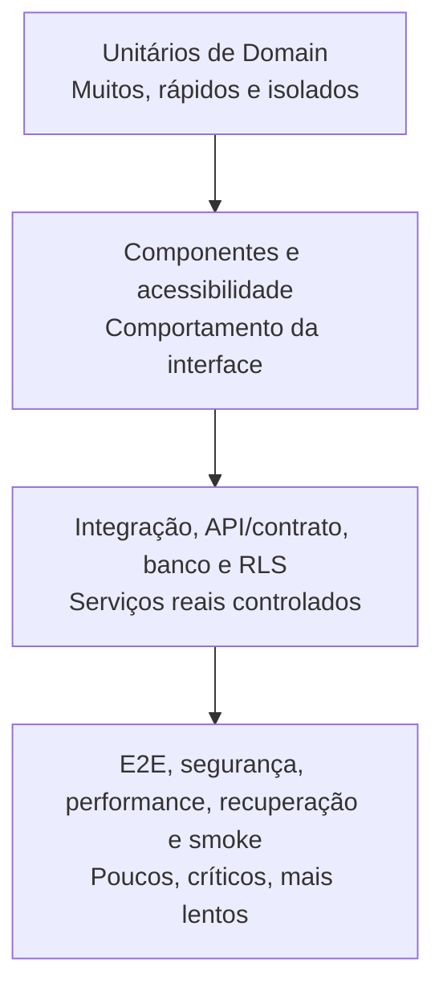

# Estratégia Oficial de Qualidade e Testes — Biosaúde Analytics 2.0

**Versão:** 1.0  
**Status:** Referência obrigatória; sem testes executáveis  
**Referências:** [Especificação](../PROJECT_SPECIFICATION.md) · [Regras](../BUSINESS_RULES.md) · [Arquitetura](02_ARCHITECTURE.md) · [Banco](03_DATABASE.md) · [Importação](04_IMPORT_PROCESS.md) · [Dashboard](05_DASHBOARD.md) · [Segurança](06_SECURITY.md)

## Índice

1. [Objetivo](#1-objetivo)
2. [Princípios de qualidade](#2-princípios-de-qualidade)
3. [Pirâmide de testes](#3-pirâmide-de-testes)
4. [Classificação por risco](#4-classificação-por-risco)
5. [Testes unitários de domínio](#5-testes-unitários-de-domínio)
6. [Testes de Meta Financeira](#6-testes-de-meta-financeira)
7. [Testes de UF do Hospital](#7-testes-de-uf-do-hospital)
8. [Testes dos filtros](#8-testes-dos-filtros)
9. [Testes de reconciliação](#9-testes-de-reconciliação)
10. [Testes do banco](#10-testes-do-banco)
11. [Testes de RLS](#11-testes-de-rls)
12. [Testes de autenticação e sessão](#12-testes-de-autenticação-e-sessão)
13. [Testes de autorização](#13-testes-de-autorização)
14. [Testes da importação](#14-testes-da-importação)
15. [Testes de parsing](#15-testes-de-parsing)
16. [Testes da promoção transacional](#16-testes-da-promoção-transacional)
17. [Testes de rollback](#17-testes-de-rollback)
18. [Testes do dashboard](#18-testes-do-dashboard)
19. [Testes de componentes](#19-testes-de-componentes)
20. [Testes E2E](#20-testes-e2e)
21. [Testes de API e contrato](#21-testes-de-api-e-contrato)
22. [Testes de exportação](#22-testes-de-exportação)
23. [Testes de segurança](#23-testes-de-segurança)
24. [Testes de acessibilidade](#24-testes-de-acessibilidade)
25. [Testes de responsividade](#25-testes-de-responsividade)
26. [Testes de performance](#26-testes-de-performance)
27. [Testes de carga e estresse](#27-testes-de-carga-e-estresse)
28. [Testes de cache](#28-testes-de-cache)
29. [Testes de observabilidade](#29-testes-de-observabilidade)
30. [Smoke tests](#30-smoke-tests)
31. [Regressão](#31-regressão)
32. [Datasets de teste](#32-datasets-de-teste)
33. [Golden datasets](#33-golden-datasets)
34. [Mocks, fakes e test containers](#34-mocks-fakes-e-test-containers)
35. [Isolamento e limpeza](#35-isolamento-e-limpeza)
36. [Flakiness](#36-flakiness)
37. [Cobertura](#37-cobertura)
38. [Mutation testing](#38-mutation-testing)
39. [Evidências](#39-evidências)
40. [Gates de qualidade](#40-gates-de-qualidade)
41. [CI](#41-ci)
42. [Ambientes de teste](#42-ambientes-de-teste)
43. [Defeitos](#43-defeitos)
44. [Critérios de saída](#44-critérios-de-saída)
45. [Matriz de rastreabilidade](#45-matriz-de-rastreabilidade)
46. [Responsabilidades](#46-responsabilidades)
47. [Decisões de teste](#47-decisões-de-teste)
48. [Decisões pendentes](#48-decisões-pendentes)
49. [Restrições](#49-restrições)
50. [Critérios de aceite](#50-critérios-de-aceite)

## 1. Objetivo

Esta estratégia estabelece como produzir evidência confiável antes de cada
entrega e prevenir regressões. Aplica a especificação, regras de negócio,
arquitetura, banco, importação, dashboard e segurança referenciados acima, sem
alterá-los. Valida cálculos financeiros, Meta Financeira, UF do Hospital,
isolamento, importação e a reconciliação entre cards, gráficos, tabelas,
drill-down e exportações.

**Esta etapa somente documenta testes; não cria teste, configuração, dado real ou
código executável.**

## 2. Princípios de qualidade

- Toda funcionalidade recebe testes proporcionais ao risco; Domain é isolado.
- Segurança é gate; banco deve ser reproduzível do zero.
- Testes são determinísticos, independentes e usam apenas dados fictícios.
- Organizações são isoladas; ausência difere de zero.
- Valores financeiros reconciliam exatamente sempre que tecnicamente possível.
- Inspeção visual isolada e “funcionou localmente” não aprovam entrega.
- Falha obrigatória bloqueia; comportamento é preferido a detalhe frágil.
- Cobertura é sinal auxiliar, não substituto de bons casos.

## 3. Pirâmide de testes

| Camada | Objetivo | Velocidade/isolamento | Responsabilidade |
|---|---|---|---|
| Unitário | Regras, valores e invariantes | Muito rápido; sem framework/banco | Desenvolvimento/Domain |
| Componente | Interação, estados e a11y | Rápido; dependências controladas | Frontend/QA |
| Integração | Casos de uso e adaptadores | Médio; recursos locais | Desenvolvimento |
| Contrato/API | Zod, envelopes, erros e auth | Médio; fronteira real | Backend/QA |
| Banco/RLS | Schema, transação e isolamento | Médio; Supabase/Postgres local | Backend/segurança |
| E2E | Jornada completa | Lento; ambiente integrado | QA/produto |
| Segurança | Abuso e controles | Variável; ambiente isolado | Segurança/QA |
| Performance/carga | Latência/capacidade | Lento e parametrizado | Operações/desenvolvimento |
| Acessibilidade | WCAG automatizada e manual | Contínuo + inspeção | QA/design |
| Smoke | Saúde pós-entrega | Curto; ambiente alvo | Operações |
| Recuperação/rollback | Falha, restore e preservação | Controlado; estado realista | Operações/backend |

## 4. Classificação por risco

| Módulo | Risco | Impacto | Tipos de teste obrigatórios |
|---|---|---|---|
| Autenticação | Crítico | Acesso indevido | Unitário, integração, E2E, segurança |
| Autorização/RLS | Crítico | Vazamento/escalada | Integração, banco, negativo, E2E segurança |
| Meta Financeira | Crítico | Indicador incorreto | Unitário, property/limite, banco, reconciliação |
| Faturamento | Crítico | Resultado financeiro incorreto | Unitário, banco, importação, reconciliação |
| Promoção/versionamento/rollback | Crítico | Perda/corrupção da ativa | Transação, concorrência, recuperação, E2E |
| Importação | Alto | Entrada inválida | Parsing, integração, segurança, E2E |
| UF do Hospital | Alto | Segmentação errada | Domain, banco, filtro, import/export |
| Filtros | Alto | Escopo inconsistente | Contrato, combinação, E2E, reconciliação |
| Dashboard | Alto | Decisão enganosa | Componente, E2E, a11y, reconciliação |
| Exportações | Alto | Divergência/exfiltração | Contrato, segurança, reconciliação |
| Auditoria | Alto | Perda de evidência | Banco/RLS, imutabilidade, E2E |
| Administração | Alto | Alteração privilegiada | Autorização, E2E, auditoria |
| Componentes visuais | Médio/baixo conforme função | UX/a11y | Componente, visual dirigido, a11y; nunca só snapshot |

## 5. Testes unitários de domínio

Cobrir FY 2025/FY 2026, Meta, cobertura, diferença, saldo, excedente, diferença e
variação anual, estados da meta, ausência/zero, denominador inválido, decimal,
arredondamento só na apresentação, granularidade e filtros compatíveis. Cada regra
tem caso normal, fronteiras, ausência, zero, extremos decimais representáveis,
inválidos e invariantes. Nunca se espera Infinity/NaN; cálculo não usa float. Os
resultados seguem as fórmulas documentadas, sem reimplementação no teste.

## 6. Testes de Meta Financeira

Golden datasets cobrem meta anual, trimestral, mensal, GR, representante, UF do
Hospital, hospital, marca, tópico, tipo e combinações somente aprovadas. Casos
negativos: grão desconhecido, duplicata, negativo, filtro incompatível e dimensão
incoerente. Casos semânticos: zero explícito versus ausência, precisão decimal,
não distribuição/replicação e não multiplicação ao adicionar fatos. Cada fixture
declara valores decimais exatos, grão, filtros e total esperado versionado.

## 7. Testes de UF do Hospital

Testar 27 UFs incluindo DF, sigla inválida, cidade/múltiplas UFs, hospital
compatível/divergente/sem UF/não localizado; independência de UF Cliente e UF
Comercial; filtro único/múltiplo; hospital combinado/impossível; meta com e sem a
dimensão; drill-down/export e auditoria de resolução. É obrigatório provar que
nenhuma UF é inferida ou substituída.

## 8. Testes dos filtros

Cada filtro canônico é testado isolado, em dependências e combinações: URL
canônica/restauração, remoção individual/todos, opção inexistente, impossível,
vazio, troca de versão, compatibilidade de meta e paridade frontend/backend.

| Prioridade | Combinação | Invariante |
|---|---|---|
| P0 | Ano + trimestre/mês | Tempo coerente e ordenado |
| P0 | UF Hospital + hospital | Somente hospitais da UF |
| P0 | Filtro factual + grão de meta incompatível | Meta N/A, não aproximada |
| P0 | Organização A/B + mesmos IDs | Nenhum vazamento |
| P1 | GR + representante + assessor | Interseção canônica |
| P1 | Marca + tópico + tipo | Dimensões distintas |
| P1 | Cliente + UF Cliente + médico | Escopo e privacidade |
| P1 | Controles derivados de meta + período | Faixa Domain e zero/ausência |

## 9. Testes de reconciliação

Comparar card×gráfico, gráfico×drill-down, drill-down×export, soma UF×geral,
hospital×escopo compatível, faturamento×ativa e meta×grão. Mesmo contrato/versão
gera mesmo escopo. Inserir múltiplos fatos ligados ao mesmo grão prova que a meta
não multiplica. Para decimal exato, exigir igualdade integral; tolerância, se
inevitável em fronteira externa, é decisão pendente documentada.

## 10. Testes do banco

Futuramente: baseline e `supabase db reset` no CI, FKs/checks/uniques, índices
únicos parciais, uma ativa/org, isolamento, zero×NULL, RESTRICT/inativação,
auditoria, lote/versão/rollback, meta duplicada e hospital/UF. Reset parte de
ambiente vazio e prova ausência de objeto manual.

## 11. Testes de RLS

Para anônimo, viewer, analyst, importer e admin, executar SELECT/INSERT/UPDATE/
DELETE permitidos e negados na organização própria e alheia, cobrindo Storage,
auditoria, arquivos, fatos, metas, versões e lotes. Toda policy exige caso positivo
e pelo menos um negativo; nenhuma é aceita apenas porque o fluxo autorizado passa.

## 12. Testes de autenticação e sessão

Login válido/inválido, usuário/org inativos, sessão expirada/revogada, logout,
renovação, papel alterado, rota direta, múltiplas sessões, recovery e convite
quando implementados. Método de login, MFA/SSO e fluxos ainda pendentes geram casos
condicionais após decisão, sem presunção agora.

## 13. Testes de autorização

| Ação | Papéis/resultado derivados da matriz de segurança | Camadas verificadas |
|---|---|---|
| Dashboard, histórico, export | Conforme permissão aprovada | UI, servidor, caso, RLS |
| Upload, validar, resolver, publicar | importer/admin e pendências explícitas | UI, servidor, caso, RLS, Storage |
| Rollback | admin | Todas + lock/auditoria |
| Hospitais, usuários, papéis, auditoria, configurações | admin ou pendente conforme recurso | UI, servidor, caso, RLS |

Botão oculto é apenas uma asserção adicional; chamada direta precisa ser negada.

## 14. Testes da importação

Cobrir válido; extensão/MIME/assinatura incorretos; corrompido/protegido/vazio;
hash repetido; schema/aba/cabeçalho/coluna ambígua; money/data/fórmula/CSV
injection; erro/warning; resolução e revalidação; preview/confirmação/publicação;
falha/retry/idempotência/concorrência/rollback. Ativa permanece segura em todo
erro e original permanece imutável.

## 15. Testes de parsing

XLSX obrigatório quando aprovado; XLS/CSV somente se aprovados. Casos: múltiplas
abas, linhas/colunas vazias, mesclas, cabeçalho deslocado, serial Excel e data
textual, BRL, fórmula com/sem valor, volume parametrizado, caracteres especiais,
acentos e espaços. Preservar aba, linha e original; parser não executa fórmula.

## 16. Testes da promoção transacional

Lote ready/invalid, ator autorizado/negado, lock obtido/indisponível, dupla
submissão, falhas antes da versão, após inserts, antes/durante ativação. Toda falha
reverte; anterior permanece; uma ativa; auditoria coerente. Cache invalida somente
depois do commit; falha de cache pós-commit é recuperável sem desfazer versão.

## 17. Testes de rollback

Alvo válido/inexistente/inválido/cross-org, papel errado, concorrência com
publicação e falha transacional. Provar histórico/arquivos/atual preservados,
auditoria, uma ativa, cache invalidado pós-commit e dashboard consultando a versão
reativada.

## 18. Testes do dashboard

Cards, 18 gráficos, rankings, tabelas, drill-down, tooltips, status de meta,
loading/vazio/erro, filtros, ativa, responsividade, formatação, a11y e exports.
Priorizar comportamento, contratos e reconciliação; snapshot nunca é a única
asserção e não valida valor financeiro.

## 19. Testes de componentes

Filtros, cards, seletores, tabelas, dialogs, paginação, mensagens, formulários e
admin: teclado, foco, leitor, evento, loading, erro, disabled e nomes/estados
acessíveis. Dependências externas são controladas, mas contratos reais são
mantidos. Testar pelo papel do usuário, não por classe/markup interno frágil.

## 20. Testes E2E

| Jornada | Pré-condição/passos resumidos | Resultado e evidência |
|---|---|---|
| Login e consulta | Usuário ativo; login→dashboard | Sessão, ativa e request IDs |
| Filtros/URL | Base golden; aplicar→compartilhar→restaurar | Mesmo escopo/resultados |
| Drill-down | Card/gráfico disponível; abrir/voltar | Filtros/totais preservados |
| Export | Papel permitido; solicitar/baixar | Arquivo reconciliado/auditado |
| Upload/preview | importer e arquivo fictício | Lote, relatório e ativa intacta |
| Resolver erro | Pendência controlável; corrigir/revalidar | Before/after e ready |
| Publicar/ativar | ready; confirmar | Uma ativa, cache/audit |
| Rollback | admin e versão válida | Alvo ativo, histórico preservado |
| Hospital | admin; criar/alterar/inativar | UF/FK/auditoria corretas |
| Alterar papel | admin; mudar e revalidar sessão | Permissão nova, trilha |
| Acesso negado | Papel/org incorretos; chamada direta | UI/servidor/RLS negam |

## 21. Testes de API e contrato

Schemas Zod de request/response, sucesso/erro, auth/RBAC, paginação/filtros,
extras/tipos inválidos/payload grande, idempotência, request ID, rate limit,
timeout e cross-org. Verificar status/códigos estáveis, nenhuma stack/enumeração e
allowlist contra mass assignment.

## 22. Testes de exportação

Filtros/versão, valores completos, meta não duplicada, UF Hospital, permissão e
limite; CSV injection, acentos, BRL/datas; auditoria; URL assinada/expirada e
reconciliação. Export sensível testa mascaramento/negação e não muda se ativa
trocar após o snapshot.

## 23. Testes de segurança

Anônimo, IDOR/cross-tenant/mass assignment, XSS/CSRF/CORS/CSP/headers, rate limit/
brute force, upload malicioso/ZIP bomb/formula/CSV injection, cache poisoning,
secret/log redaction, service role ausente do bundle, export indevido e sessão
revogada. Testes seguem threat model e incluem negações.

## 24. Testes de acessibilidade

WCAG 2.2 AA exige análise automatizada **e** inspeção manual: teclado, foco,
contraste, leitores, nomes, descrição/tabela de gráficos, tabelas, erros, live
regions e redução de movimento. Aprovação automática isolada não é suficiente.

## 25. Testes de responsividade

Breakpoints conceituais desktop, notebook, tablet e celular; valores finais vêm
do design system. Validar cards, filtros, navegação, gráficos, tabelas, dialogs,
scroll, zoom e orientação, sem perder função/estado ou criar overflow inacessível.

## 26. Testes de performance

Cenários parametrizados por volume: query agregada, filtros, inicial, drill-down,
export, import/parsing/publicação, concorrência, cache e banco. Metas aprovadas:
p95 agregado <1 s e interação percebida <300 ms com cache. Volume final, ambiente
de medição e percentis adicionais permanecem pendentes.

## 27. Testes de carga e estresse

Medir carga nominal, pico, estresse, endurance, concorrência e recuperação para
usuários/filtros/exports/uploads, publicações em organizações diferentes e query
durante ativação. Verificar degradação segura, backpressure, erros e recuperação.
Volumes não são inventados.

## 28. Testes de cache

Chaves por organização, versão, filtros e papel/escopo: hit/miss, normalização,
invalidação por publicação/rollback/troca/papel/logout; nenhum cross-tenant ou
dado obsoleto. Testar poisoning e que falha pós-commit gera retry sem misturar
versões.

## 29. Testes de observabilidade

Propagação de request ID/batch ID, schema de logs, redaction, métricas/duração,
alertas, erros e auditoria. Asserções negativas impedem senha, token, service role,
PII desnecessária e arquivo/planilha integral.

## 30. Smoke tests

Após deploy: aplicação/health respondem, login, dashboard, ativa, filtro básico,
Storage/banco/Auth e export controlado operam, sem erro crítico. Smoke é mínimo e
não substitui regressão. Em produção usa conta/dado de teste autorizados e
minimizados.

## 31. Regressão

Suíte cobre finanças, filtros, import, RLS, rollback, meta, UF Hospital,
dashboard, exports e permissões. PR executa escopo relevante + críticos; merge e
preview executam conjunto integrado; produção recebe smoke. Mudança de banco roda
reset/RLS; mudança de regra exige documentação prévia e regressão completa do
domínio afetado.

## 32. Datasets de teste

Categorias: mínimo, normal, limite, inválido, concorrente, multi-organização,
financeiro, geográfico e importação. Somente ficção determinística, legível, com
resultado esperado versionado; sem PII ou dado comercial real. IDs/instantes são
controlados quando relevantes.

## 33. Golden datasets

Goldens cobrem indicadores, rankings, filtros, grãos, reconciliação, import e
rollback. Cada um contém objetivo, entrada, resultado decimal exato, versão,
responsável funcional (papel, não pessoa), justificativa e histórico. Alteração
exige revisão formal de negócio/QA e não serve para “fazer o teste passar”.

## 34. Mocks, fakes e test containers

Mock isola interação unitária; fake implementa porta em memória; banco/Supabase
local valida SQL/RLS; Storage fake serve unidade, enquanto Storage real controlado
valida ownership/URL. Serviços reais não produtivos validam integração/E2E.
Proibido mockar banco/Auth/Storage em teste cuja finalidade seja provar a
integração correspondente.

## 35. Isolamento e limpeza

Testes usam transação/rollback quando possível, reset reproduzível, seeds
fictícios, organização/usuário exclusivos, limpeza de Storage, relógio controlado
e UUID determinístico quando necessário. Paralelismo usa namespaces distintos;
nenhum teste depende da ordem ou deixa estado para outro.

## 36. Flakiness

Teste instável não é ignorado. Registrar causa, owner funcional, evidência e prazo;
quarentena é temporária, visível e não pode remover gate crítico sem aceite.
Retries coletam diagnóstico, mas nunca são solução permanente ou mascaram race.

## 37. Cobertura

Linhas, branches e funções são indicadores auxiliares; regras críticas recebem
mapa de casos/invariantes e, se adotado, mutação. Não há percentual global
arbitrário como único gate. Regras financeiras buscam cobertura integral ou quase
integral de caminhos, com exceção tecnicamente justificada e revisada.

## 38. Mutation testing

Pode provar força dos testes de fórmulas, grãos, filtros, autorização e
validações, alterando operadores/condições de modo controlado. Ferramenta, escopo,
custo e threshold permanecem pendentes; mutantes sobreviventes críticos geram
caso ou justificativa.

## 39. Evidências

Cada fase registra comandos exatos, resultados, relatórios, screenshots úteis,
logs redigidos, cobertura, falhas/waivers, decisões e commit. Artefatos ligam
requisito, ambiente e versão, com retenção pendente. “Funcionou localmente” sem
evidência reproduzível não aprova.

## 40. Gates de qualidade

| Gate | Pull request | Preview | Produção | Bloqueante |
|---|---|---|---|---|
| Typecheck/lint | Sempre | Confirmado | Artefato aprovado | Sim |
| Unitário/integração | Sempre relevante/crítico | Completo | Não reexecutar sem motivo | Sim |
| Banco/migrations/reset/RLS | Mudança relacionada | Completo | Evidência aprovada | Sim quando aplicável |
| E2E crítico | Mudança relacionada | Completo | Smoke | Sim |
| Build | Sempre | Deploy do artefato | Mesmo artefato | Sim |
| Segurança/dependency/secret | Sempre | Verificação integrada | Monitoramento | Sim para achado bloqueante |
| Performance | Mudança/agenda de risco | Ambiente representativo | Monitoramento | Sim quando meta aplicável |
| Smoke | Não aplicável | Após preview | Após produção | Sim |

## 41. CI

Execução conceitual: instalação limpa via lockfile, cache seguro, typecheck/lint,
testes, banco local, migrations/reset/RLS quando existirem, build, E2E (ferramenta
pendente; Playwright é apenas candidato), artifacts/relatórios. Paralelismo é
isolado; secrets são mínimos e redigidos. Nenhum workflow/configuração é criado.

## 42. Ambientes de teste

| Ambiente | Dados/uso | Limitação |
|---|---|---|
| Local | Fictícios; unitário/integração | Não prova configuração hospedada. |
| CI | Fictícios e efêmeros; gates | Recursos/tempo controlados. |
| Preview | Sanitizados/fictícios; E2E/a11y | Protegido, sem produção. |
| Staging, se adotado | Representativos sanitizados; carga/aceite | Decisão pendente. |
| Production | Somente smoke minimizado | Não executar destrutivos/carga. |

## 43. Defeitos

Fluxo: detecção → registro com evidência → severidade → reprodução → correção →
regressão → validação independente → encerramento. Bloqueante impede entrega;
crítica ameaça segurança/integridade; alta afeta função importante; média possui
impacto contornável; baixa é limitada. SLA e critérios finais são pendentes.

## 44. Critérios de saída

Fase: requisitos/rastreabilidade e gates aplicáveis verdes. Release: regressão,
build, segurança e evidências. Banco: reset/FK/RLS. Import: golden, transação,
concorrência/rollback. Dashboard: reconciliação/a11y. Segurança: negativos e
achados tratados. Produção: aprovação, mesmo artefato e smoke. Nenhuma fase
crítica termina com teste obrigatório falhando.

## 45. Matriz de rastreabilidade

| Requisito | Documento de origem | Teste | Camada | Evidência | Status |
|---|---|---|---|---|---|
| Meta/decimal/grão | Regras, Banco, Dashboard | Golden de meta | Domain/banco/E2E | Relatório exato | Planejado |
| UF Hospital | Regras, Banco, Import | UF independente/divergente | Domain/integr. | Casos + audit | Planejado |
| Importação segura | Spec, Import, Security | Pipeline válido/inválido | Integração/E2E | Lote/relatório | Planejado |
| Rollback | Spec, Import | Reativação não destrutiva | Banco/E2E | Versões/audit | Planejado |
| RLS | Arquitetura, Banco, Security | Positivo/negativo cross-org | Banco/security | Suite RLS | Planejado |
| Filtros | Arquitetura, Dashboard | Matriz canônica | Contrato/E2E | Resultados/URL | Planejado |
| Dashboard | Dashboard | Cards/gráficos/drill | Componente/E2E | Reconciliação | Planejado |
| Export | Dashboard, Security | Snapshot/permissão/injection | Integração/E2E | Arquivo/audit | Planejado |

## 46. Responsabilidades

Desenvolvimento cria testes/corrige defeitos; revisão valida design e suficiência;
QA planeja risco, E2E e evidência; negócio aprova goldens/semântica; segurança
valida threat cases/RLS; operações valida ambiente, carga, restore/smoke; Product
Owner aceita critérios/risco residual. Nenhum nome pessoal é fixado.

## 47. Decisões de teste

| ID | Decisão | Motivo | Alternativas | Consequências |
|---|---|---|---|---|
| TST-001 | Pirâmide por risco | Feedback rápido + confiança | E2E apenas | Mais unitários/integração |
| TST-002 | Golden datasets | Resultados auditáveis | Fixtures ad hoc | Revisão formal |
| TST-003 | Finanças unitárias | Fórmula única | UI calcula/testa | Domain isolado |
| TST-004 | Banco/Supabase local | Reproduzir integração | Mock SQL | Reset e containers locais |
| TST-005 | RLS testada | Impedir cross-tenant | Revisão visual | Positivos e negativos |
| TST-006 | E2E crítico | Provar jornadas | Somente componentes | Suite curta e estável |
| TST-007 | Reconciliação obrigatória | Confiança analítica | Conferência manual | Mesmo escopo/versão |
| TST-008 | Dados fictícios | Privacidade/determinismo | Cópia real | Fixtures mantidas |
| TST-009 | Gates bloqueantes | Qualidade antes de deploy | Aviso | Falha impede entrega |
| TST-010 | A11y automática + manual | Cobertura complementar | Scanner apenas | Evidência humana |
| TST-011 | Performance medida | Meta verificável | Impressão subjetiva | Cenário parametrizado |
| TST-012 | Nenhuma policy sem negativo | Provar deny | Happy path | Mais casos de abuso |
| TST-013 | Ausência ≠ zero | Invariante financeira | Defaults | Fixtures/asserções explícitas |
| TST-014 | Snapshot nunca exclusivo | Evitar teste frágil | Snapshot-only | Asserção comportamental |

## 48. Decisões pendentes

Vitest ou Jest; ferramenta E2E; performance; security testing; mutation testing;
metas de cobertura; volumes/concorrência; breakpoints; tolerância financeira;
browsers/dispositivos; staging; retenção de artifacts; severidade/SLA; ferramenta
de gestão de testes. Nenhum item é escolhido por suposição.

## 49. Restrições

É proibido: dado real; dependência de ordem; flaky ignorado; snapshot como única
validação; mocks em excesso; RLS sem negativo; regra financeira sem teste;
publicação sem transação/concorrência testada; rollback sem teste; cobertura como
único critério; manual como única evidência; deploy com gate falho; expectativa
financeira aproximada sem justificativa; golden alterado sem revisão.

## 50. Critérios de aceite

- [x] consistente com documentos anteriores e sem alterar regra;
- [x] índice, pirâmide Mermaid e risco definidos;
- [x] Domain, Meta, UF, filtros e reconciliação definidos;
- [x] banco, RLS, auth, import, dashboard e segurança definidos;
- [x] E2E, contrato, export, a11y, responsividade e performance definidos;
- [x] cache, observabilidade, smoke e regressão definidos;
- [x] datasets/goldens, isolamento, flakiness e cobertura definidos;
- [x] evidências, gates, CI, ambientes, defeitos e saída definidos;
- [x] rastreabilidade, responsabilidades, decisões e pendências registradas;
- [x] nenhum teste ou código implementado.

Este documento encerra somente a definição documental da estratégia de testes.
