# Roadmap Oficial de Implementação — Biosaúde Analytics 2.0

**Versão:** 1.0  
**Status:** Plano oficial; implementação não iniciada  
**Referências:** [Especificação](../PROJECT_SPECIFICATION.md) · [Regras](../BUSINESS_RULES.md) · [Arquitetura](02_ARCHITECTURE.md) · [Banco](03_DATABASE.md) · [Importação](04_IMPORT_PROCESS.md) · [Dashboard](05_DASHBOARD.md) · [Segurança](06_SECURITY.md) · [Testes](07_TESTING.md) · [Operações](08_DEPLOYMENT_AND_OPERATIONS.md)

## Índice

1. [Objetivo](#1-objetivo)
2. [Princípios de execução](#2-princípios-de-execução)
3. [Estrutura do roadmap](#3-estrutura-do-roadmap)
4. [Modelo de documentação por fase](#4-modelo-de-documentação-por-fase)
5. [Fase 0 — Decisões prévias e preparação](#5-fase-0--decisões-prévias-e-preparação)
6. [Fase 1 — Fundação do projeto](#6-fase-1--fundação-do-projeto)
7. [Fase 2 — Banco baseline e ambiente local](#7-fase-2--banco-baseline-e-ambiente-local)
8. [Fase 3 — Autenticação, organizações, RBAC e RLS](#8-fase-3--autenticação-organizações-rbac-e-rls)
9. [Fase 4 — Cadastros e dimensões mestres](#9-fase-4--cadastros-e-dimensões-mestres)
10. [Fase 5 — Pipeline de importação e staging](#10-fase-5--pipeline-de-importação-e-staging)
11. [Fase 6 — Versionamento, promoção e rollback](#11-fase-6--versionamento-promoção-e-rollback)
12. [Fase 7 — Domínio analítico e consultas](#12-fase-7--domínio-analítico-e-consultas)
13. [Fase 8 — Dashboard executivo](#13-fase-8--dashboard-executivo)
14. [Fase 9 — Drill-down, tabelas e exportações](#14-fase-9--drill-down-tabelas-e-exportações)
15. [Fase 10 — Administração, auditoria e operações](#15-fase-10--administração-auditoria-e-operações)
16. [Fase 11 — Segurança, desempenho e acessibilidade](#16-fase-11--segurança-desempenho-e-acessibilidade)
17. [Fase 12 — Deploy, migração e produção](#17-fase-12--deploy-migração-e-produção)
18. [Dependências entre fases](#18-dependências-entre-fases)
19. [Entregas incrementais](#19-entregas-incrementais)
20. [MVP](#20-mvp)
21. [Pós-MVP](#21-pós-mvp)
22. [Backlog de decisões pendentes](#22-backlog-de-decisões-pendentes)
23. [Matriz de rastreabilidade](#23-matriz-de-rastreabilidade)
24. [Critérios de entrada](#24-critérios-de-entrada)
25. [Critérios de saída](#25-critérios-de-saída)
26. [Checkpoint padrão](#26-checkpoint-padrão)
27. [Padrão de prompt de implementação](#27-padrão-de-prompt-de-implementação)
28. [Estratégia de commits](#28-estratégia-de-commits)
29. [Estratégia de pull requests](#29-estratégia-de-pull-requests)
30. [Gestão de riscos](#30-gestão-de-riscos)
31. [Estimativas](#31-estimativas)
32. [Estratégia de validação pelo negócio](#32-estratégia-de-validação-pelo-negócio)
33. [Estratégia de migração](#33-estratégia-de-migração)
34. [Paridade com o sistema anterior](#34-paridade-com-o-sistema-anterior)
35. [Descontinuação da versão anterior](#35-descontinuação-da-versão-anterior)
36. [Governança da documentação](#36-governança-da-documentação)
37. [Decisões do roadmap](#37-decisões-do-roadmap)
38. [Decisões pendentes críticas](#38-decisões-pendentes-críticas)
39. [Restrições](#39-restrições)
40. [Critérios de aceite](#40-critérios-de-aceite)

## 1. Objetivo

Este roadmap converte todos os documentos normativos em entregas incrementais,
verificáveis e reversíveis. Checkpoints, critérios de entrada/saída e dependências
impedem implementação prematura; rastreabilidade liga requisito, tarefa, teste,
evidência e commit.

**Esta etapa documenta o plano; não inicia Next.js, código, migration, API,
componente, rota, autenticação, teste, workflow ou infraestrutura.**

## 2. Princípios de execução

- Uma fase por vez; a seguinte exige aceite manual da anterior.
- Funcionalidade crítica exige teste compatível com risco.
- Código e documentação evoluem juntos em commits pequenos/rastreáveis.
- Regra não é inferida; pendência bloqueia somente o escopo afetado.
- Segurança e qualidade são gates; banco é reproduzível.
- Dados fictícios antecedem qualquer dado real.
- Entrega é demonstrável e possui rollback.
- Fase não termina com lint, typecheck, testes ou build falhando.
- Ao checkpoint, registrar pendências e parar; não avançar automaticamente.

## 3. Estrutura do roadmap

| Fase | Nome | Resultado principal |
|---:|---|---|
| 0 | Decisões prévias e preparação | Bloqueios classificados e resoluções aprovadas |
| 1 | Fundação do projeto | Aplicação vazia, modular e verificável |
| 2 | Banco baseline e ambiente local | Schema reproduzível e testado |
| 3 | Auth, organizações, RBAC e RLS | Acesso segregado e negado por padrão |
| 4 | Cadastros e dimensões | Fontes mestres estáveis |
| 5 | Importação e staging | Arquivo validado sem ativação |
| 6 | Versão, promoção e rollback | Publicação atômica e reversível |
| 7 | Domain analítico e consultas | Indicadores/filtros reconciliáveis |
| 8 | Dashboard executivo | Visão executiva funcional |
| 9 | Drill-down, tabelas e exports | Detalhe/export reconciliados |
| 10 | Administração, auditoria e operações | Operação protegida/rastreável |
| 11 | Hardening | Segurança, performance e WCAG aprovadas |
| 12 | Deploy, migração e produção | Cutover seguro e aceito |

Fases não serão combinadas para reduzir tarefas.

## 4. Modelo de documentação por fase

Cada fase usa explicitamente: **objetivo; incluído; excluído; referências;
decisões prévias; pré-requisitos; entregáveis/módulos; tarefas; testes; validação
manual; evidências; aceite; riscos; rollback; dependência seguinte; commit; e
condição de parada**. As seções 5–17 aplicam esse contrato. O checkpoint comum das
seções 24–26 complementa, mas não substitui os itens específicos.

## 5. Fase 0 — Decisões prévias e preparação

**Objetivo:** tornar decisões suficientes explícitas sem inventar solução.  
**Incluído:** backlog, owners conceituais, critérios e registros de decisão.
**Excluído:** instalação e implementação.  
**Referências:** todos os documentos.  
**Pré-requisito:** documentação normativa aprovada; árvore limpa.

| Decisão | Classificação/limite |
|---|---|
| Precisão decimal | Bloqueante antes da Fase 2 |
| Login inicial | Bloqueante antes da Fase 3 |
| MFA no MVP | Antes da Fase 3 ou explicitamente não bloqueante do MVP |
| Ambiente staging | Decisão posterior; limite Fase 12 se necessário |
| Granularidades reais da meta | Bloqueante antes das Fases 5 e 7 |
| Estornos/negativos | Bloqueante antes das Fases 5 e 7 |
| Formato inicial/limite/parser | Bloqueante antes da Fase 5 |
| Erro versus warning | Bloqueante antes da Fase 5 |
| Matriz inicial de permissões | Bloqueante antes da Fase 3 |
| Timezone | Bloqueante antes da Fase 1 para infraestrutura temporal |
| Formato de export | Bloqueante antes da Fase 9 |
| Identidade visual | Não bloqueia Fase 1; limite Fase 8 |
| Projetos Supabase | Bloqueante antes da Fase 2 |
| Observabilidade inicial | Bloqueante antes da Fase 1/CI mínima |

**Entregáveis/módulos:** ADRs/decisões, backlog priorizado e mapa de bloqueios.
**Tarefas:** obter aprovações, registrar alternativas/impactos, atualizar docs se
regra mudar. **Testes:** validação de consistência/links. **Manual:** negócio,
segurança e engenharia confirmam. **Evidências:** atas/ADRs/diff/checks.
**Aceite:** decisões necessárias à Fase 1 resolvidas; demais têm fase limite.
**Riscos:** decisão implícita. **Rollback:** reverter somente decisão ainda não
implementada via nova revisão. **Próxima:** habilita Fase 1. **Commit:**
`docs: resolve phase 0 implementation decisions`. **Parar:** após aceite, sem
inicializar aplicação.

## 6. Fase 1 — Fundação do projeto

**Objetivo:** criar fundação executável vazia. **Incluído:** Next.js App Router,
React, strict TS, Tailwind, módulos, ESLint/Prettier, runner unitário aprovado,
Testing Library, preparação E2E aprovada, Zod, React Query, layout/providers,
tokens provisórios, `.gitignore`, `.env.example`, instalação e CI inicial.
**Excluído:** banco funcional, auth, import, dashboard e dado real.
**Referências:** arquitetura, testes, segurança e operações. **Decisões:** timezone,
runners e observabilidade mínima. **Pré-requisito:** F0 aceita.

**Entregáveis/módulos:** skeleton de `src/`, configs, teste inicial e docs.
**Tarefas:** inicializar, impor boundaries/strict, providers mínimos e gates.
**Testes:** instalação limpa, teste inicial, lint, typecheck, build e secret scan.
**Manual:** iniciar app e verificar layout neutro/a11y. **Evidências:** comandos,
CI/build e screenshot se perceptível. **Aceite:** tudo verde, sem segredo e
estrutura conforme arquitetura. **Riscos:** acoplamento/config excessiva.
**Rollback:** reverter commit de fundação. **Próxima:** tooling para F2.
**Commit:** `chore: initialize application foundation`. **Parar:** checkpoint.

## 7. Fase 2 — Banco baseline e ambiente local

**Objetivo:** banco local integralmente reproduzível. **Incluído:** Supabase local,
baseline, extensões/funções aprovadas, 21 tabelas, constraints/FKs, índices
essenciais, timestamps, seeds fictícios, RLS habilitada, tipos gerados, reset e
testes. **Excluído:** dado real e UI. **Referências:** banco, segurança, testes.
**Decisões:** decimal, ambientes, CNPJ/códigos/estados físicos necessários.
**Pré-requisito:** F1 verde.

**Entregáveis:** migrations/seeds/tests/schema docs. **Tarefas:** criar na ordem
aprovada e provar reset. **Testes:** `supabase db reset`, FK/check/unique/uma ativa,
RLS baseline. **Manual:** inspecionar schema e seeds. **Evidências:** reset limpo e
test report. **Aceite:** nenhum objeto manual, tudo recriado, fictício e testado.
**Riscos:** schema prematuro/drift. **Rollback:** reset e revert de migrations não
aplicadas; migration corretiva se aplicada. **Próxima:** F3 usa identidade/RLS.
**Commit:** `feat(db): add baseline schema`. **Parar:** checkpoint.

## 8. Fase 3 — Autenticação, organizações, RBAC e RLS

**Objetivo:** acesso autenticado/segregado. **Incluído:** Auth aprovado, sessão,
middleware, profiles/roles/orgs, server authorization, RLS, inativos, logout e
auditoria mínima. **Excluído:** cadastros/import/dashboard. **Referências:** auth,
banco, segurança. **Decisões:** login, MFA MVP e matriz. **Pré-requisito:** F2.

**Entregáveis:** identity/application/adapters/routes mínimas e tests. **Tarefas:**
auth, sessão, deny default, policies e logout. **Testes:** anônimo, cada papel,
cross-tenant, inativo, revogado e service role ausente do bundle. **Manual:** login/
logout/negação. **Evidências:** RLS positives/negatives e audit. **Aceite:** nenhum
anônimo/cross-tenant; papéis mínimos. **Riscos:** escalada/sessão. **Rollback:**
desabilitar release, preservar schema e revogar sessões. **Próxima:** F4 herda
proteção. **Commit:** `feat(auth): add organization access control`. **Parar.**

## 9. Fase 4 — Cadastros e dimensões mestres

**Objetivo:** fontes mestres confiáveis. **Incluído:** hospitals/UF, GR,
representantes, assessores, clientes, médicos, marcas, tópicos, tipos e períodos;
IDs/códigos/CNPJ aplicável, inativação, pesquisa, validação, audit, APIs/telas admin
mínimas e testes. **Excluído:** fuzzy merge/import. **Referências:** banco,
arquitetura, segurança. **Decisões:** códigos/CNPJ/mascaramento. **Pré-requisito:**
F3.

**Entregáveis:** módulos masters e admin mínimo. **Tarefas:** CRUD controlado,
exact resolution e audit. **Testes:** FK/RLS/unique/inativação, UF divergente e
nomes não usados como chave. **Manual:** administrar hospital. **Evidências:**
testes/audit/screenshot. **Aceite:** nunca inferir UF, abreviar vínculo ou fuzzy
merge. **Riscos:** legado sem ID. **Rollback:** inativar/reverter app sem apagar
histórico. **Próxima:** F5 resolve dimensões. **Commit:**
`feat(master-data): add official dimensions`. **Parar.**

## 10. Fase 5 — Pipeline de importação e staging

**Objetivo:** validar arquivo sem ativar base. **Incluído:** batches/files, Storage
privado, hash/schema, upload, parser server-side, staging, estrutura/tipos,
resolução, errors/warnings, preview/relatório. **Excluído:** promoção/ativa.
**Referências:** importação, banco, segurança. **Decisões:** formato/limite/parser,
grãos, estornos, severidades, staging físico. **Pré-requisito:** F4.

**Entregáveis:** imports ports/adapters/staging e UI operacional mínima. **Tarefas:**
pipeline até ready/invalid. **Testes:** arquivos válidos/hostis, money/datas, hash,
meta/UF, ausência×zero, resolução e preview. **Manual:** upload fictício e relatório.
**Evidências:** lote, hash, erros e totais. **Aceite:** inválido não altera oficial;
original preservado e preview reconciliável. **Riscos:** parser/volume. **Rollback:**
cancelar lote/staging conforme retenção. **Próxima:** F6 promove ready. **Commit:**
`feat(imports): add validated staging pipeline`. **Parar.**

## 11. Fase 6 — Versionamento, promoção e rollback

**Objetivo:** publicação atômica/reversível. **Incluído:** dataset versions, lock
por org, idempotência, promoção, uma ativa, anterior inativa, cache pós-commit,
audit, rollback e recovery. **Excluído:** analytics/dashboard. **Referências:**
importação/banco/operações. **Decisões:** lock/retry. **Pré-requisito:** F5.

**Entregáveis:** casos de promoção/rollback e controles. **Tarefas:** transação,
contagens/totais/integridade. **Testes:** concorrência, falha em cada etapa, dupla
submissão, cache e histórico. **Manual:** ativar/rollback dataset fictício.
**Evidências:** versões/audit/reconciliação. **Aceite:** nenhuma parcial; falha
preserva anterior; rollback válido. **Riscos:** race/cache. **Rollback:** reativar
versão anterior pelo fluxo aprovado. **Próxima:** F7 consulta ativa. **Commit:**
`feat(imports): add transactional dataset activation`. **Parar.**

## 12. Fase 7 — Domínio analítico e consultas

**Objetivo:** cálculo único/reconciliável. **Incluído:** value objects decimais,
FY, meta, cobertura, diferença, saldo, excedente, variação/status, filtros, grãos,
agregações separadas, união pós-agregação, paginação/cache. **Excluído:** UI final.
**Referências:** regras, dashboard, banco. **Decisões:** fórmulas aprovadas/grãos/
estornos/tolerância. **Pré-requisito:** F6.

**Entregáveis:** Domain, application queries/contracts/goldens. **Tarefas:** regras
e read models. **Testes:** unitários/contrato/reconciliação/performance inicial.
**Manual:** comparar golden. **Evidências:** resultados exatos/planos. **Aceite:**
sem fórmula UI/meta multiplicada; zero distinto; filtros consistentes. **Riscos:**
ambiguidade/performance. **Rollback:** reverter implementação/cache sem alterar
dataset. **Próxima:** F8 consome contratos. **Commit:**
`feat(analytics): add financial target domain`. **Parar.**

## 13. Fase 8 — Dashboard executivo

**Objetivo:** visão executiva autenticada. **Incluído:** ativa, filtros, cards,
18 gráficos em incrementos, estados/tooltips/URL/responsividade/a11y; primeiro
cards, evolução, GR, UF Hospital e rankings principais. **Excluído:** exports/admin
completos. **Referências:** dashboard, arquitetura, testes. **Decisões:** visual,
breakpoints, excedente. **Pré-requisito:** F7.

**Entregáveis:** dashboard presentation consumindo Domain. **Tarefas:** incrementos
reconciliados até todos os gráficos. **Testes:** componente/E2E/a11y/reconciliação.
**Manual:** desktop/mobile, vazio/zero/N/A. **Evidências:** screenshots, axe/manual,
goldens. **Aceite:** filtros/cards corretos, grão/UF independentes, sem NaN/Infinity.
**Riscos:** divergência/densidade. **Rollback:** deploy anterior; dados intactos.
**Próxima:** F9 amplia detalhe. **Commit:**
`feat(dashboard): add executive indicators`. **Parar.**

## 14. Fase 9 — Drill-down, tabelas e exportações

**Objetivo:** detalhar/exportar o mesmo escopo. **Incluído:** drill reutilizável,
pesquisa/order/filtro/página/totais/Top N, export, CSV injection, audit e signed URL
quando aplicável. **Excluído:** admin amplo. **Referências:** dashboard/security.
**Decisões:** formatos/limites/URL/mascaramento. **Pré-requisito:** F8.

**Entregáveis:** exports module e analytical tables. **Tarefas:** snapshot server,
permission, generation/download. **Testes:** reconciliação, PII, injection, expiry.
**Manual:** card→drill→export. **Evidências:** arquivos fictícios/audit. **Aceite:**
sem meta duplicada, UF preservada, permissão correta. **Riscos:** exfiltração/
volume. **Rollback:** desabilitar export/versão app e revogar URLs. **Próxima:**
F10 opera. **Commit:** `feat(exports): add reconciled analytical exports`. **Parar.**

## 15. Fase 10 — Administração, auditoria e operações

**Objetivo:** operação protegida. **Incluído:** histórico, audit, usuários/papéis,
hospitals, pendências, versões/rollback admin, logs permitidos e health checks.
**Excluído:** observability hardening final. **Referências:** security/operations.
**Decisões:** permissões/log retention. **Pré-requisito:** F9.

**Entregáveis:** admin/audit views e operational endpoints. **Tarefas:** casos
protegidos/before-after/health. **Testes:** RBAC/RLS/audit/log redaction. **Manual:**
admin journeys. **Evidências:** audit/request IDs. **Aceite:** ações críticas
auditadas, segredo ausente e histórico íntegro. **Riscos:** privilégio. **Rollback:**
revogar feature/deploy, sem apagar audit. **Próxima:** F11 hardening. **Commit:**
`feat(admin): add audited administration workflows`. **Parar.**

## 16. Fase 11 — Segurança, desempenho e acessibilidade

**Objetivo:** hardening antes do real. **Incluído:** headers/CSP/rate/CSRF/CORS,
cache/redaction/dependencies/secrets/export security/cross-tenant, performance/
carga, WCAG 2.2 AA e observability. **Excluído:** cutover. **Referências:** security,
testing, operations. **Decisões:** thresholds/tools/CSP. **Pré-requisito:** F10.

**Entregáveis:** controles/config/test reports/runbooks iniciais. **Tarefas:**
remediar threat model e medir. **Testes:** security, load, a11y manual/auto.
**Manual:** pentest review/a11y. **Evidências:** reports e exceptions. **Aceite:**
sem critical conhecida, metas medidas, logs/cache seguros. **Riscos:** regressão de
CSP/perf. **Rollback:** configuração/deploy anterior seguro. **Próxima:** F12 pode
usar reais. **Commit:** `chore(security): harden production readiness`. **Parar.**

## 17. Fase 12 — Deploy, migração e produção

**Objetivo:** cutover reconciliado. **Incluído:** Supabase prod, Vercel, env,
migrations/CI-CD, backup/restore, mestres, migração, reconciliação, usuários,
release/smoke/monitoring/rollback/aceite. **Excluído:** pós-MVP. **Referências:**
todos, sobretudo operações. **Decisões:** RPO/RTO/SLA/on-call/cutover.
**Pré-requisito:** F11 aceita.

**Entregáveis:** release candidate/produção, evidence pack/runbooks. **Tarefas:**
inventário→ensaio→freeze→migração→reconciliação→cutover. **Testes:** restore,
smoke, security, financial reconciliation. **Manual:** negócio aprova usuários/
indicadores. **Evidências:** backup/restore/release/audit. **Aceite:** produção
protegida, reconciliação e smoke, runbooks/audit ativos. **Riscos:** legado/cutover.
**Rollback:** app anterior e dataset/migração conforme runbooks distintos.
**Próxima:** operação/pós-MVP. **Commit:** `chore(release): prepare production cutover`.
**Parar:** aceite de produção; não iniciar evolução.

## 18. Dependências entre fases

```mermaid
flowchart LR
    F0[Fase 0: decisões] --> F1[Fase 1: fundação]
    F1 --> F2[Fase 2: banco]
    F2 --> F3[Fase 3: identidade e RLS]
    F3 --> F4[Fase 4: dimensões]
    F4 --> F5[Fase 5: import e staging]
    F5 --> F6[Fase 6: versões e rollback]
    F6 --> F7[Fase 7: analytics]
    F7 --> F8[Fase 8: dashboard]
    F8 --> F9[Fase 9: drill e export]
    F9 --> F10[Fase 10: administração]
    F10 --> F11[Fase 11: hardening]
    F11 --> F12[Fase 12: produção]
    F1 -. documentação, testes e threat review contínuos .-> F11
```



Documentação, threat review, fixtures e observabilidade podem evoluir em paralelo
sem implementar antecipadamente a fase dependente e sem ciclo.

## 19. Entregas incrementais

| Marco | Valor demonstrável | Limitação |
|---|---|---|
| M0 | Documentação/decisões aprovadas | Sem código |
| M1 | Fundação inicia/testa/builda | Sem negócio/banco |
| M2 | Banco reproduzível + acesso segregado | Sem cadastros completos |
| M3 | Dimensões mestres, hospital/UF | Sem import |
| M4 | Arquivo validado e preview | Não publica |
| M5 | Versão ativa/rollback fictícios | Sem analytics final |
| M6 | Domain/goldens/queries | Sem UI final |
| M7 | Dashboard/drill/export | Admin/hardening incompletos |
| M8 | Administração/auditoria | Ainda não produção |
| M9 | Release candidate endurecido | Migração/cutover pendentes |
| M10 | Produção reconciliada | Pós-MVP separado |

## 20. MVP

Entrega segura inclui login aprovado, isolamento, papéis básicos, XLSX se
aprovado, validação/staging, ativa/rollback, dashboard/indicadores/filtros,
UF Hospital, Meta, rankings principais, drill-down, export básico, audit e deploy.
Exclui salvo aprovação: SSO, MFA avançado, forecast/IA/sazonalidade, múltiplos
formatos, personalização/alerta avançados e app móvel nativo.

## 21. Pós-MVP

Possíveis evoluções, não requisitos: SSO/MFA, forecast, alertas/agendamentos, APIs
externas/integrações, relatórios programados, novos visuais, mobile e modelos
preditivos. Cada uma exige especificação, risco e fase próprios.

## 22. Backlog de decisões pendentes

| ID | Decisão | Origem | Fase limite | Responsável conceitual | Impacto |
|---|---|---|---:|---|---|
| DEC-PROD-01 | Identidade visual/timezone/MVP final | Dashboard/Operações | 1/8 | Produto/design | UI/tempo bloqueados no escopo |
| DEC-DATA-01 | Decimal, CNPJ/códigos, estornos | Banco | 2/5 | Negócio/dados | Schema/validação bloqueados |
| DEC-META-01 | Grãos/combinações/tolerância | Banco/Dashboard/Testes | 5/7 | Negócio/finanças | Import/analytics bloqueados |
| DEC-IMP-01 | Formato, limite, parser, staging, severidades | Import | 5 | Dados/engenharia | Pipeline bloqueado |
| DEC-SEC-01 | Login, MFA, permissions, masking | Segurança | 3/9 | Segurança/produto | Acesso/export bloqueados |
| DEC-DASH-01 | Cores, excedente, breakpoints, exports | Dashboard | 8/9 | Produto/design | UI/export afetados |
| DEC-TEST-01 | Runners, browsers, coverage, volumes | Testes | 1/11 | QA/engenharia | Gates/medição afetados |
| DEC-OPS-01 | Supabase envs, observability, staging, RPO/RTO | Operações | 2/12 | Operações/segurança | Ambiente/produção bloqueados |

Subdecisões permanecem nos documentos de origem; esta tabela não as resolve.

## 23. Matriz de rastreabilidade

| Requisito | Documento | Fase | Entregável | Teste | Evidência |
|---|---|---:|---|---|---|
| Meta/grão/decimal | Regras/Banco/Dashboard | 5–9 | Domain/import/visual | Golden/reconciliação | Resultados exatos |
| UF Hospital | Regras/Banco/Import | 4–9 | Master/filter/export | Divergência/cross-UF | Audit/export |
| Importação segura | Import/Security | 5 | Lote/staging/preview | Arquivo hostil/válido | Relatório/hash |
| RLS/org | Security/Banco | 3+ | Policies/casos | Cross-tenant negativo | Suite RLS |
| Versionamento | Spec/Banco | 6 | Ativa única | Concorrência/falha | Versões/audit |
| Rollback | Import/Operations | 6/12 | Reativação | Transação/cache | Histórico intacto |
| Dashboard | Dashboard | 8 | Cards/gráficos | A11y/reconciliação | Screens/reports |
| Export | Dashboard/Security | 9 | Arquivo seguro | Injection/PII/total | Arquivo/audit |
| Auditoria | Security | 3–10 | Events/views | Imutabilidade/RLS | Trilha |

## 24. Critérios de entrada

Fase anterior aceita; decisões bloqueantes resolvidas; ambiente/ferramentas
disponíveis; referências lidas; riscos registrados; dados fictícios e plano de
testes preparados; árvore limpa; escopo/rollback explícitos.

## 25. Critérios de saída

Escopo/aceite completos; lint/typecheck/testes/build verdes; docs/evidências e
segurança atualizadas; validação manual; commit; árvore limpa; pendências/riscos
registrados; autorização explícita para a próxima fase.

## 26. Checkpoint padrão

Ao final, o Codex: (1) resume; (2) lista criados; (3) alterados; (4) dependências;
(5) decisões; (6) pendências; (7) lint; (8) typecheck; (9) testes; (10) build;
(11) checks da fase; (12) riscos; (13) instruções manuais; (14) commit descritivo;
(15) confirma árvore limpa; (16) **para**. Não avança automaticamente.

## 27. Padrão de prompt de implementação

```text
Leia integralmente: <documentos normativos e AGENTS.md aplicáveis>.
Implemente somente a Fase <N>: <nome>.
Incluído: <escopo fechado>. Proibido: <próximas fases/atalhos>.
Decisões aprovadas: <IDs>. Critérios de aceite: <lista>.
Execute: <install permitido>, lint, typecheck, testes, build e checks específicos.
Apresente evidências e validação manual. Commit: <mensagem>.
Confirme árvore limpa e pare; não avance de fase.
```

## 28. Estratégia de commits

Um commit coerente por entrega, Conventional Commits, pequeno, fase/escopo claro;
não misturar docs não relacionadas. Correção independente recebe commit separado.
Exemplos: `chore: initialize application foundation`; `feat(db): add baseline
schema`; `feat(auth): add organization access control`; `feat(imports): add
validated staging pipeline`; `feat(analytics): add financial target domain`;
`feat(dashboard): add executive indicators`; `test: add cross-tenant security
coverage`.

## 29. Estratégia de pull requests

PR descreve escopo/fase, checklist, evidências/comandos, screenshots quando visual,
riscos, migrations, testes, segurança, rollback e reviewers. Não mistura fases.
Sem remoto, PR não é exigível, mas título/corpo padrão e commit/evidência são
preservados para uso posterior.

## 30. Gestão de riscos

| Risco | Probabilidade | Impacto | Fase | Mitigação | Evidência |
|---|---|---|---:|---|---|
| Regra ambígua | Média | Crítico | 0/7 | Decisão/Domain golden | ADR/test |
| Grão de meta | Alta | Crítico | 0/5/7 | Catálogo/unique/golden | Reconciliation |
| Legado inconsistente | Alta | Alto | 4/12 | Inventário/staging | Relatório |
| Hospital sem ID | Alta | Alto | 4/5 | Master/resolução manual | Audit |
| Arquivo/volume | Incerta | Alto | 5/11 | Limites/load/async | Métricas |
| Performance | Incerta | Alto | 7/11 | Agregação/planos/cache | p95 |
| RLS | Média | Crítico | 3 | Negativos cross-tenant | Suite RLS |
| Migração/cutover | Média | Crítico | 12 | Ensaio/backup/rollback | Restore/smoke |
| Duplicidade | Média | Crítico | 5–7 | Hash/fingerprint/unique | Negative tests |
| Reconciliação | Média | Crítico | 7–12 | Goldens/end-to-end | Matrix |
| Cronograma | Incerta | Alto | Todas | Fases/MVP/checkpoints | Burnup qualitativo |
| Dependência externa | Incerta | Alto | 1/5/12 | Lock/review/contingência | Audit/runbook |

Sem metodologia aprovada, não há score numérico.

## 31. Estimativas

| Fase | Complexidade | Variáveis principais |
|---:|---|---|
| 0 | Média | Quantidade/tempo de decisões |
| 1 | Média | Tooling/CI |
| 2 | Muito grande | 21 entidades/RLS/migrations |
| 3 | Grande | Método auth/matriz/tenancy |
| 4 | Grande | Qualidade/códigos do legado |
| 5 | Muito grande | Formato/volume/parser/grãos |
| 6 | Grande | Lock/transação/cache |
| 7 | Muito grande | Regras/granularidade/performance |
| 8 | Muito grande | 18 gráficos/a11y/responsividade |
| 9 | Grande | Export/PII/volume |
| 10 | Grande | Administração/auditoria |
| 11 | Muito grande | Hardening/load/WCAG |
| 12 | Muito grande | Migração/cutover/aceite |

Não são prazos; dependem de equipe, dados e decisões.

## 32. Estratégia de validação pelo negócio

Checkpoints: F0 regras/decisões; F2 precisão/modelo; F4 cadastros/UF; F5 planilha,
severidades e preview; F7 fórmulas/grãos/goldens; F8 indicadores/filtros/layout;
F9 export/drill; F12 reconciliação, migração e aceite produtivo. Aprovação registra
versão, evidência e ressalvas.

## 33. Estratégia de migração

Inventariar fonte → sanear sem apagar origem → estabilizar mestres → importar em
staging → reconciliar → comparar anterior → freeze aprovado → cutover → observar
→ rollback se critério → encerrar. Nenhum dado é migrado agora; ensaio e backup
precedem produção.

## 34. Paridade com o sistema anterior

Mapear capacidades válidas de indicadores, filtros, rankings, importação e visual;
não reproduzir bugs, insegurança, fórmulas duplicadas ou filtros inconsistentes.
Paridade é semântica, não cópia de arquitetura. Divergência decorrente de correção
é documentada, reconciliada e aprovada antes do cutover.

## 35. Descontinuação da versão anterior

Após validação, manter somente leitura durante convivência pendente, com backup,
preservação e acesso histórico controlado; comunicar marcos, validar produção e
desativar com aprovação/auditoria. Período e retenção são decisões pendentes.

## 36. Governança da documentação

Spec e BUSINESS_RULES são fontes normativas; documentos técnicos detalham sem
contradizer; changelog registra. ADRs guardam decisão/alternativa. Links e versões
são validados. Mudança de regra segue Spec→Rules→Changelog antes de código.
Produto/negócio responde pela regra; engenharia pela tradução; QA/security/ops
pelos controles, sempre como papéis conceituais.

## 37. Decisões do roadmap

| ID | Decisão | Motivo | Alternativas | Consequências |
|---|---|---|---|---|
| ROAD-001 | Implementação em 13 fases | Reduz risco | Big bang | Mais checkpoints |
| ROAD-002 | Checkpoint obrigatório | Aceite/evidência | Avanço automático | Parada manual |
| ROAD-003 | Banco antes do dashboard | Fonte estável | Mock permanente | Schema/RLS primeiro |
| ROAD-004 | Segurança antes de dado real | Privacidade | Hardening tardio | F3/F11 gates |
| ROAD-005 | Import antes de analytics | Dados validados | Query sobre arquivo | Staging primeiro |
| ROAD-006 | Versão antes do dashboard produtivo | Rastreabilidade | Base mutável | Toda query tem ativa |
| ROAD-007 | Goldens antes da UI final | Fórmulas comprovadas | Ajuste visual ad hoc | F7 precede F8 |
| ROAD-008 | Incrementos demonstráveis | Feedback | Entrega única | Marcos M0–M10 |
| ROAD-009 | MVP limitado | Foco seguro | Todas evoluções | Pós-MVP separado |
| ROAD-010 | Migração após reconciliação | Evitar divergência | Cutover cego | F12 gate financeiro |
| ROAD-011 | Rollout com rollback | Reversibilidade | Deploy irreversível | Runbooks/backup |
| ROAD-012 | Docs com código | Governança | Docs posteriores | Gate de fase |
| ROAD-013 | Commits rastreáveis | Auditoria | Commit gigante | Escopo coerente |
| ROAD-014 | Sem avanço automático | Validação manual exigida | Execução contínua | Usuário autoriza próxima |

## 38. Decisões pendentes críticas

- Antes F1: tooling de teste, timezone e observabilidade inicial.
- Antes F2: decimal, Supabase local/projetos e detalhes físicos bloqueantes.
- Antes F3: login, MFA MVP e matriz de permissões.
- Antes F5: formato/limite/parser/staging, grãos, estornos e severidades.
- Antes F7: fórmulas/granularidades/tolerância e política de negativos.
- Antes F8: identidade/tokens, breakpoints e apresentação de meta limitada.
- Antes F12: staging produtivo, RPO/RTO, on-call/SLA, cutover/convivência.

Detalhes permanecem no backlog da seção 22 e documentos de origem.

## 39. Restrições

É proibido: implementar fases de uma vez; dashboard antes do Domain; import
destrutivo; dado real antes de segurança; avançar com gate falho; ignorar decisão
bloqueante/inventar regra; misturar fases sem justificativa; omitir docs; pular
banco reproduzível/RLS/versionamento; migrar sem reconciliação; deploy sem rollback;
continuar automaticamente após checkpoint.

## 40. Critérios de aceite

- [x] consistente com documentos anteriores e sem alterar regra;
- [x] índice, 13 fases, escopo/testes/checkpoints definidos;
- [x] entrada/saída, MVP/pós-MVP e marcos definidos;
- [x] backlog, rastreabilidade, riscos e dependências definidos;
- [x] diagrama Mermaid, migração/paridade/descontinuação definidos;
- [x] commits/PRs/governança/validação de negócio definidos;
- [x] decisões e restrições registradas;
- [x] nenhum código ou infraestrutura implementado.

Este documento encerra somente o planejamento oficial de implementação.
